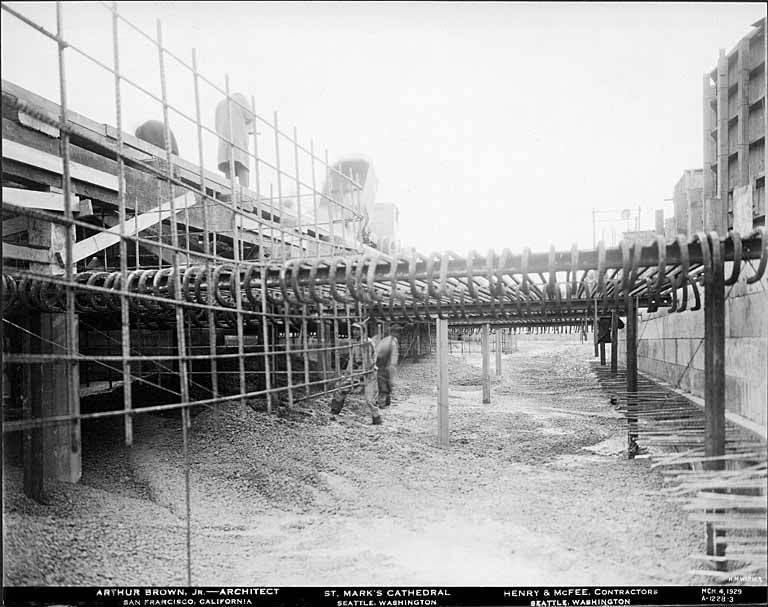
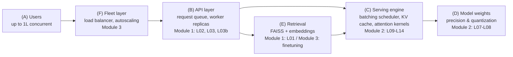
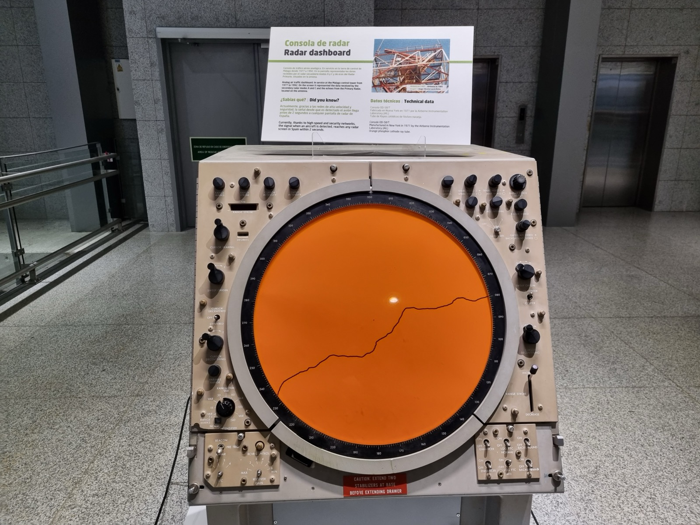

# Lecture 00 — The System We're Building

> **In one sentence:** Before writing a line of code, we look at the finished blueprint — one system, six boxes, three passes — so that every lecture from here on is a labeled change to a picture you already hold in your head.

## Learning Objectives

- See the one target system this entire course builds, as a single diagram, before any code exists.
- Know which of the six boxes in that diagram each module changes, and why the order — build it, speed it up, scale it — is the order a real team would choose.
- Do the back-of-envelope arithmetic that explains why "just rent more GPUs" cannot be the answer, so every optimization lecture that follows has a reason to exist.

## Prerequisites

| Concept | Needed? | Notes |
| --- | --- | --- |
| Python | Yes | No code runs today; Lecture 01 starts immediately after |
| Transformers basics | Yes | You know what self-attention and tokens are; internals come in Lecture 04 |
| GPUs | No | We rent the first one next lecture |

## Story

No construction crew pours a foundation before looking at the finished building.

<figure>
  
  <figcaption>Nobody on this floor is laying a single brick yet. Every one of them is looking at the whole building first. <em>Photo: Harris & Ewing, Library of Congress, public domain.</em></figcaption>
</figure>

Your manager's ask, in full, was never just "build an assistant that reads our manual." It was three asks, in order: **build it, make it fast enough to afford, make it survive Monday morning.** Lecture 01 dramatizes the first one — a support team drowning in a 500-page manual — in exact, hands-on detail. Today we look at all three at once, from far enough away to see the shape of the whole thing.

That distance matters. Up close, the next twenty-eight lectures are quantization formulas, attention kernels, and Kubernetes YAML. From here, they're six boxes and three passes over them.

## Mental Model

> **This course builds one system, in three passes, the way a building gets a foundation, a frame, and a finish — in that order, on the same structure.** Pass one makes it exist and tells the truth about its limits. Pass two makes every box in it 10× more efficient without changing what it does. Pass three makes many copies of it survive real traffic.

<figure>
  
  <figcaption>Nobody re-pours this foundation once the frame goes up — they build on it. Module 1 is this course's foundation: everything Module 2 and 3 optimize is a box this pass built first. <em>Photo: H.M. Warner, Seattle Municipal Archives, public domain.</em></figcaption>
</figure>

| Pass | Module | Question it answers | Ends when |
| --- | --- | --- | --- |
| Foundation | 1 — Foundations | Does it work, and where exactly does it break? | We've measured the system failing, on purpose, with numbers |
| Frame | 2 — Vertical wins | How much more can one GPU do without changing the answer? | Each win is proven with a before/after benchmark |
| Finish | 3 — Modalities & scale | How do many of these survive a lakh concurrent users? | It's on AWS, autoscaled, with an SLO and a $/Mtok number |

Nothing in Module 2 or 3 replaces what Module 1 builds. They replace *how efficiently* it runs.
{: .remember}

## The System

Here is the target — the actual system every later lecture edits one box of. Six boxes, not sixty; anything more detailed than this belongs to a specific lecture, not to the map.

<figure>
  
  <figcaption>Every aircraft in the sector, on one screen, at once. That's what this diagram is for — not to replace the detail in any one lecture, but to hold the whole system in view while a single lecture zooms into one box of it. <em>Photo: Cabeza2000, Wikimedia Commons, CC BY-SA 4.0.</em></figcaption>
</figure>

| Box | What it actually is | Who touches it, and when |
| --- | --- | --- |
| (A) Users | Whoever sends a request — one support agent today, a lakh of them by Module 3 | Grows throughout the course; never itself "built" |
| (B) API layer | The process (or processes) that accept HTTP requests and queue them | Born in Lecture 02, breaks on purpose in Lecture 03, fixed cheaply in Lecture 03b |
| (C) Serving engine | Whatever decides which requests run together, and when | Built by hand in Lecture 13, handed to vLLM/SGLang in Lecture 14 |
| (D) Model weights | The actual parameters sitting in GPU memory | Shrunk in Lectures 07–08 (quantization); their shape changes again in Lectures 11–12 (GQA/MQA, RoPE) |
| (E) Retrieval | Embedding models plus the FAISS index that finds the right page or figure | Built in Lecture 01; refined with rerankers and finetuned embeddings in Module 3 |
| (F) Fleet layer | Whatever sits in front of many copies of (B)–(E), routing and scaling them | Doesn't exist until Module 3 — before then, there is exactly one of everything |

Every hands-on lecture from here on gets a one-line tag telling you which of these six boxes it just changed. That tag is the whole point of drawing this diagram once, today, instead of re-explaining the system's shape every time a lecture touches a piece of it.

## The Journey

**Module 1 builds boxes (A), (B), and (E), then breaks (B) on purpose.** Lecture 01 builds the multimodal RAG — box (E), with a first, single-process version of box (C) inside it. Lecture 02 wraps it as a real service — box (B) is born. Lecture 03 load-tests it until box (B) falls over, and Lecture 03b gives box (B) its first, cheapest fix. Lectures 04–06 explain *why* the underlying GPU behaved the way it did the whole time.

**Module 2 doesn't add boxes. It makes (C) and (D) 10× cheaper, one lecture at a time.** Quantization shrinks (D). FlashAttention and PagedAttention change how (C) uses memory. GQA/MQA/MLA and RoPE/ALiBi/YaRN change what (D) even has to store. Continuous batching, then vLLM/SGLang, rebuild (C) properly. Every one of these lectures ends with the same benchmark table re-measured, so "10× cheaper" is a number, not an adjective.

**Module 3 doesn't make any one box faster. It makes many of them survive real traffic.** Multimodal serving, MoE, and finetuned embeddings extend (D) and (E) to more model types. Multi-LoRA and disaggregation split (C) further. Then box (F) is built for the first time — Docker, Kubernetes, autoscaling, SLOs — because "10× faster" and "handles a lakh users" are two different problems, and this course refused to conflate them.

## The Target Numbers

Not a benchmark — nothing has run yet. These are the goals every later "Measure It" table is judged against:

| Target | Where it's aimed | First real number appears |
| --- | --- | --- |
| Cost per answer | Meaningfully below Lecture 01's single-user baseline | Lecture 01 (baseline), re-measured after every Module 2 win |
| Concurrent users served | 1 → a lakh (100,000+), same underlying system | Lecture 03 (breaks at ~2), Module 3 (the actual target) |
| p99 latency under real load | A stated SLO, not "as fast as possible" | Module 3's capacity-planning lectures |
| GPU compute actually used per request | Up from Lecture 03's measured <1% | Every Module 2 lecture's before/after table |

Lecture 01 will hand you the first row of real numbers in about twenty minutes. Everything above is what those numbers are aimed at, not what they already are.

## The Math, One Level Deeper

Here's the argument this whole course is a twelve-week answer to, and it only takes multiplication to see it.

Lecture 01's system — one GPU, one request at a time — will measure roughly \\(400\\) answers per hour, renting that one GPU at about $1/hr. Lecture 03 goes further: it shows that simply *adding concurrent users* to that same system doesn't add throughput — one user at a time is a ceiling, not a starting point, until something changes.

So take the naive plan literally: "a lakh concurrent users" at "one GPU per user, one request at a time" means renting

\\[
100{,}000 \text{ users} \times 1 \text{ GPU/user} \times 1 \text{ hr} = 100{,}000 \text{ GPU-hours, every hour}
\\]

— at ~$1/GPU-hour, a six-figure hourly bill, for a system Lecture 03 will show is using **under 1% of each GPU's real compute** the entire time. You would be renting a hundred thousand machines to leave ninety-nine thousand of them, in effect, idling at full price.

> That gap — between what naive scaling costs and what the hardware is actually capable of — is the entire subject of Module 2. Every lecture there is an answer to the same question: how much of that wasted 99% can we get back, on the *one* GPU we're already paying for, before we ever touch the fleet-size math again?
{: .remember}

## Where the Map Isn't the Territory

**These numbers are targets, not measurements.** Treat the table above as a compass, not a spec sheet — the real numbers, GPU and precision named, start arriving next lecture and keep arriving every lecture after.

**Six boxes is a simplification on purpose.** Real production systems have more moving parts — caches, CDNs, secrets managers — that this course never needs to teach the core lesson. If a later lecture introduces something that doesn't fit cleanly into one box, that's a sign the map is doing its job: staying simple enough to hold in your head.

**The module order is a teaching order, not the only valid order.** A team under real deadline pressure might quantize before load-testing, or stand up autoscaling before optimizing a single GPU. This course teaches "make it correct, then fast, then scale" because it's the order that lets each pass be *measured* against the previous one — not because any other order is wrong.

## Exercises

1. **Predict before you measure.** Before starting Lecture 01, write down your own guess for its four baseline numbers: TTFT, tokens/sec, peak VRAM, and answers per hour on one GPU. Compare after.
2. **Redraw it from memory.** Close this page and sketch the six-box diagram yourself, labeling which module touches each box. Then reopen and check.
3. **Name the box.** For each of these — "the model now answers in 4-bit instead of 16-bit," "requests wait in a shared line instead of one at a time," "a Kubernetes deployment adds a second pod under load" — name which box (A)–(F) changed.
4. **Attack the naive number.** Recompute the ~$100,000/hr naive-scaling estimate assuming Module 2 alone delivers a 10× cheaper answer *per GPU* — with everything else held constant, what does the naive fleet cost become? (This is the argument in miniature; the real Module 3 lectures do it properly, with real numbers.)

## Summary

We haven't run a line of code, and we already know the shape of the next twelve weeks: one system, six boxes — users, an API layer, a serving engine, model weights, retrieval, and eventually a fleet layer — built once in Module 1, made ruthlessly efficient box by box in Module 2, and finally made to survive real scale in Module 3. Every hands-on lecture from here on will tell you, in one line, which of these six boxes it just changed.

> **What should you remember?**
> - One system, three passes: make it work, make it 10× cheaper, make it survive a lakh users — in that order, on purpose.
> - Six boxes: users, API layer, serving engine, model weights, retrieval, fleet layer. Nothing this course builds falls outside them.
> - Naive scaling ("one GPU per user") is a six-figure hourly bill for hardware sitting at under 1% real utilization — that gap is what Module 2 spends eight lectures closing.

## Resources

- This course's own [index page](../index.md) — the authoritative, always-current lecture order and module map.
- Martin Kleppmann, *Designing Data-Intensive Applications* (2017) — the broader engineering habit of drawing the whole system before optimizing any piece of it.

---

[Course Home](../index.md) · [Next: Lecture 01 — Build a Multimodal RAG →](01-build-a-multimodal-rag.md)
