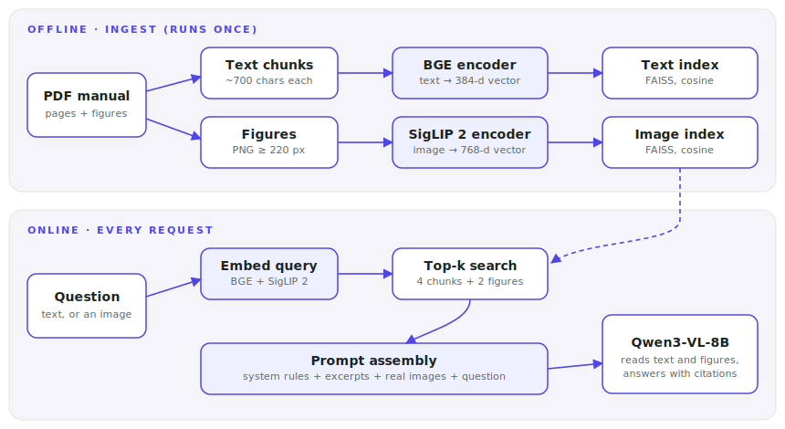
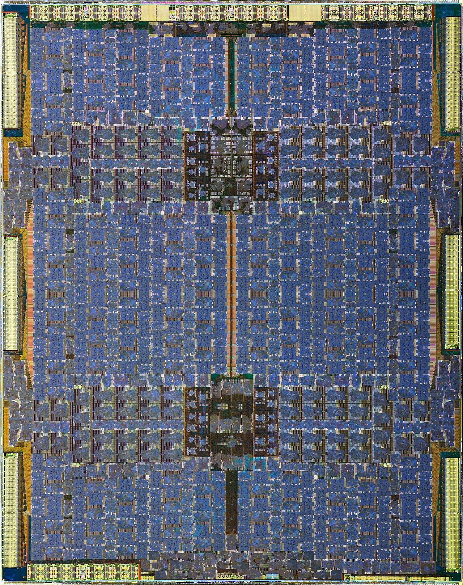

# Lecture 01 — Build a Multimodal RAG

> **In one sentence:** We build a working assistant that answers questions about a 500-page illustrated manual — retrieving both text and figures, and reading them with a vision-language model — because this exact system is what we will deploy, break, and then spend twelve weeks making 10× faster and cheaper.

## Learning Objectives

- Build a complete multimodal RAG pipeline — ingest, embed, index, retrieve, generate — in stock Hugging Face code.
- Explain why text and images live in two different vector spaces, and what a shared image–text space actually is.
- Measure your first four serving numbers — prompt tokens, TTFT, TPOT, VRAM — and save them as the course baseline.

## Prerequisites

| Concept | Needed? | Notes |
| --- | --- | --- |
| Python | Yes | Comfortable with classes and virtual environments |
| Transformers basics | Yes | You know what self-attention and tokens are; internals come in Lectures 4–5 |
| GPUs | No | We rent one today; how it works is Lecture 4 |

## Story

It is your first week at a mid-size company, and the support team is drowning.

Their product ships with a **500-page illustrated manual**. Every day, hundreds of tickets ask questions the manual already answers — but nobody can find the right page, and half the answers are **diagrams**, not paragraphs.

Your manager's request is one sentence: *"Can we get an assistant that actually reads our manual — pictures included?"*

Before neural networks, institutions solved the finding problem with furniture.

<figure>
  
  <figcaption>A library card catalog: thousands of documents, reduced to small searchable cards. Replace the cards with vectors and you have the core of RAG. <em>Photo: Dr. Marcus Gossler, Wikimedia Commons, CC BY-SA 3.0</em></figcaption>
</figure>

A librarian never memorizes the library. They master the **catalog** — and fetch the right document on demand.

That is exactly what we build today. And to make it real, we use a real manual: the FAA's *Pilot's Handbook of Aeronautical Knowledge* — hundreds of public-domain pages, packed with technical diagrams. Swap in your company's manual later; nothing else changes.

## Mental Model

> **RAG is an open-book exam.** The embedding model writes the index cards, retrieval opens the right page, and the language model writes the answer — with the page in front of it.

Keep the three roles separate in your head, because we will optimize them separately:

| Role | Who does it | Runs |
| --- | --- | --- |
| Write the index cards | Embedding models (BGE, SigLIP 2) | Once, offline |
| Open the right page | FAISS similarity search | Every request, milliseconds |
| Write the answer | Qwen3-VL-8B | Every request, seconds |

"Multimodal" changes one thing only: the book has pictures, so some index cards must describe **images** — and the exam-taker must be able to **look at them**.

A RAG system is three jobs, not one: index, retrieve, generate. Every optimization in this course targets exactly one of the three.
{: .remember}

## The System

Here is everything we build today, on one screen.

<figure>
  
  <figcaption>The offline lane runs once per manual. The online lane runs on every request — and it is the lane whose speed we will obsess over for twelve weeks.</figcaption>
</figure>

Two details deserve a pause.

**There are two vector spaces, not one.** Text chunks are embedded by BGE, a text-only model, because it is very good at matching questions to paragraphs. Images are embedded by SigLIP 2, which was trained so that *an image and its caption land near each other* — one shared space for both modalities. That shared space is what makes "find me the diagram for this question" possible at all. The math page below shows exactly why.

**Retrieved figures go into the prompt as real images.** We do not describe images with text and hope. Qwen3-VL is a vision-language model: it will look at the actual pixels of the retrieved diagrams while writing the answer.

Questions find paragraphs in BGE's space; questions find figures in SigLIP's shared image–text space; the generator reads both.
{: .remember}

## The Build

All code **and all data** live in [`code/module-1-foundations/01-build-a-multimodal-rag/`](https://github.com/gaurav98095/Course-on-AI-Engineering/tree/develop/code/module-1-foundations/01-build-a-multimodal-rag) at the repo root — three small files plus the PDFs, and the folder runs standalone. We walk through every step.

Before any command, let's kill the question every tutorial skips: **where does each thing run?**

| Environment | Role | In this lecture |
| --- | --- | --- |
| 💻 Your laptop | Browser only — reading this page, clicking around lightning.ai | No code runs here |
| ⚡ Lightning AI Studio | A cloud machine with a GPU, driven from your browser: editor + terminal | **Every command below** |
| ☁️ AWS (EC2 / EKS) | Production home of this system | Nothing until Module 3 |

> **Convention for the whole course:** if a command block doesn't say otherwise, it runs in the **Lightning Studio terminal**. When we move to AWS in Module 3, every block will say so explicitly.

### Step 1 — Rent the GPU

💻 *On your laptop, in the browser:* sign up at lightning.ai, create a **Studio** (their name for a cloud dev machine), and switch its hardware to one **L40S (48 GB)**. That is comfortably enough for an 8B vision-language model in bf16; a 24 GB L4 works too, just tighter.

Opening the Studio gives you a VS Code-like editor and a terminal — that terminal is where the rest of this lecture happens.

⚡ *In the Studio terminal*, confirm the GPU is real:

```bash
nvidia-smi
```

You should see the L40S with ~48 GB of memory, nearly all free. Remember that number — by the end of this lecture we will know exactly where 20+ GB of it went.

<figure class="portrait">
  
  <figcaption>A data-center GPU die, tens of billions of transistors — this one's an NVIDIA A100's, not your L40S's own (dies aren't photographed for every SKU), but the same idea: this is the physical silicon you just rented a slice of. In Lecture 04 we tour it properly. <em>Photo: Wikimedia Commons, CC BY 3.0</em></figcaption>
</figure>

### Step 2 — Ingest the manual

⚡ Clone the course repo — the two handbook chapters **ship inside it** (`data/`, public domain), so there is nothing else to hunt down:

```bash
git clone https://github.com/gaurav98095/Course-on-AI-Engineering.git
cd Course-on-AI-Engineering/code/module-1-foundations/01-build-a-multimodal-rag
pip install -r requirements.txt
python ingest.py
```

The ingester takes the PDFs apart page by page. (Drop any illustrated PDF of your own into `data/` and it gets indexed too — nothing else changes.)

Inside `ingest.py`, one function does the physical work — walking the PDF page by page, packing paragraphs into ~700-character chunks, and saving every figure large enough to be a real diagram:

```python
for page in doc:
    # text: paragraph blocks, greedily packed into ~700-char chunks
    for block in page.get_text("blocks"):
        paragraph = block[4].strip()
        if len(paragraph) < 40:          # headers, page numbers
            continue
        ...
    # images: every embedded figure big enough to matter
    for xref, *_ in page.get_images(full=True):
        img = Image.open(io.BytesIO(doc.extract_image(xref)["image"]))
        if min(img.size) < 220:          # skip icons and decorations
            continue
```

What you should see (counts vary slightly by PDF edition):

```text
phak-ch4-aerodynamics: ~230 text chunks, ~60 figures
phak-ch7-instruments:  ~260 text chunks, ~90 figures
```

Why 700 characters? Small enough that a chunk means one thing — retrieval precision — but big enough to carry a full thought. We will revisit this number with evals in the embeddings module.

### Step 3 — Write the index cards

Still inside `ingest.py`: two encoders, two indexes.

```python
# text chunks -> BGE (384-dim), unit length
model = SentenceTransformer("BAAI/bge-small-en-v1.5", device="cuda")
text_vecs = model.encode(chunks, normalize_embeddings=True)

# figures -> SigLIP 2 image tower (768-dim), unit length
f = clip.get_image_features(**processor(images=batch, return_tensors="pt").to("cuda"))
f = f.pooler_output if hasattr(f, "pooler_output") else f   # see note below
f = torch.nn.functional.normalize(f, dim=-1)
```

That middle line is a real gotcha, not defensive boilerplate: on current `transformers` versions, SigLIP 2's `get_image_features()`/`get_text_features()` return the model's full output object (with attentions, hidden states, and a `.pooler_output` field) rather than a bare tensor — a change from how these convenience methods behave on older model families. Skip that line and `normalize()` fails immediately on the next one, because you can't normalize an output object. The `hasattr` check keeps the code working either way, in case a future library version changes it back.

Both sets of vectors are **normalized to unit length**. That single line buys us something important:

```python
index = faiss.IndexFlatIP(vecs.shape[1])   # inner product == cosine, because unit length
index.add(vecs)
```

> For unit vectors, the fastest similarity (a dot product) and the right similarity (cosine) are **the same number**. That is not a coincidence — it is the first equation of the course, and the math page proves it in three lines.

This is exact, brute-force search. A few hundred vectors need nothing smarter — approximate indexes earn their complexity around a million vectors, and we will meet them at scale in Module 3.

### Step 4 — Retrieve, before you generate

Never wire retrieval straight into generation and hope. Retrieval is cheap to test on its own — so test it on its own.

The `Retriever` in `rag.py` embeds a question into *both* spaces:

```python
# text -> text index (BGE's own space)
q = self.text_model.encode([question], normalize_embeddings=True)
_, idx = self.text_index.search(q, k_text)

# text -> image index (SigLIP's shared image-text space)
inputs = self.clip_processor(text=[question], padding="max_length",
                             max_length=64, return_tensors="pt")
qv = self.clip.get_text_features(**inputs)
qv = qv.pooler_output if hasattr(qv, "pooler_output") else qv   # Step 3's gotcha, again
```

Notice `max_length=64`. SigLIP's text tower was trained on short captions — it literally cannot read more than 64 tokens. File that away; it returns in *Where It Breaks*.

Ask for the pitot-static system and you should see hits like:

```text
[phak-ch7-instruments p.8]  The pitot-static system utilizes impact pressure...
[phak-ch7-instruments p.9]  The airspeed indicator is the only instrument that...
[figure] phak-ch7-instruments-p8-x123.png   <- a pitot-static system diagram
```

The right paragraphs *and* the right diagram, before any generation happened. If this step looks wrong, no generator can save you.

### Step 5 — Generate the answer

Now the exam-taker. Qwen3-VL-8B-Instruct loads in two lines:

```python
model = AutoModelForImageTextToText.from_pretrained(
    "Qwen/Qwen3-VL-8B-Instruct", torch_dtype="auto", device_map="auto"
)
```

The prompt assembly is the heart of RAG, and it is disarmingly plain — retrieved figures as real images, retrieved chunks as cited excerpts, then the question:

```python
content = [{"type": "image", "image": fig_path} for fig_path in retrieved_figures]
content.append({"type": "text",
                "text": f"Manual excerpts:\n{excerpts}\n\nQuestion: {question}"})
```

The system message pins the behavior we want at work: *answer only from the provided excerpts, cite pages, admit when the context is not enough.*

Run it end to end:

```bash
python rag.py "Why does an aircraft stall at the critical angle of attack?"
```

You should get a grounded, cited answer along these lines:

```text
--- answer (1842 prompt tokens -> 231 new tokens):
An aircraft stalls at the critical angle of attack because the smooth airflow
over the wing separates... As shown in the figure, beyond this angle the
boundary layer... [phak-ch4-aerodynamics p.5]
```

Read that first line again: **1,842 prompt tokens for a ~40-token question.** Retrieved excerpts and two images made the prompt ~45× larger than the question. Hold that thought — it is the seed of the prefill story in Lecture 05, and of prefix caching in Lecture 17.

### Step 6 — Ask with a picture

The payoff of the shared space: the query itself can be an image. A sample cockpit-instrument photo ships in `data/` so you can try it immediately:

```bash
python rag.py "What does this instrument do and what are its errors?" \
  --image data/sample-query-instrument.jpg
```

The photo is embedded by SigLIP's *image* tower, lands near similar figures in the index, and Qwen3-VL sees both the user's photo and the manual's own diagrams side by side. A support user photographing a broken part and getting back the right manual page — that is the corporate demo that gets this project funded.

## Measure It

Every lecture in this course ends with numbers, and these are the most important ones you will ever record: **the baseline**.

```bash
python measure.py
```

The harness does three things stock timing code gets wrong: it **warms up** first (the first run silently includes kernel compilation), it calls `torch.cuda.synchronize()` (CUDA is asynchronous — untimed, your timers lie), and it measures TTFT with a streamer, exactly the way a user experiences it.

Ballpark results — one L40S, bf16, batch size 1, ~1.8k-token multimodal prompts, ~300 new tokens. Yours will differ; that is fine, they are *yours*:

| Metric | Ballpark | What it means |
| --- | --- | --- |
| TTFT | ~1 s | Time to first token: reading 1.8k tokens + 2 images (prefill) |
| TPOT | ~30 ms | Time per output token after the first (decode) |
| Throughput | ~30 tok/s | One stream, one user |
| Answer time | ~8–10 s | What the support agent actually waits |
| Peak VRAM | ~22 GiB | On a 48 GB card — for **one** concurrent request |

Now the sentence that launches the next eleven weeks.

**This serves exactly one user at a time.**

At ~$1 per L40S-hour and ~9 s per answer, that is ~400 answers per hour — a quarter of a cent each. Sounds fine, until the support team wants it live for every customer, concurrently, at p95 under two seconds. We will watch this exact system melt under load in Lecture 03 — on purpose, with graphs.

Your baseline table is the plot of this course. Every optimization we ever make will be judged against the numbers you just saved.
{: .remember}

## The Math, One Level Deeper

Everything retrieval did today reduces to one question: *how similar are two vectors?*

The intuition: an embedding model maps meaning to **direction**. Texts about stalls point one way, texts about instruments another. Similar meaning, similar direction — and the measure of "similar direction" is the angle.

\\[
\cos\theta \;=\; \frac{\mathbf{a}\cdot\mathbf{b}}{\lVert\mathbf{a}\rVert\,\lVert\mathbf{b}\rVert}
\qquad\xrightarrow{\;\lVert\mathbf{a}\rVert=\lVert\mathbf{b}\rVert=1\;}\qquad
\cos\theta \;=\; \mathbf{a}\cdot\mathbf{b}
\\]

One worked number, small enough to check by hand. Take three unit vectors in 2-D: a question \\(q=(0.6,\,0.8)\\), chunk \\(c_1=(0.8,\,0.6)\\), chunk \\(c_2=(-0.6,\,0.8)\\).

\\[
q\cdot c_1 = 0.48+0.48 = 0.96 \qquad q\cdot c_2 = -0.36+0.64 = 0.28
\\]

\\(c_1\\) wins, 0.96 to 0.28 — two multiplications and an add per pair. FAISS just does this against every card in the catalog, very fast.

> **Want the full derivation?** Why normalization makes dot = cosine, how contrastive training *creates* these spaces, why images and captions can share one, and what recall@k really measures:
> [Math Deep Dive 01 — The Geometry of Retrieval →](../math/01-geometry-of-retrieval.md)

## Where It Breaks

Three cracks are already present in today's system. Finding them now is the difference between a demo and an engineer.

**The 64-token ceiling.** SigLIP's text tower truncates silently past 64 tokens. Short questions are fine; paste a long error log as a query and the image search reads only its first sentence. This is why our *paragraphs* go to BGE, and it is the opening argument for finetuning our own embeddings in Module 3.

**Top-k has no memory.** Chunks are retrieved independently. Ask *"compare the errors of the altimeter and the airspeed indicator"* and you need chunks about **both** — nothing guarantees the top-4 covers them. Rerankers (Lecture 21) exist for this.

**Two spaces, two rulers.** A 0.71 from BGE and a 0.31 from SigLIP are **not comparable** — different models, different score distributions. That is why we take "top-4 text + top-2 images" as separate quotas instead of one merged ranking. Merging them properly needs a reranker or calibration; feel that itch, we scratch it later.

A retrieval score is only meaningful inside its own index — never compare across embedding models.
{: .remember}

## Exercises

1. **Your own manual.** Point `PDF_URLS` at any illustrated PDF you own — a product datasheet, an appliance manual — re-ingest, and ask five questions. Where does retrieval fail first?
2. **Tune k.** Sweep `k_text` from 1 to 12. Watch answer quality *and* prompt tokens *and* answer time. You are feeling the cost–quality trade-off that Module 2 attacks with hardware.
3. **Break the 64-token ceiling on purpose.** Query the image index with one sentence, then with that sentence buried after 100 words of preamble. Compare the retrieved figures.
4. **Build a tiny eval.** Write 10 question → correct-page pairs by hand. What fraction of the time is the right page in the top-4? Congratulations — you just invented recall@4, and you will use it in every retrieval lecture from now on.
5. **Stress preview.** Open two terminals and run `rag.py` in both simultaneously. Watch `nvidia-smi`. What happened to answer time? Write the number down — Lecture 03 explains it.

## Summary

We built the whole thing: a PDF manual became text chunks and figures; BGE and SigLIP 2 wrote them onto index cards; FAISS finds the right cards in milliseconds; Qwen3-VL reads the retrieved paragraphs *and looks at the retrieved diagrams* to write cited answers. Then we measured it — TTFT, TPOT, tokens/sec, VRAM — and found a system that works beautifully for exactly one user.

> **What should you remember?**
> - RAG is an open-book exam: index cards (embeddings), page-finding (FAISS), answer-writing (VLM) — three jobs, optimized separately.
> - Unit-length vectors make the fast similarity and the right similarity the same dot product.
> - Your baseline table — ~1 s TTFT, ~30 tok/s, ~22 GiB, one user — is the number every future lecture must beat.

## Resources

- Lewis et al., *Retrieval-Augmented Generation for Knowledge-Intensive NLP Tasks* (2020) — the RAG paper.
- Radford et al., *Learning Transferable Visual Models From Natural Language Supervision* (2021) — CLIP, the original shared image–text space.
- Zhai et al., *Sigmoid Loss for Language Image Pre-Training* (2023) — SigLIP.
- Model cards: `Qwen/Qwen3-VL-8B-Instruct`, `BAAI/bge-small-en-v1.5`, `google/siglip2-base-patch16-224`.
- Other public multimodal-RAG designs to compare with ours: the [Hugging Face ColPali + VLM cookbook](https://huggingface.co/learn/cookbook/en/multimodal_rag_using_document_retrieval_and_vlms) (retrieves page *screenshots* instead of extracting text — the main rival architecture) and the [Awesome-RAG-Vision list](https://github.com/zhengxuJosh/Awesome-RAG-Vision). More in the [code folder's README](https://github.com/gaurav98095/Course-on-AI-Engineering/tree/develop/code/module-1-foundations/01-build-a-multimodal-rag#licenses).

---

[Course Home](../index.md) · [Next: Lecture 01b — GPU Vitals: Watching What You Built →](01b-gpu-vitals.md)
