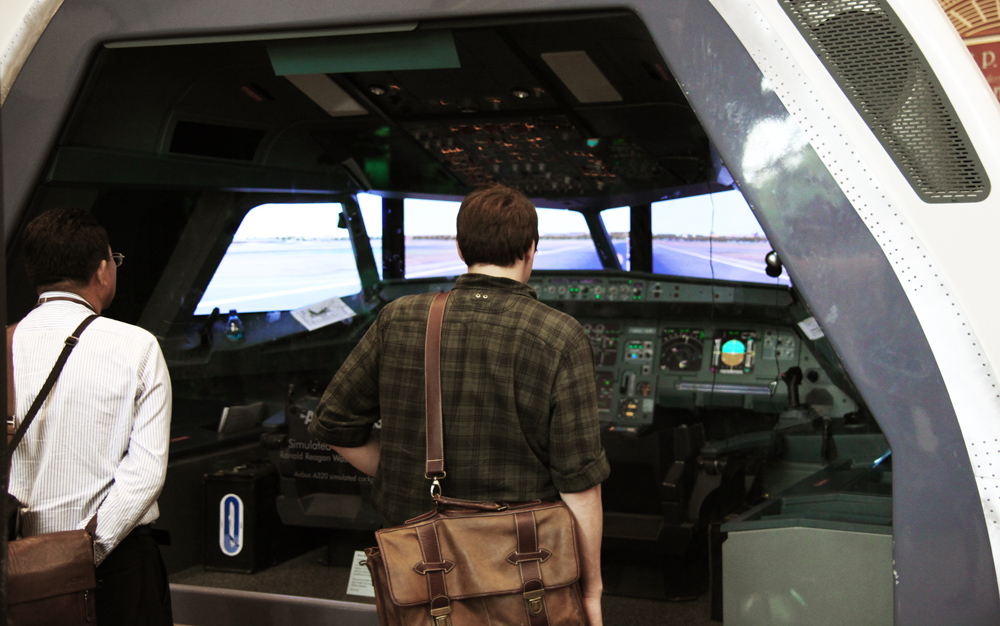
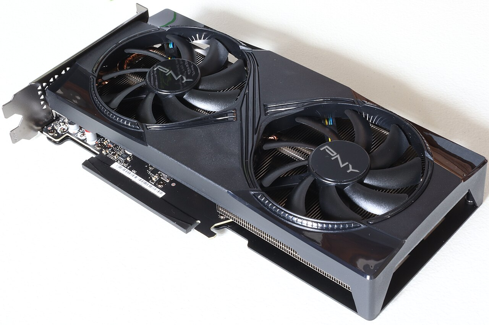
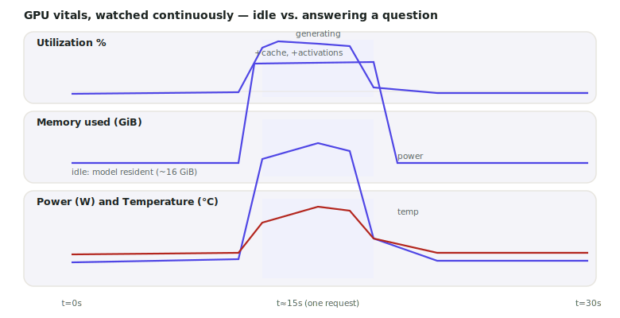

# Lecture 01b — GPU Vitals: Watching What You Built

> **In one sentence:** We stop glancing at `nvidia-smi` once and start watching it continuously — because "the GPU has ~48 GB, mostly free" is a snapshot, and every lecture from here on needs a movie.

## Learning Objectives

- Name the GPU vitals that matter while serving a model — utilization, memory, power, temperature, clock — and what each one actually tells you.
- Watch them continuously with `nvidia-smi dmon` (zero install) and with your own polling script (`pynvml`).
- Correlate a vitals trace against real activity: idle vs. one full RAG request, so you know what "normal" looks like before Module 2 starts changing it.

## Prerequisites

| Concept | Needed? | Notes |
| --- | --- | --- |
| Lecture 01 | Yes | We watch *that* system while it runs — nothing new to build today |
| Command line | Yes | Reading streamed CLI output |
| GPU internals | No | Lecture 04 explains *why* these numbers move; today we just watch them |

## Story

A pilot never checks the altimeter once before takeoff and calls it done. They watch a **panel** — altitude, speed, engine temperature, fuel — continuously, the entire flight, because a single healthy glance tells you nothing about what happens ten minutes later.

<figure>
  
  <figcaption>A modern cockpit: several instruments, always live, always visible together. Nobody flies by checking one gauge once before departure. <em>Photo: Wikimedia Commons, CC BY-SA 2.0</em></figcaption>
</figure>

Lecture 01 ended with exactly one glance: `nvidia-smi`, once, before we rented the GPU. We never looked again. We built a whole RAG system, ran it, measured a baseline — and flew the entire flight with the panel switched off.

That's fine for a five-minute demo. It stops being fine the moment you start asking questions Module 2 is built around: *did quantization actually shrink memory? did that kernel actually raise utilization? is the fan even audible under this load?* None of those questions can be answered by a single glance. They need a panel.

## Mental Model

> **A vitals monitor doesn't tell you what's wrong. It tells you where to look.** Utilization tells you if the chip is busy. Memory tells you if you're about to crash. Power and temperature tell you if the card is straining. None of them explain *why* — that's what Lectures 04–06 are for. Today is purely instrumentation.

Five numbers, five different questions:

| Vital | Question it answers | Healthy range (our L40S, serving) |
| --- | --- | --- |
| GPU utilization % | Is a kernel running right now? | Spikes during generation, ~0% idle |
| Memory used | Am I close to running out? | ~16 GiB (weights) at idle, more per request |
| Power draw | How hard is the card working? | Well under its 350W cap during light load |
| Temperature | Is it thermal-throttling? | Comfortably under ~85°C on a data-center card |
| SM clock | Is it running at full speed? | Near its boost clock when busy, lower when idle |

Keep this in mind for later: `nvidia-smi`'s single utilization number can be misleading — Lecture 03 will catch it claiming "100%" while the GPU does less than 1% of its real arithmetic. A vitals *trace* over time won't fix that kind of lie by itself — but it's the difference between never noticing a problem and having the data to go looking for one.
{: .remember}

## The System

We're not building anything new today — we're pointing instruments at what Lecture 01 already built. Same environment convention as always:

| Environment | Role in this lecture |
| --- | --- |
| ⚡ Lightning Studio, terminal 1 | Run `rag.py` a few times, or just let the GPU sit idle |
| ⚡ Lightning Studio, terminal 2 | Watch the vitals monitor live |
| 💻 Your laptop | Browser only, reading the lecture |

<figure class="portrait">
  
  <figcaption>Every vital in this lecture traces back to something physical: fans spin faster because power went up; power went up because utilization did. <em>Photo: Wikimedia Commons, CC BY-SA 4.0</em></figcaption>
</figure>

## The Build

⚡ This lecture's folder, `code/module-1-foundations/01b-gpu-vitals/`, is a copy-forward of Lecture 01's folder with two new files: `gpu_vitals.py` and `plot_vitals.py`.

```bash
git clone https://github.com/gaurav98095/Course-on-AI-Engineering.git   # skip if already cloned
cd Course-on-AI-Engineering/code/module-1-foundations/01b-gpu-vitals
pip install -r requirements.txt     # adds pynvml, matplotlib
```

### Step 1 — The zero-install path: `nvidia-smi dmon`

Every NVIDIA driver ships this. No Python, no packages:

```bash
nvidia-smi dmon
```

```text
# gpu   pwr  gtemp  mtemp    sm   mem   enc   dec   jpg   ofa  mclk  pclk
# Idx     W      C      C     %     %     %     %     %     %   MHz   MHz
    0    62     41      -     0     0     0     0     0     0  9501   405
    0    58     41      -     0     0     0     0     0     0  9501   405
    0   287     67      -    94    38     0     0     0     0  9501  2520
```

Read it as a live table: `sm` is compute utilization, `mem` is memory-controller utilization (not memory *used* — a common confusion), `pwr` is watts, `pclk` is the SM clock. That third row — power jumping from 58W to 287W, `sm` from 0 to 94%, clock from 405MHz to 2520MHz — is exactly what a request looks like from the outside. Leave this running and switch to another terminal to fire a request:

```bash
python rag.py "Why does an aircraft stall at the critical angle of attack?"
```

Watch the `dmon` terminal the whole time the answer is generating.

### Step 2 — Your own monitor: `pynvml`

`nvidia-smi dmon` is great for watching live, but it doesn't save anything. `gpu_vitals.py` polls the same underlying data through `pynvml` (NVIDIA's own management library) and logs it to CSV:

```python
def sample(handle) -> dict:
    util = pynvml.nvmlDeviceGetUtilizationRates(handle)
    mem = pynvml.nvmlDeviceGetMemoryInfo(handle)
    power = pynvml.nvmlDeviceGetPowerUsage(handle) / 1000.0     # mW -> W
    temp = pynvml.nvmlDeviceGetTemperature(handle, pynvml.NVML_TEMPERATURE_GPU)
    clock = pynvml.nvmlDeviceGetClockInfo(handle, pynvml.NVML_CLOCK_SM)
    return {"util_gpu_pct": util.gpu, "mem_used_mib": mem.used / 2**20, ...}
```

Every field here is the same data `dmon` prints — we're just capturing it ourselves so we can plot it and reuse it in later lectures.

```bash
python gpu_vitals.py --seconds 30
```

While that's running, ⚡ *in a second terminal*, fire two or three requests spaced a few seconds apart:

```bash
python rag.py "How does the attitude indicator work?"
```

### Step 3 — Plot it

```bash
python plot_vitals.py
```

<figure>
  
  <figcaption>What you should see (illustrative shape — your exact numbers depend on your GPU and prompt): idle, then every vital spikes together for the duration of one request, then falls back.</figcaption>
</figure>

Three panels, one story: utilization, memory, and power don't move independently — they rise and fall **together**, in lockstep with request boundaries. That correlation is the entire point of watching continuously instead of once. A single glance could have landed on the spike or the idle gap and told you two completely different (and equally incomplete) stories.

## Measure It

Ballpark vitals for one full RAG request, L40S, bf16 — save your own trace, it's the reference every later Module 2 lecture will ask you to beat:

| Vital | Idle | During one request |
| --- | --- | --- |
| GPU utilization | ~0% | spikes toward 90%+ during decode bursts |
| Memory used | ~16 GiB (model resident) | +2–6 GiB during generation (KV cache + activations) |
| Power draw | ~55–65 W | up to ~280–300 W |
| SM clock | ~400–500 MHz | near boost clock, ~2,500 MHz |

> Notice memory jumps by a few GiB — far more than the KV cache alone accounts for (Lecture 05 derives its exact size later: a few hundred MiB for a prompt this size). The rest of the jump is activation memory and PyTorch's own allocator overhead. A cache-size formula was never going to predict *everything* the allocator touches; profiling (Lecture 06) is how you'd separate the two precisely.

## The Math, One Level Deeper

Here's a question the numbers above raise, and it has a precise answer: `nvidia-smi dmon` sampled once per second by default, but one decode step takes about 30 ms. **Are we even capable of seeing what we claim to be watching?**

This is a sampling problem. If the thing you're measuring changes faster than you're measuring it, your trace can systematically miss it — a short spike can vanish entirely between two samples, or worse, look smaller than it really was.

\\[
\\text{samples per event} = \\frac{\\text{event duration}}{\\text{sampling interval}}
\\]

One worked number: at a 1-second interval, a single 30 ms decode step gets exactly 0.03 samples on average — meaning most individual steps are invisible, and what you actually see is an *average* smeared over the ~33 steps that occurred during that one-second window. That's not a flaw in the tool; it's a deliberate trade-off, and it's exactly why our dashboard shows smooth humps per *request* (which last seconds) rather than jagged spikes per *token* (which last milliseconds).

> **Want the full derivation?** Why undersampling can hide real spikes entirely (not just blur them), the exponential moving average formula real dashboards use to smooth noisy signals without storing every sample, and how to choose a sampling interval on purpose instead of by accident:
> [Math Deep Dive 01b — Sampling Rate and Smoothing a Live Signal →](../math/01b-sampling-and-smoothing.md)

## Where It Breaks

**`mem` in `dmon` is not memory *usage*.** It's the memory *controller's* utilization percentage — how busy the memory bus is, not how many bytes are occupied. For actual bytes used, read the `mem_used_mib` field from `gpu_vitals.py` (or `nvidia-smi --query-gpu=memory.used`), not `dmon`'s `mem` column. This is one of the most common misreadings of `nvidia-smi` output.

**A single sample can catch a lucky (or unlucky) instant.** If your polling interval happens to land exactly between two requests, you'll log a false "idle" moment in the middle of real traffic. This is the same undersampling problem from the math page, just seen from the other direction.

**Vitals monitoring has its own overhead.** Polling `pynvml` at very high frequency (say, every millisecond) adds CPU-side cost and, at extreme rates, can itself perturb what you're measuring. A 1 Hz–10 Hz polling rate is normally invisible to the workload; don't assume that holds all the way down to microseconds.

**"Normal" vitals depend entirely on what's running.** The ranges in this lecture's table are specific to our RAG system's request shape. A different model, a different batch size, or a different precision will move every one of these numbers — that's the whole subject of Modules 2 and 3.

## Exercises

1. **Idle vs. loaded, side by side.** Run `gpu_vitals.py --seconds 60` while doing nothing for 20 seconds, then firing three requests back to back, then nothing again. Plot it and label the three phases.
2. **Catch the undersampling.** Rerun with `--interval 0.05` (20 samples/sec) during one request and compare the plotted shape against the default 1-second interval. Does decode's step-by-step pattern become visible?
3. **Read the power, not the utilization.** For one request, find the peak power draw and compute what fraction of the card's rated TDP (check your GPU's datasheet) it actually reached. Is a "fully utilized" GPU also a "fully powered" one?
4. **Correlate with Lecture 05.** Using `gpu_vitals.py`'s memory column, watch memory during a *long* generation (`max_new_tokens=300` in `rag.py`) versus a short one (`max_new_tokens=20`). Does the memory delta roughly match Lecture 05's KV cache growth-per-token formula?
5. **Build the habit.** From this lecture onward, run `gpu_vitals.py` in a spare terminal any time you run a Module 2 lecture's benchmark. You'll have a real before/after trace for every optimization, not just a printed number.

## Summary

We didn't build anything new — we finally looked at what Lecture 01 built, continuously instead of once. `nvidia-smi dmon` gives a live table for free; `gpu_vitals.py` gives you the same data logged to CSV and plotted. Utilization, memory, power, and temperature all move together, in lockstep with request boundaries — and now that we've established what "normal" looks like, every optimization from Module 2 onward has a real baseline trace to beat, not just a single number.

> **What should you remember?**
> - Five vitals, five questions: utilization (busy?), memory (running out?), power (straining?), temperature (throttling?), clock (full speed?).
> - `dmon`'s `mem` column is bus utilization, not bytes used — read `memory.used` for that.
> - Sampling rate matters: a 1-second poll smooths over ~33 individual 30ms decode steps into one averaged hump.

## Resources

- NVIDIA System Management Interface (`nvidia-smi`) documentation — the `dmon` subcommand reference.
- NVIDIA Management Library (NVML) / `pynvml` — the Python bindings used in `gpu_vitals.py`.
- NVIDIA DCGM (Data Center GPU Manager) — the production-grade version of what we hand-built today, referenced again in Lecture 27.

---

[← Previous: Lecture 01 — Build a Multimodal RAG](01-build-a-multimodal-rag.md) · [Course Home](../index.md) · [Next: Lecture 02 — Deploy It on a GPU →](02-deploy-it-on-a-gpu.md)
