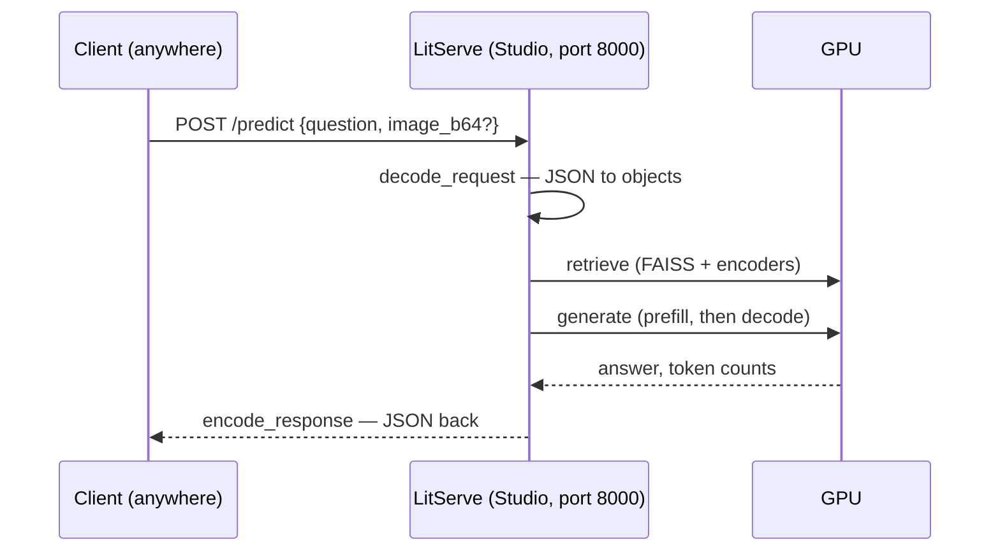

# Lecture 02 — Deploy It on a GPU

> **In one sentence:** We turn last lecture's script into a running service — an HTTP endpoint with a schema, a health check, and per-request logs — because a model nobody can call is a model that doesn't exist.

## Learning Objectives

- Wrap the multimodal RAG in a LitServe endpoint where the model loads once and answers forever.
- Trace the anatomy of one request — network, queue, retrieve, prefill, decode — and know which part you're measuring.
- Expose the endpoint to the internet from a Lightning Studio, call it like a user, and read your first request logs.

## Prerequisites

| Concept | Needed? | Notes |
| --- | --- | --- |
| Lecture 01 | Yes | The RAG must be built and `corpus/` indexed on your Studio |
| HTTP basics | Light | You've seen a POST request and JSON before |
| GPUs | No | Still renting; internals arrive in Lecture 04 |

## Story

Your Lecture 01 demo went well. Too well.

Your manager watched the terminal print a cited answer, nodded, and said the seven words that define this lecture: *"Great — can you send me a link?"*

A script that runs when **you** type is not a product. A **service** answers whoever calls, whenever they call, without you in the room. That gap — script to service — is where most ML projects stall.

A century ago, the telephone network had the same problem: a phone on your desk is useless until something always-on connects calls to answers.

<figure>
  
  <figcaption>A telephone switchboard, early 1900s: always on, one operator per call, every call logged. Today we build exactly this for our model. <em>Photo: Wikimedia Commons, public domain</em></figcaption>
</figure>

## Mental Model

> **A deployed model is a switchboard.** There's a number to call (the endpoint), an operator who answers (the server process), a fixed way to state your business (the request schema), and a logbook (per-request logs). And — crucially, today — **one operator**: while she connects your call, everyone else hears ringing.

Map it once and the code becomes obvious:

| Switchboard | Our service |
| --- | --- |
| The phone number | `http://<host>:8000/predict` |
| The operator | the LitServe worker process |
| "State your business" | the JSON schema in `decode_request` |
| Connecting the call | `predict` — retrieve, then generate |
| The logbook | one printed line per request |
| Operator's training, done before opening | `setup` — the model loads **once** |

One operator per switchboard is exactly one worker per GPU. Remember the ringing — Lecture 03 makes it deafening.
{: .remember}

## The System

Where things run today, one new column compared to Lecture 01: the **caller** can now be anywhere.

| Environment | Role in this lecture |
| --- | --- |
| 💻 Your laptop | Browser: reading, clicking "expose port" in Lightning; optionally running `client.py` against the public URL |
| ⚡ Lightning Studio | Runs the server; unlabeled commands run in its terminal |
| ☁️ AWS | Still nothing — Module 3 |

One request, end to end:



Everything from Lecture 01 is unchanged underneath — `serve.py` just picks up `Retriever` and `Generator` from `rag.py` and puts a phone number on them.

## The Build

This lecture's folder, `code/module-1-foundations/02-deploy-it-on-a-gpu/`, is a copy-forward of Lecture 01's folder with two new files: `serve.py` and `client.py`.

```bash
git clone https://github.com/gaurav98095/Course-on-AI-Engineering.git   # skip if already cloned
cd Course-on-AI-Engineering/code/module-1-foundations/02-deploy-it-on-a-gpu
pip install -r requirements.txt     # adds litserve
python ingest.py                    # rebuild the indexes in this folder
```

### Step 1 — Write the endpoint

The whole server is one class with four methods, and the method boundaries *are* the lesson:

```python
class RAGAPI(ls.LitAPI):
    def setup(self, device):            # runs ONCE at startup
        self.retriever = Retriever()
        self.generator = Generator()

    def decode_request(self, request):  # JSON in -> python objects
        question = request["question"]
        image = ...                     # optional base64 image
        return question, image, max_new

    def predict(self, inputs):          # the actual work, timed and logged
        hits_t, hits_i = self.retriever(question, image)
        answer, n_in, n_out = self.generator(question, hits_t, hits_i, image)
        return {"answer": answer, "sources": [...], "seconds": ...}

    def encode_response(self, output):  # python objects -> JSON out
        return output
```

The line that separates professionals from demos is the first one: **the model loads in `setup`, never in `predict`.** Load-per-request would add ~90 seconds to every single answer.

### Step 2 — Start it

```bash
python serve.py
```

What you should see (ballpark — the wait is Qwen3-VL loading into VRAM):

```text
models loaded, serving            # after ~90 s
INFO: Uvicorn running on http://0.0.0.0:8000
```

That ~90 seconds has a name — **cold start** — and it's why services restart rarely and autoscaling (Module 3) is harder than it sounds.

### Step 3 — Health check, then a real call

⚡ *In a second Studio terminal* (the first one is busy being the server):

```bash
curl localhost:8000/health          # -> ok  (LitServe gives you this for free)
python client.py "Why does an aircraft stall at the critical angle of attack?"
```

The client prints the answer, its sources, and a line worth staring at:

```text
server time: 8.9s | wall time incl. network: 8.94s | overhead: 0.04s
```

An image query works over HTTP too — the photo travels as base64 text inside the JSON:

```bash
python client.py "What does this instrument do?" --image data/sample-query-instrument.jpg
```

### Step 4 — Give your manager the link

💻 *On your laptop, in the browser:* in the Studio's right-hand toolbar, open the **port** plugin and expose port **8000**. Lightning gives you a public `https://...` URL.

From any machine on earth:

```bash
python client.py "How does the altimeter work?" --url https://<your-url>
```

<figure class="portrait">
  
  <figcaption>The whole point of a switchboard: the caller can be anyone, anywhere — they just need the number. <em>Photo: Sam Hood, public domain</em></figcaption>
</figure>

That URL is the deliverable your manager asked for. It is also — say it out loud — **an open door to a GPU you pay for**, with no authentication. Exercise 1 fixes that; Module 3 does it properly.

### Step 5 — Read your logs

Back in the server terminal, every request left one line:

```text
[req] retrieve=41ms total=8.92s prompt_tok=1847 new_tok=243 tok/s=27.2
```

One line, four numbers, and the whole story of this course is already in them: retrieval is **milliseconds**, generation is **seconds** — the GPU spends its life in `generate`. This log line is observability v0; Prometheus dashboards (Lecture 27) are this same line, grown up.

## Measure It

Same five questions as Lecture 01's baseline, but now through HTTP. Ballpark on one L40S, bf16, batch 1:

| Metric | Lecture 01 (direct) | Lecture 02 (HTTP) | What it says |
| --- | --- | --- | --- |
| Mean answer time | ~8–10 s | ~8–10 s + ~0.05 s | Network overhead is noise |
| Retrieval share | ~40 ms | ~40 ms | Still not the problem |
| Cold start | — | ~90 s | The cost of every restart |
| Concurrent callers | 1 (by definition) | **still 1** | The switchboard has one operator |

> Deploying changed *who can call* — it changed nothing about *how much can be served*. HTTP added ~0.5% overhead; the other 99.5% is still the model.

## The Math, One Level Deeper

No new derivation today — just the equation that names the parts, because from now on every latency number we measure decomposes as:

\\[
T_{\text{request}} \;=\; T_{\text{network}} \;+\; T_{\text{queue}} \;+\; T_{\text{retrieve}} \;+\; T_{\text{prefill}} \;+\; T_{\text{decode}}
\\]

Today we measured: network ≈ 0.05 s, queue = 0 (one polite caller), retrieve ≈ 0.04 s, prefill + decode ≈ 9 s. Every optimization in this course attacks exactly one term — and next lecture, \\(T_{\text{queue}}\\) stops being zero and tries to eat the whole equation. That story has beautiful math (Little's law, why p95 explodes), and it gets its own deep-dive page next time.

## Where It Breaks

**One operator.** A second caller waits for the first to finish — completely, all ~9 seconds. There is no parallelism anywhere in `serve.py`. This is deliberate: you must *feel* it break in Lecture 03 before Module 2's fixes mean anything.

**The open door.** The exposed URL has no auth, no rate limit. Anyone with the link can spend your GPU credits.

**Base64 bloat.** Encoding images as text inflates them ~33%, and a phone photo can be 5 MB. Fine today; at scale you'll want size limits and object storage, not JSON stuffing.

**Timeouts are policy.** We set `timeout=120`. Too low and long answers die mid-generation; too high and a stuck request holds the only operator hostage. There is no correct value — only a chosen one.

A service's weakest points are rarely the model: they're the door (auth), the line (queue), and the clock (timeouts).
{: .remember}

## Exercises

1. **Lock the door.** Add an `X-API-Key` header check in `decode_request` (reject with an exception if it's wrong). Confirm a bad key fails and a good key works.
2. **Schema power.** The endpoint already accepts `max_new_tokens`. Call with 50 vs 400 and compare `seconds` — you just built a cost knob into your API.
3. **Measure the network honestly.** Run `client.py` from your laptop against the public URL and compare `overhead` with the in-Studio value. Where did the extra go?
4. **Two callers, one operator.** Open two terminals, fire `client.py` in both simultaneously, and note both wall times. Write the second number down — Lecture 03 explains it exactly.
5. **Parse your logs.** After 10 requests, pipe the server output through `grep '\\[req\\]'` and compute mean tok/s with `awk`. Congratulations: you built your first metrics pipeline.

## Summary

We put a phone number on the model: `setup` loads once, `decode_request` defines the schema, `predict` does timed work, `encode_response` answers in JSON. A health check says "alive", a public URL makes it real, and one log line per request tells the truth: retrieval is milliseconds, generation is seconds, HTTP is nothing — and there is still exactly **one operator at the switchboard**.

> **What should you remember?**
> - Load in `setup`, never in `predict` — cold start is paid once, not per request.
> - \\(T_{\text{request}} = T_{\text{net}} + T_{\text{queue}} + T_{\text{retrieve}} + T_{\text{prefill}} + T_{\text{decode}}\\): know which term you're measuring.
> - Deploying changed who can call, not how much can be served: concurrency is still 1.

## Resources

- LitServe documentation — `lightning.ai/docs/litserve` (the `LitAPI` lifecycle we used).
- The Twelve-Factor App — factor VI (processes) and IX (disposability) are `setup` and cold starts in older clothes.
- Lightning AI docs: exposing Studio ports.

---

[← Previous: Lecture 01 — Build a Multimodal RAG](01-build-a-multimodal-rag.md) · [Course Home](../index.md) · [Next: Lecture 03 — Load-Test It Until It Breaks →](03-load-test-it-until-it-breaks.md)
