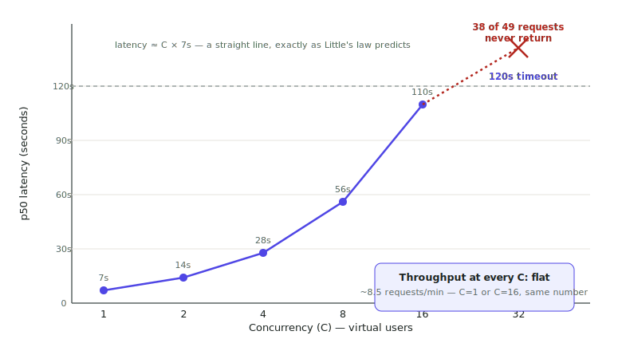

# Lecture 03 — Load-Test It Until It Breaks

> **In one sentence:** We point a swarm of virtual users at our endpoint and watch it drown in slow motion — because the numbers it breaks at, and the *way* it breaks, decide everything we build for the next nine weeks.

**Last time:** Lecture 02 proved the service answers one caller correctly — it never tested what happens with more than one. **This time:** we throw concurrent users at it on purpose and watch exactly how, and where, it falls over.

## Learning Objectives

- Build a closed-loop load generator and read its output like an engineer: throughput, p50/p95/p99, error rate.
- Explain why latency grows linearly with concurrency while throughput stays pinned at a ceiling.
- Watch the API layer and the GPU layer live, side by side, and catch `nvidia-smi` lying about "100% GPU utilization" — while `/metrics` shows the API layer clearly struggling and the GPU layer barely moving.

## Prerequisites

| Concept | Needed? | Notes |
| --- | --- | --- |
| Lectures 01b–02 | Yes | The endpoint from `serve.py` must be running, with its `/metrics` route |
| async Python | Light | We read `asyncio` code; we don't write it from scratch |
| Statistics | No | Percentiles are defined when they appear |

## Story

The link you gave your manager worked. So on Monday, the support team got an email: *"AI assistant is live — try it!"*

At 9:00 sharp, **forty support agents** click it at once.

Every system that has ever fallen over in public fell over like this: not from one big request, but from many ordinary ones arriving faster than they leave. Queues are older than computing, and they always look the same.

<figure>
  
  <figcaption>A queue forms for one reason only: arrivals outpace service. Nothing about the server has to change for the line to grow without bound. <em>Photo: Wikimedia Commons, public domain</em></figcaption>
</figure>

Today we simulate those forty agents — on purpose, with instruments attached — and record exactly where and how our one-operator switchboard dies.

## Mental Model

> **Our service is a shop with one till.** Checkout takes ~7 seconds per customer, no matter how long the line is. So the shop's *throughput* is fixed — one customer per 7 seconds, forever — and every extra person in line pays the full line's wait. The till doesn't break. **The queue is the breakage.**

<figure>
  
  <figcaption>One till, one speed, a growing line — every concurrent user in this lecture is one more shopper joining it. <em>Photo: Wikimedia Commons, CC0</em></figcaption>
</figure>

Three quantities, one relationship — worth memorizing before the math page makes it precise:

| Name | Symbol | At our shop |
| --- | --- | --- |
| Service time | \\(S\\) | ~7 s per answer |
| Throughput ceiling | \\(1/S\\) | ~8.5 answers/min, *no matter what* |
| Latency at concurrency \\(C\\) | \\(\approx C \times S\\) | 10 people in line → 70 s each |

Latency curves bend; throughput ceilings don't. When you see flat throughput and climbing latency, you're not "slowing down" — you're queueing.
{: .remember}

## The System

Same environments as before — server in the Studio, and one honesty rule for load tests:

| Environment | Role in this lecture |
| --- | --- |
| ⚡ Lightning Studio, terminal 1 | `serve.py` — the victim |
| ⚡ Lightning Studio, terminal 2 | `load_test.py` — the swarm (same machine: we're measuring the *server*, not the internet) |
| ⚡ Lightning Studio, terminal 3 | `live_dashboard.py` — watching both the API layer and the GPU layer while the swarm runs |
| 💻 Your laptop | Optional: rerun the swarm over the public URL later and compare |

The generator is **closed-loop**: each virtual user asks, waits for the full answer, then immediately asks again. \\(C\\) users means at most \\(C\\) requests in flight — a faithful model of \\(C\\) impatient support agents.

## The Build

This lecture's folder, `code/module-1-foundations/03-load-test-it-until-it-breaks/`, is a copy-forward of Lecture 02's folder with two new files: `load_test.py` and `live_dashboard.py`.

```bash
git clone https://github.com/gaurav98095/Course-on-AI-Engineering.git   # skip if already cloned
cd Course-on-AI-Engineering/code/module-1-foundations/03-load-test-it-until-it-breaks
pip install -r requirements.txt     # adds httpx
python ingest.py                    # rebuild the indexes in this folder
```

### Step 1 — Meet the weapon

The heart of `load_test.py` is ten lines — one virtual user:

```python
async def user(client, url, deadline, latencies, errors):
    while time.perf_counter() < deadline:
        q = random.choice(QUESTIONS)
        t0 = time.perf_counter()
        try:
            r = await client.post(f"{url}/predict",
                                  json={"question": q, "max_new_tokens": 200})
            r.raise_for_status()
            latencies.append(time.perf_counter() - t0)
        except Exception as e:
            errors.append(type(e).__name__)
```

`asyncio.gather` launches \\(C\\) of these; at the end we sort the latencies and read off percentiles. Note `max_new_tokens=200` — shorter answers than the baseline, so each sweep level fits in 3 minutes.

### Step 2 — Sanity at concurrency 1

The output below reports **p50/p95/p99** — the latency under which 50%, 95%, and 99% of requests finish. At one user they're nearly identical; watch them spread apart as concurrency climbs.

```bash
python load_test.py --concurrency 1
```

```text
 conc  done  err  req/min   p50 s   p95 s   p99 s
    1    25    0      8.4     7.0     7.6     7.9
```

(Ballpark, L40S, bf16 — as always, your numbers are the real ones.) ~7 s per answer at 200 tokens: consistent with our Lecture 01 baseline. The instrument agrees with history; now we can trust it.

### Step 3 — Two users. Feel the queue.

```bash
python load_test.py --concurrency 2
```

```text
    2    25    0      8.4    14.1    15.0    15.2
```

Read both numbers. Throughput: **unchanged**. Latency: **doubled** — for *everyone*, both users, every request.

Nothing got slower inside the GPU. The second user simply waits a full service time, then pays their own. One operator, two calls.

### Step 4 — The sweep

```bash
python load_test.py --sweep 1 2 4 8 16 32
```

What you should see, in shape if not in digits:

```text
 conc  done  err  req/min   p50 s   p95 s   p99 s
    1    25    0      8.4     7.0     7.6     7.9
    2    25    0      8.4    14.1    15.0    15.2
    4    26    0      8.6    27.8    29.5    30.1
    8    25    0      8.4    55.9    59.7    61.0
   16    24    0      8.1   109.8   118.4   119.6
   32    11   38      6.8   142.3   149.9   150.0
```

Three stories in one table:

**Throughput is a flat line.** ~8.5 requests/min at every level. That is the till's speed, and no amount of demand changes it.

**Latency is a straight ramp.** p50 ≈ \\(C \times 7\\) s, exactly as the mental model predicted. At 16 concurrent users, two minutes per answer.

**Then the cliff.** At 32, requests start outliving the server's 120 s timeout. They don't come back slow — they **don't come back**. Latency problems become availability problems at a hard edge, not a slope.

<figure>
  
  <figcaption>Same data as the table, easier to feel: one straight line climbing, one flat line underneath it — until the line climbs straight off the chart.</figcaption>
</figure>

> Forty support agents at 9:00 means p50 near **five minutes** and a third of requests erroring. The launch email was a denial-of-service attack we sent ourselves.

### Step 5 — Now catch the GPU lying

Lecture 02's `/metrics` route already combines both sides of the split it taught you to see — API-layer counters and GPU vitals, in one response. While the sweep runs, ⚡ *in a third terminal*, watch both at once:

```bash
python live_dashboard.py
```

```text
polling http://localhost:8000/metrics every 1.0s -> dashboard.csv (Ctrl-C to stop)

      t  API layer                         ||  GPU layer
t=  1.0s  requests=   2  errors=  0  p50=   7.1s   ||   gpu_util= 99%  gpu_mem=  17820MiB
t=  2.0s  requests=   2  errors=  0  p50=   7.1s   ||   gpu_util= 97%  gpu_mem=  17820MiB
t=  3.0s  requests=   3  errors=  0  p50=   7.3s   ||   gpu_util=100%  gpu_mem=  17904MiB
...
t= 16.0s  requests=  14  errors=  0  p50=  55.9s   ||   gpu_util= 98%  gpu_mem=  18012MiB
```

(Ballpark — your own numbers are the real ones.)

**What those numbers mean.** Read the two halves side by side: `gpu_util` sits near 90% almost the whole time, at every concurrency level — it barely moves between \\(C=2\\) and \\(C=16\\), while the API layer's `p50` climbs from 7 seconds to nearly a minute. The card *swears* it's consistently busy. But look at our own throughput numbers: aggregate tokens/sec at \\(C=16\\) is the same as at \\(C=1\\). Busy is not the same as productive.

Here's the arithmetic the whole of Module 2 hangs on. Generating one token costs roughly \\(2 \times 8\text{B} = 16\\) GFLOPs — a rule of thumb (2 FLOPs per parameter per output token) that Lecture 04 derives properly. At ~30 tokens/sec — Lecture 01's own baseline throughput, still true here since one request at a time is exactly what Lecture 01 measured — that's ~**0.5 TFLOP/s** of actual work — on a card rated for **362 TFLOP/s** of bf16 compute (Lecture 04's table — this is the same L40S, dense FP16, straight off NVIDIA's datasheet).

**We are using well under 1% of the machine we're paying for.**

`nvidia-smi`'s "utilization" only means "a kernel was running" — it says nothing about how full the ALUs are. What decode at batch 1 actually does all day is *move 16 GB of weights through memory for every single token*. The card isn't computing; it's hauling. Lecture 04 gives this observation a name — memory-bound — and a picture you'll use for the rest of your career.

The GPU was never the bottleneck today. One-at-a-time scheduling was. The fix is not a faster card; it's serving smarter — and there's a factor of ~100 sitting on the table.
{: .remember}

## Measure It

This lecture's artifact *is* the sweep table — save it; the whole course reports progress against it:

| Metric | Value (ballpark, L40S, bf16, 200-tok answers) | The verdict |
| --- | --- | --- |
| Throughput ceiling | ~8.5 req/min ≈ 510 answers/hr | One operator |
| p50 @ C=16 | ~110 s | Unusable |
| First errors | C≈18 (when \\(C \times S\\) crosses the 120 s timeout) | The cliff |
| GPU compute actually used | < 1% of rated bf16 FLOPs | The scandal |
| Cost per answer | ~\$0.002 (at ~\$1/hr ÷ 510/hr) — **at every C** | Queueing never made it cheaper |

## The Math, One Level Deeper

Everything in that table obeys one law you can derive on a napkin. **Little's law**: in any stable system, the average number of requests inside it, the arrival rate, and the time each request spends inside are locked together:

\\[
L \;=\; \lambda \, W
\\]

Our closed loop pins \\(L = C\\) (each user always has exactly one request in flight) and the server pins throughput at \\(\lambda = 1/S\\). Solve for the wait:

\\[
W \;=\; \frac{L}{\lambda} \;=\; C \times S
\\]

— which is precisely the straight ramp in our table: \\(16 \times 7 \approx 110\\) s. One worked number, zero mystery left.

The *open* world — real users arriving whenever they want, not waiting politely — is crueler. Our closed loop can never have more than \\(C\\) requests in flight, because each virtual user politely waits its turn; real traffic keeps arriving even while the server is behind, so the queue can grow past anything a fixed \\(C\\) would show you. And p95 explodes before the mean does, because one unlucky request stuck behind a burst of others pays for *everyone* ahead of it in line — a cost the median, sitting comfortably in the middle of the pack, never sees.

> **Want the full derivation?** Utilization ρ, the M/M/1 waiting-time formula, why p95 ≈ 3× the mean near saturation, and the classic way load tests lie (coordinated omission):
> [Math Deep Dive 03 — Queues, Percentiles, and Why p95 Explodes →](../math/03-queues-and-percentiles.md)

## Where It Breaks

Today the *system* broke on schedule. What can break silently is the **measurement**:

**Closed loops are polite.** Our virtual users wait for an answer before sending the next request — so when the server slows, the load *automatically eases off*. Real users don't ease off; they arrive anyway (and hit refresh). Closed-loop numbers are therefore a *lower bound* on the pain. The math page covers the fix's name: coordinated omission.

**Timeouts convert latency into errors.** Whoever sets the timeout decides where "slow" becomes "down". Our 120 s made the cliff land at C≈18; a 30 s timeout would put it at C≈4. Same server, very different-looking incident.

**Single numbers lie.** "8.5 req/min" and "p50 7 s" are both true at C=1 and catastrophic at C=16. A capacity claim without a concurrency and a percentile attached is marketing, not engineering.

## Exercises

1. **Shrink the answers.** Rerun the sweep with `max_new_tokens=50` in `load_test.py`. Predict the new ceiling from \\(1/S\\) *before* you run — then check.
2. **Predict the cliff.** With your measured \\(S\\) and the 120 s timeout, compute the concurrency where errors must begin. Verify with a targeted `--concurrency` run.
3. **Cost per answer.** Using your Studio's hourly price, compute \$/answer at C = 1, 8, 16. Explain in one sentence why it barely moves — and what, therefore, is the *only* way to make answers cheaper.
4. **The internet tax.** 💻 From your laptop, rerun `--concurrency 4` against the public URL. Compare p50 with the in-Studio run: how many milliseconds is the network worth compared to the queue?
5. **Draw it.** Plot p50 vs concurrency from your sweep (any tool, even a notebook). Mark the timeout as a horizontal line. You've just drawn your first capacity plan.
6. **Log the correlation.** Rerun the sweep with `live_dashboard.py` writing to `dashboard.csv`. Plot `latency_p50_s` against `gpu_util_pct` on the same time axis — does GPU utilization ever spike the way latency does, or does it stay nearly flat the whole time? That flatness *is* Lecture 02's "two systems" argument, made visible.

## Summary

We built a swarm, calibrated it at C=1, and marched it up to C=32. Throughput never moved — ~8.5 answers/min, the single-operator ceiling. Latency climbed the straight ramp Little's law demands, then fell off the timeout cliff into errors. And under it all, `nvidia-smi` claimed 100% while the GPU used less than 1% of its arithmetic — busy hauling weights, not computing. The system didn't fail; it queued. Fixing *that* is Module 2.

> **What should you remember?**
> - Flat throughput + linear latency = queueing. \\(L = \lambda W\\) explains every number in the sweep.
> - Timeouts turn slow into down at a hard edge; someone chooses where.
> - "100% GPU util" ≠ compute: decode at batch 1 uses <1% of the ALUs. The 100× we're about to chase is real.

## Resources

- John Little, *A Proof for the Queuing Formula L = λW* (1961) — the law itself.
- Gil Tene, *How NOT to Measure Latency* — the coordinated-omission talk every engineer should watch once.
- Brendan Gregg, *The USE Method* — utilization, saturation, errors: the checklist we just lived through.

---

[← Previous: Lecture 02 — Deploy It on a GPU](02-deploy-it-on-a-gpu.md) · [Course Home](../index.md) · [Next: Lecture 03b — Fix It at the API Layer, First →](03b-api-layer-concurrency.md)
