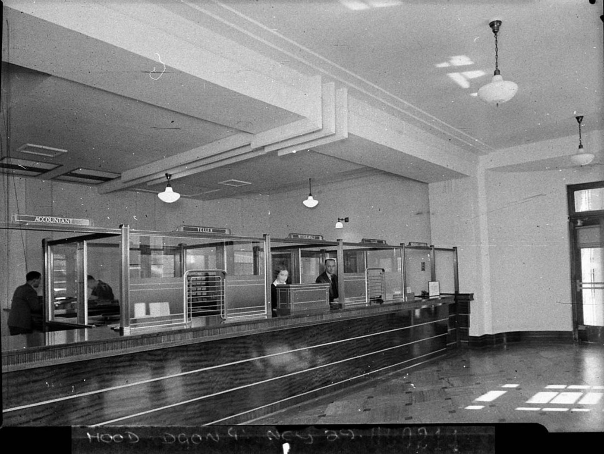
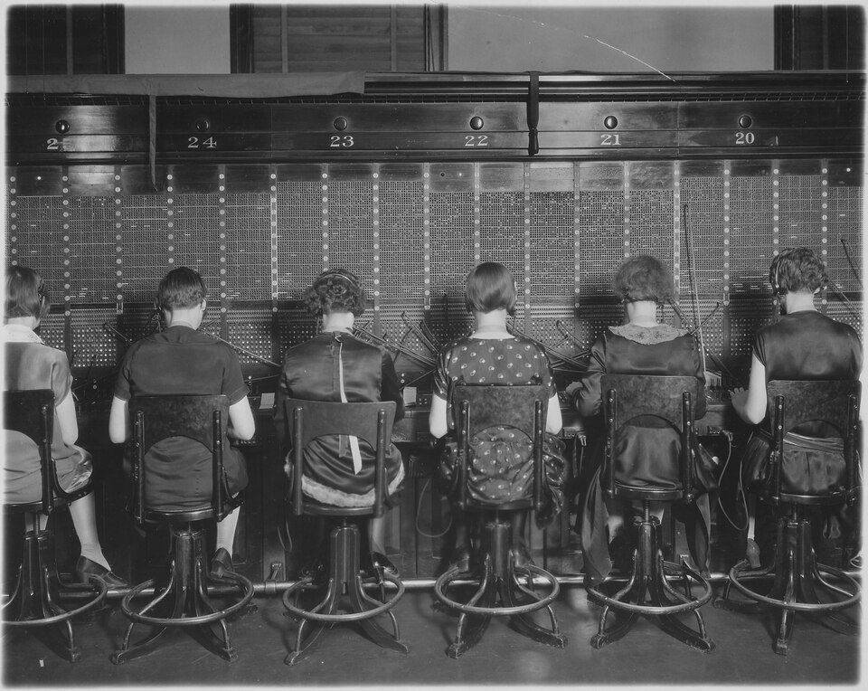
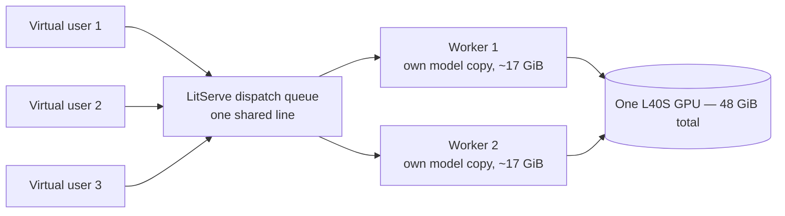
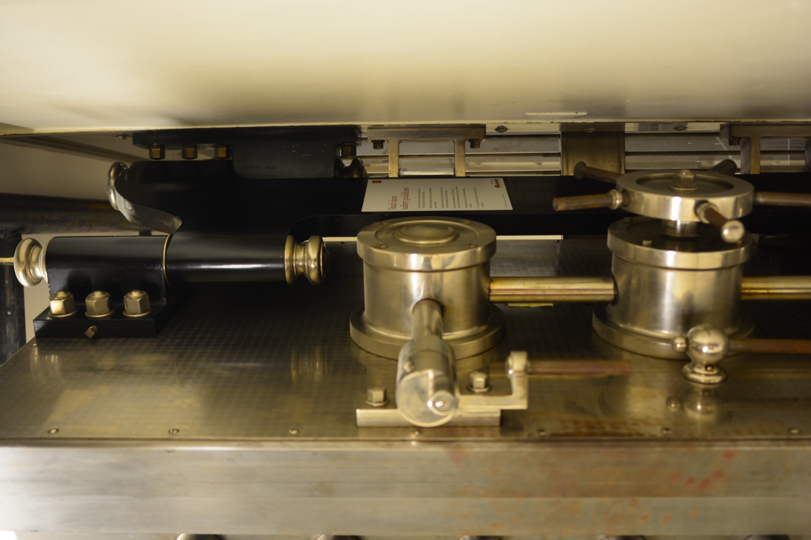

# Lecture 03b — Fix It at the API Layer, First

> **In one sentence:** Before we touch the model at all, we fix what's cheap and already ours — the serving layer — and measure exactly how far "just add workers" goes before the GPU's own memory says no.

**Last time:** the sweep proved the GPU sat under 1% utilized while p50 climbed a straight ramp — one till, one line, and Module 2 was the only fix on offer. **This time:** we open a second till on the very same GPU, prove it with the identical sweep, and find the honest ceiling on how far that trick goes.

*[Lecture 00's map](00-the-system-we-are-building.md): still box (B) — the API layer — getting its first, cheapest fix.*

## Learning Objectives

- See that Lecture 03's queue wasn't inevitable — it was a config default, `workers_per_device=1`, sitting in `serve.py` the whole time.
- Fix it the cheap way: add a second worker process, rerun Lecture 03's exact sweep, and watch the throughput ceiling move and the latency ramp halve.
- Turn the `in_flight_estimate` placeholder Lecture 02 left honestly at zero into a real number, using LitServe's own request-tracking.
- Find the ceiling on this lever with a real measurement, not a guess: how many tills fit in one GPU's memory before a worker refuses to start.

## Prerequisites

| Concept | Needed? | Notes |
| --- | --- | --- |
| Python | Yes | Same `serve.py` / `load_test.py` pair as Lecture 03 |
| Lecture 02 | Yes | `serve.py`'s LitServe setup and `/metrics` route — we're changing one constructor argument in it |
| Lecture 03 | Yes | The sweep, the mental model, Little's law — we reuse `load_test.py` completely unchanged |

## Story

Monday's launch email brought forty support agents to one till, and Lecture 03 recorded exactly how that failed: flat throughput, a latency ramp, then a timeout cliff at concurrency 18.

A real manager watching that line out the door does not, on day one, redesign the cash register. **They open a second till.**

<figure>
  
  <figcaption>Six windows, six clerks, one branch. Nobody rebuilt the vault to serve more customers — they opened more windows onto the same one. <em>Photo: State Library of NSW / Sam Hood, 1937, public domain.</em></figcaption>
</figure>

That is the whole idea of this lecture, and it costs one line of config, not a rewrite. The question worth asking before we run it: what, exactly, do those extra windows share that a single vault can't stretch to cover?

## Mental Model

> **Opening a second till doesn't make the till faster. It buys a second line — and both lines draw from the same stockroom out back.** Two cashiers, each still ~7 s per customer, now serve two customers at once: throughput doubles, and the wait at any given concurrency roughly halves. But the stockroom — one GPU's memory — doesn't double. Open enough tills and *it*, not the counter, becomes the new limit.

<figure>
  
  <figcaption>Lecture 02's switchboard had one operator. Here are six, side by side, sharing one exchange — the same move `workers_per_device` makes inside one GPU. <em>Photo: Chesapeake and Potomac Telephone Co., 1927, U.S. National Archives, public domain.</em></figcaption>
</figure>

Three quantities, extending Lecture 03's table with one new column:

| Name | Symbol | At \\(N=1\\) till | At \\(N\\) tills |
| --- | --- | --- | --- |
| Service time | \\(S\\) | ~7 s per answer | ~7 s per answer (unchanged) |
| Throughput ceiling | \\(1/S\\) | ~8.5 answers/min | \\(N \times 8.5\\) answers/min |
| Latency at concurrency \\(C\\) | \\(C \times S\\) | 16 people → 112 s | \\(\lceil C/N \rceil \times S\\) |

Nothing about the *till* changed — one request still takes 7 seconds, and one request still uses under 1% of the GPU's compute. We didn't make the work faster; we bought more lines to do the same work in parallel.
{: .remember}

## The System

Same server, same load generator, one new constructor argument. The dispatch queue is the part worth drawing, because it's the part doing the actual work of "opening a second till":



| Environment | Role in this lecture |
| --- | --- |
| ⚡ Lightning Studio, terminal 1 | `serve.py --workers N` — the same victim, now with N tills |
| ⚡ Lightning Studio, terminal 2 | `load_test.py` — Lecture 03's swarm, completely unchanged |
| ⚡ Lightning Studio, terminal 3 | `live_dashboard.py` — now showing a real `in_flight_estimate` |

One request still goes into one queue and gets served by whichever worker is free next — a **shared** queue, not \\(N\\) separate lines. That distinction turns out to matter more than it sounds; the math page proves it.

## The Build

⚡ This lecture's folder, `code/module-1-foundations/03b-api-layer-concurrency/`, is a copy-forward of Lecture 03's folder with exactly one file changed: `serve.py`.

```bash
git clone https://github.com/gaurav98095/Course-on-AI-Engineering.git   # skip if already cloned
cd Course-on-AI-Engineering/code/module-1-foundations/03b-api-layer-concurrency
pip install -r requirements.txt     # no new deps -- litserve was already here
python ingest.py                    # rebuild the indexes in this folder
```

### Step 1 — Find the default that queued you

Lecture 03 never set `workers_per_device`. LitServe's own default is `1`:

```python
server = ls.LitServer(api, accelerator="gpu", timeout=120)
# workers_per_device defaults to 1 -- this line IS Lecture 03's ceiling
```

The queue Lecture 03 measured wasn't the GPU being slow. It was this default, unexamined.

### Step 2 — Open a second till

```python
ap.add_argument("--workers", type=int, default=1)
...
server = ls.LitServer(api, accelerator="gpu", timeout=120,
                       workers_per_device=args.workers, track_requests=True)
```

`track_requests=True` is the second change — it turns on LitServe's own in-flight request counter, summed across every worker, so `/metrics` can finally report something real instead of a hardcoded zero.

```bash
python serve.py --workers 2
```

```text
serving with 2 worker(s) on this GPU
models loaded, serving
models loaded, serving
```

Two `setup()` calls, not one — each worker loads its own copy of the model, in its own process, roughly back-to-back. Budget twice Lecture 01's ~90 s cold start before testing.

### Step 3 — Rerun Lecture 03's exact sweep

Not a new script — the same `load_test.py`, unchanged, against the two-worker server:

```bash
python load_test.py --sweep 1 2 4 8 16 32
```

```text
 conc  done  err  req/min   p50 s   p95 s   p99 s
    1    25    0      8.5     7.1     7.6     7.9
    2    26    0     17.0     7.3     7.9     8.2
    4    26    0     17.1    14.2    15.1    15.4
    8    25    0     17.0    28.0    29.8    30.3
   16    24    0     16.9    56.1    59.9    61.2
   32    22    2     16.7   109.7   118.0    122.4
```

(Ballpark, L40S, bf16, `--workers 2` — your numbers are the real ones.) Read \\(C=2\\) first: **both** requests now finish in ~7 s, not the doubled ~14 s Lecture 03 measured — the second user finally has their own till instead of waiting behind the first.

### Step 4 — Watch the stockroom fill up

⚡ In a spare terminal, while `serve.py --workers 2` is idling:

```bash
python gpu_vitals.py --seconds 10
```

```text
mem_used_mib ≈ 33,800   # roughly 2x Lecture 01b's single-copy ~16-17 GiB baseline
```

Two copies of the same 8B model's weights, resident at once, on the one 48 GiB card. Nothing else moved — same model, same precision, same weights — we just paid for them twice.

### Step 5 — Push it until it says no

```bash
python serve.py --workers 3
```

```text
serving with 3 worker(s) on this GPU
models loaded, serving
models loaded, serving
torch.cuda.OutOfMemoryError: CUDA out of memory. ...
```

(Ballpark — the exact worker that fails, and whether it fails at all, depends on your card's free VRAM at that moment.) Three copies of ~17 GiB each is ~51 GiB, before a single request's KV cache or activations — over budget on a 48 GiB L40S. The math page derives this ceiling in one line; today we just watched it happen.

## Measure It

Same benchmark table Lecture 03 started, one more row:

| Metric | \\(N=1\\) (Lecture 03) | \\(N=2\\) (today) | The verdict |
| --- | --- | --- | --- |
| Throughput ceiling | ~8.5 req/min | ~17 req/min | Doubled, free, same GPU bill |
| p50 @ C=16 | ~110 s | ~56 s | Halved |
| First errors | C≈18 | C≈34 | Cliff pushed out, not removed |
| GPU memory at idle | ~16–17 GiB | ~34 GiB | The stockroom cost of the second till |
| \\(N=3\\) | — | OOM | The ceiling, measured, not guessed |
| Cost per answer | ~\$0.002 | ~\$0.001 | Half — same rented hour, twice the answers |

## The Math, One Level Deeper

Little's law didn't change — we just gave it a bigger throughput ceiling to work with. With \\(N\\) workers sharing one dispatch queue, the ceiling becomes \\(N/S\\) instead of \\(1/S\\), and the wait shrinks in proportion:

\\[
W = \frac{C}{N/S} = \frac{C}{N}\times S
\\]

One worked number: \\(C=16\\), \\(N=2\\), \\(S=7\\) s gives \\(W \approx 56\\) s — exactly half of Lecture 03's 112 s, because the queue is now splitting the same 16 people across two tills instead of one.

What that equation can't tell you is *how far you can push \\(N\\)* — that's a memory question, not a queueing one, and it has its own closed-form answer: \\(N_{\max} = \lfloor V/v \rfloor\\), total GPU memory over memory per worker. Plug in 48 GiB over ~17 GiB and you get 2 — which is exactly the ceiling Step 5 just measured, not a coincidence.

> **Want the full derivation?** The shared-queue-vs-split-queues proof (why one line beats \\(N\\) separate ones at equal load), the memory-ceiling arithmetic, and why this lever tops out in the single digits while Module 2's levers don't:
> [Math Deep Dive — Pooling: Why One Queue Beats N, and Where the Backroom Runs Out →](../math/03b-replica-pooling.md)

## Where It Breaks

**Replication is not the same fix as Module 2's.** Each worker still runs one request at under 1% of the GPU's real compute — we didn't make the till faster, we bought more of the same slow till. Quantization, FlashAttention, and continuous batching change \\(S\\) and \\(v\\) themselves; replication changes neither.

<figure>
  
  <figcaption>Every till in the branch draws from this one vault. Add enough tills and the vault, not the counter, is what tells you to stop. <em>Photo: Joe Mabel, CC BY-SA 4.0.</em></figcaption>
</figure>

**The ceiling is low precisely because the fix is generous.** \\(N_{\max}=2\\) or \\(3\\) is a real, free win — but it's a small multiplier next to the ~100x Lecture 03 already told you was sitting on the table. A bigger card raises \\(N_{\max}\\); it doesn't change the shape of the argument.

**This still isn't a fleet.** `workers_per_device` replicates inside *one* GPU we're already renting. Scaling across many GPUs behind a real load balancer — the same pooling idea, a different \\(N\\), a much higher ceiling — is Module 3's job, once Module 2 has made each individual GPU worth replicating.

**One shared queue is doing more work here than it looks like.** If requests instead picked a till and committed (as at a badly designed grocery store), an unlucky customer behind one long generation would wait even with an idle neighbor till two feet away. LitServe already gives you the shared-queue version for free — but it's worth knowing that's *why* this works as well as it does, not just that it works.

## Exercises

1. **Confirm the halving.** Rerun `load_test.py --sweep 1 2 4 8 16` at `--workers 1` and `--workers 2` back to back. Compute the ratio of each level's p50 — is it close to 2, as the math predicts?
2. **Find your own \\(N_{\max}\\).** Using `nvidia-smi` (or `gpu_vitals.py`) at idle with `--workers 1`, read your model's actual per-worker memory footprint, and compute \\(N_{\max} = \lfloor V_{\text{your GPU}} / v \rfloor\\) before you try `--workers 3`. Did the prediction match what happened?
3. **LitServe's other lever.** Set `max_batch_size=4, batch_timeout=0.01` in `serve.py` with `--workers 1` and rerun the sweep. Does throughput move at all with only one worker? This is LitServe's own *static* batching — Lecture 13 builds the smarter, continuous version from scratch, and explains why static batching alone won't get you the rest of the way.
4. **Cost, not just latency.** Using your Studio's hourly price and today's measured throughput at \\(N=1\\) and \\(N=2\\), compute \$/answer for both. Confirm it moved by roughly the same factor as \\(N\\) — the GPU bill didn't change, only the answers per hour did.
5. **Read `restart_workers`.** Look up LitServe's `restart_workers` flag. Write one sentence on what problem it solves that a single-till system never had to worry about.

## Summary

Lecture 03's queue was never the GPU's fault — it was `workers_per_device=1`, a default nobody had looked at. We changed one constructor argument, reran Lecture 03's exact sweep unchanged, and watched throughput double and latency halve for free. Then we pushed the same lever until the GPU's own memory said no: three copies of one model's weights didn't fit in 48 GiB, and the math predicted the exact number before we ever ran the command. Replication is real, it's cheap, and it tops out fast — which is exactly why the rest of Module 2 exists.

> **What should you remember?**
> - A worker-process default is a config choice, not a law of physics — check it before blaming the hardware.
> - \\(N\\) tills sharing one queue: throughput ceiling becomes \\(N/S\\), wait becomes \\((C/N)\times S\\) — same Little's law, bigger ceiling.
> - The ceiling on "just add workers" is memory, not compute: \\(N_{\max} = \lfloor V/v \rfloor\\), and it's small because each worker pays full price for its own copy of the weights.

## Resources

- LitServe documentation — `workers_per_device`, `track_requests`, and `restart_workers`.
- Agner Krarup Erlang, *The Theory of Probabilities and Telephone Conversations* (1909) — the original pooling result behind M/M/N, from the same telephone-exchange world as this lecture's photo.
- John Little, *A Proof for the Queuing Formula L = λW* (1961) — the same law from Lecture 03, still doing all the work.

---

[← Previous: Lecture 03 — Load-Test It Until It Breaks](03-load-test-it-until-it-breaks.md) · [Course Home](../index.md) · [Next: Lecture 04 — The GPU: Architecture, HBM, and the Roofline Model →](04-the-gpu-architecture-and-roofline.md)
