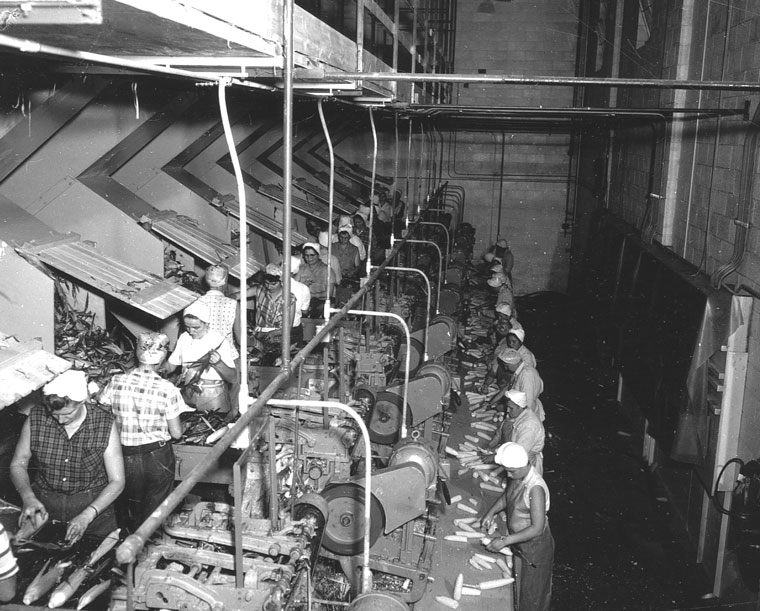
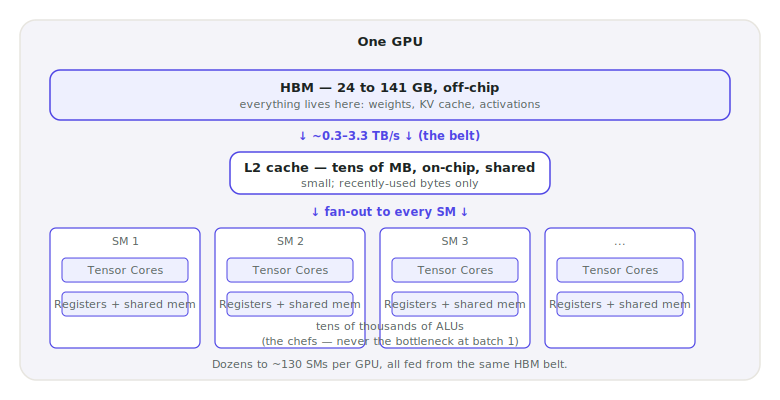
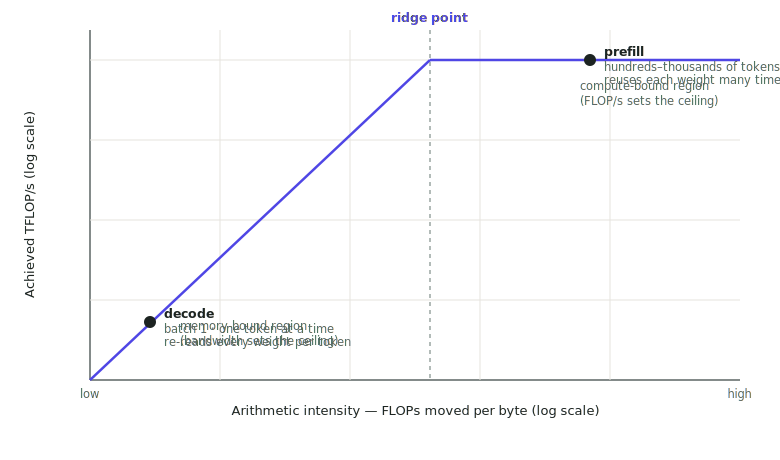
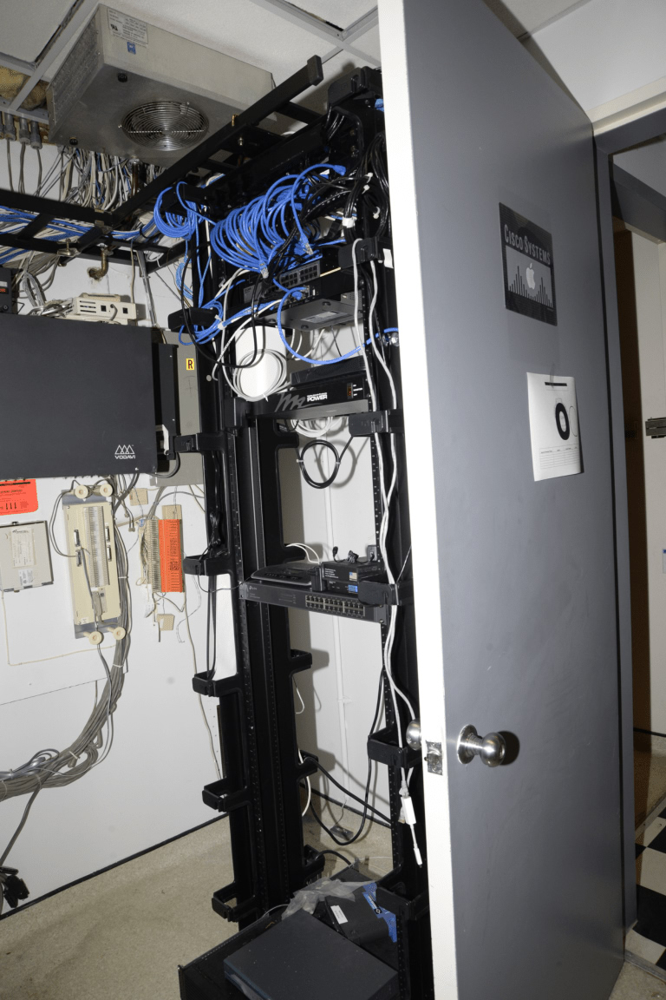

# Lecture 04 — The GPU: Architecture, HBM, and the Roofline Model

> **In one sentence:** We open the GPU up, name its parts, and derive one plot — the roofline — that predicts, from arithmetic alone, why decode was slow and prefill was fast in every measurement we've taken so far.

**Last time:** Lecture 03b's second worker doubled throughput but still left every request using under 1% of the GPU's real compute — replication bought more tills, not a faster one, and the "100% utilization but <1% real work" contradiction from Lecture 03 still had no explanation. **This time:** we open the GPU up and build the model that explains exactly why both numbers were true at once.

## Learning Objectives

- Name the GPU's parts — SMs, Tensor Cores, HBM, L2 cache — and state which of them decode actually uses.
- Derive arithmetic intensity and the roofline model, and compute your own GPU's ridge point.
- Measure, empirically, that decode is memory-bound and prefill is compute-bound — with your own numbers, on your own card.

## Prerequisites

| Concept | Needed? | Notes |
| --- | --- | --- |
| Lecture 03 | Yes | We're explaining the <1% GPU utilization number it measured |
| Matrix multiplication | Yes | FLOPs and bytes of a matmul, nothing deeper |
| CUDA internals | No | We build the mental model from scratch today |

## Story

Lecture 03 ended on an uncomfortable number: `nvidia-smi` said **100%**, but our own math said the GPU was doing **less than 1%** of the arithmetic it's capable of.

That is not a contradiction. It's a clue we haven't followed yet.

Picture a kitchen with world-class chefs — fast, skilled, ready. But ingredients arrive on a single narrow conveyor belt, one at a time. The chefs are **never idle** in the sense that they're always reaching for the next ingredient the moment it arrives. But they are also never limited by their own speed. They are limited by the belt.

<figure>
  
  <figcaption>Cornwall Canning, 1950: busy hands, idle capacity — the chefs of this story, on their belt. Workers are never waiting for permission; they're waiting for corn. <em>Photo: Wikimedia Commons, public domain</em></figcaption>
</figure>

A GPU running decode is this kitchen. `nvidia-smi`'s "100%" means *a kernel was always running* — the chefs were always reaching. It says nothing about whether they ever got to cook at full speed.

Today we build the tool that tells the difference: the **roofline model**. One plot, one number per workload, and you will never again be fooled by a utilization percentage.

## Mental Model

> **The GPU has chefs (compute) and a conveyor belt (memory bandwidth). A dish is slow because the chef is slow, or because the belt is slow — never both at once, and the roofline model tells you which.**

Two ceilings, and every workload hits exactly one of them:

| Ceiling | What limits you | Unit | Analogy |
| --- | --- | --- | --- |
| Compute ceiling | How fast the Tensor Cores can multiply-add | TFLOP/s | Chef's top speed |
| Bandwidth ceiling | How fast HBM can feed the chip | GB/s | Belt's top speed |

The ratio of the two ceilings is a single number — the **ridge point** — measured in FLOPs per byte. Compare it against your workload's own FLOPs-per-byte, its **arithmetic intensity**, and you instantly know which ceiling you're under.

A workload is compute-bound or memory-bound depending on one ratio: how many FLOPs it does per byte it moves, compared to the GPU's own ridge point.
{: .remember}

## The System

Open the box. Every GPU used in this course has the same three-layer shape:

<figure>
  
  <figcaption>HBM holds everything; L2 is a small fast staging area; each SM does the actual arithmetic. The belt is HBM → L2 → SM. The chefs are the Tensor Cores.</figcaption>
</figure>

Read it bottom to top, the way a number actually travels: a weight sits in **HBM** (24–141 GB depending on the card — your Studio's L40S has 48). To multiply it against an activation, it must first cross into the small, fast **L2 cache** (tens of MB), then into a **streaming multiprocessor (SM)** — the chip's actual compute unit, dozens to over a hundred per GPU — and into that SM's registers, where the **Tensor Core** finally does the multiply-add.

That crossing has a price, and the price is what the roofline model measures.

| GPU (this course may use) | HBM bandwidth | FP16 Tensor Core (dense) | Ridge point |
| --- | --- | --- | --- |
| L4 (24 GB) | 300 GB/s | ~121 TFLOP/s | ~403 FLOPs/byte |
| L40S (48 GB) — our Studio | 864 GB/s | 362 TFLOP/s | ~419 FLOPs/byte |
| A100 80GB SXM | 2,039 GB/s | 312 TFLOP/s | ~153 FLOPs/byte |
| H100 SXM | 3,350 GB/s | 989 TFLOP/s | ~295 FLOPs/byte |

*(NVIDIA datasheet figures, dense — no structured sparsity, which real LLM matmuls don't use.)*

Notice something: the ridge point doesn't simply grow with the fancier card. A100 has **more** bandwidth than L40S but a **lower** ridge point, because its compute grew less than its bandwidth did. Which GPU is "better" for decode depends on the shape of *your* workload — this table is a preview of a real capacity decision, not just trivia.

Here is the plot that table is quietly describing — the roofline itself, with decode and prefill placed on it:

<figure>
  
  <figcaption>Two straight lines on log-log axes. Everything left of the ridge point is bandwidth's problem; everything right of it is the chip's problem. Decode and prefill live on opposite sides.</figcaption>
</figure>

<figure>
  
  <figcaption>Somewhere behind your Lightning AI Studio's browser tab is a room exactly like this one — racks of GPUs, each with its own belt and its own chefs. <em>Photo: Wikimedia Commons, public domain</em></figcaption>
</figure>

## The Build

⚡ This lecture's folder, `code/module-1-foundations/04-the-gpu-architecture-and-roofline/`, is a copy-forward of Lecture 03b's folder with one new file: `roofline.py`. It needs no new dependencies.

```bash
git clone https://github.com/gaurav98095/Course-on-AI-Engineering.git   # skip if already cloned
cd Course-on-AI-Engineering/code/module-1-foundations/04-the-gpu-architecture-and-roofline
pip install -r requirements.txt
```

### Step 1 — Measure your own ceilings

Don't trust the datasheet blindly — measure what your card *actually* delivers, kernel launch overhead and all:

```python
def measure_compute_ceiling(dim=8192):
    a = torch.randn(dim, dim, dtype=torch.float16, device="cuda")
    b = torch.randn(dim, dim, dtype=torch.float16, device="cuda")
    t = timed(lambda: a @ b, warmup=5, iters=20)
    return (2 * dim**3) / t / 1e12   # TFLOP/s
```

A big square matmul reuses every loaded byte thousands of times — so this measures compute, almost nothing else. The bandwidth twin is a big elementwise add, which reuses *nothing* — every byte is loaded once, used once, thrown away:

```python
def measure_bandwidth_ceiling(n_elem=256*1024*1024):
    a = torch.randn(n_elem, dtype=torch.float16, device="cuda")
    b = torch.randn(n_elem, dtype=torch.float16, device="cuda")
    t = timed(lambda: a.add_(b), warmup=5, iters=20)
    return (3 * n_elem * a.element_size()) / t / 1e9   # GB/s
```

Run it:

```bash
python roofline.py
```

```text
GPU: NVIDIA L40S

measuring compute ceiling (large square matmul, fp16 tensor core)...
  achieved: ~310 TFLOP/s

measuring bandwidth ceiling (large elementwise add)...
  achieved: ~780 GB/s

ridge point on THIS run: ~397 FLOPs/byte
```

(Ballpark — achieved numbers always land under the datasheet's peak; ~80–90% is normal, the rest is real-world overhead the datasheet doesn't model.) Your own printed ridge point is the number the rest of today's lecture is measured against — not the table's.

### Step 2 — Don't let the benchmark cheat

A tempting shortcut — reuse one small weight matrix in a hot loop — would quietly sit inside L2 cache and report an unrealistically fast "memory" speed. Real serving never gets that luxury: every decoder layer has its *own* weights, so `roofline.py` rotates through 12 distinct matrices:

```python
weights = [torch.randn(d, d, dtype=torch.float16, device="cuda")
          for _ in range(N_LAYERS_SIM)]
def step():
    nonlocal i
    _ = x @ weights[i % N_LAYERS_SIM]
    i += 1
```

This one line is the difference between a benchmark that flatters your GPU and one that tells the truth.

### Step 3 — Read the real hidden size, don't guess it

Rather than assume a dimension, `roofline.py` asks the actual course model:

```python
cfg = AutoConfig.from_pretrained("Qwen/Qwen3-VL-8B-Instruct")
d = cfg.text_config.hidden_size
```

This downloads a small `config.json`, not the 16 GB of weights — seconds, not minutes.

### Step 4 — Sweep from decode to prefill

The core loop tries `tokens = 1, 2, 8, ... 2048` — batch 1 is pure decode, 2048 is a full prefill — and reports which side of the ridge point each one lands on:

```text
 tokens   AI (F/B)   time ms   TFLOP/s    GB/s        regime
      1        1.0     0.043       0.8      780  memory-bound
      2        2.0     0.043       1.6      780  memory-bound
      8        8.0     0.043       6.2      780  memory-bound
     32       31.5     0.044      24.6      780  memory-bound
    128      120.5     0.046      94.0      780  memory-bound
    512      409.6     0.055     310.0      757 compute-bound
   2048     1024.0     0.222     310.0      303 compute-bound
```

(Ballpark, L40S, `d`≈4096, using Step 1's own achieved ceilings — 310 TFLOP/s, 780 GB/s.) Three things to notice in that table, each one the roofline model made visible:

**GB/s is pinned at ~780 for every memory-bound row.** The belt runs at exactly one speed, regardless of how much work is queued behind it.

**Once `tokens` crosses the ridge, TFLOP/s pins at 310 instead.** The chefs are now the limit, and no amount of extra data waiting in the belt speeds them up.

**AI climbs with `tokens`** — almost exactly linearly while `tokens` is small (\\(t \ll d\\), the approximation from the math page), visibly bending below that line once `tokens` approaches `d` (512, 2048) as the correction term stops being negligible. Watch the **regime** column flip right around your measured ridge point.

## Measure It

The number this lecture exists to produce:

| Workload | Tokens | Arithmetic intensity | Regime | Matches |
| --- | --- | --- | --- | --- |
| Decode | 1 | ~1 FLOP/byte | memory-bound, deep left of the ridge | Lecture 03's <1% compute utilization |
| Our RAG's real prefill | ~1,800 | ~1,800 FLOPs/byte | compute-bound, deep right of the ridge | Lecture 01's ~1s TTFT on a big prompt |

> Batch-1 decode sits roughly **400× left** of the ridge point on an L40S. That is not a rounding error — it is the entire explanation for why one GPU can serve at most one fast conversation, and it is the single fact Module 2's kernels and batching strategies all attack.

## The Math, One Level Deeper

The intuition: every matmul does some FLOPs and moves some bytes. Their ratio — arithmetic intensity — is the *only* number that matters for deciding which ceiling applies:

\\[
\text{AI} = \frac{\text{FLOPs}}{\text{bytes moved}}, \qquad
\text{achievable TFLOP/s} = \min\bigl(\text{peak compute},\ \text{AI} \times \text{peak bandwidth}\bigr)
\\]

One worked number: a single linear layer, hidden size \\(d=4096\\), one token. FLOPs \\(= 2d^2 \approx 33.6\\)M; bytes (fp16 weight, dominant term) \\(= 2d^2 \approx 33.6\\)MB. **AI = 2d² / 2d² = 1** FLOP/byte, independent of \\(d\\) entirely — decode is memory-bound at *any* model size, by construction.

> **Want the full derivation?** Why the `min()` formula falls out of two straight lines on a log-log plot, the general formula for a GEMM's arithmetic intensity, why more batch is the same lever as more tokens, and where the roofline model's assumptions break (memory-compute overlap, multiple memory tiers):
> [Math Deep Dive 04 — Deriving the Roofline Model →](../math/04-roofline-model.md)

## Where It Breaks

**The roofline model assumes memory and compute can't overlap perfectly with everything else going on.** Real GPUs pipeline: the next tile's bytes can arrive while the current tile computes. The roofline is a hard *ceiling*, not a promise you'll reach it — real kernels commonly hit 60–90% of it, never more.

**One ridge point hides multiple memory tiers.** We measured HBM bandwidth. But L2 cache is faster still, and registers faster yet — a workload can be "compute-bound against HBM" while still wasting cycles on L2 traffic. The roofline is a first cut, not the final word (that's what `nsys`/`ncu` profiling gives us in Lecture 06).

**Batch size moves you along the line, not off it.** Serving 8 users at once (batch 8) doesn't change the *kind* of bottleneck — it just multiplies tokens-per-forward-pass, sliding your point rightward. Real serving frameworks push this as far right as they can. That's continuous batching, and it's most of Module 2's opening act.

## Exercises

1. **Find your card's real ridge point.** Run `roofline.py` and compare the achieved numbers against this lecture's table for your GPU. How close to the datasheet peak did you get, and why might it be lower?
2. **Predict before you measure.** Using \\(d\\) from your own `roofline.py` run, calculate by hand the AI at tokens = 4, 16, 64. Then check against the printed sweep.
3. **Cross the ridge on purpose.** Find the exact token count where your GPU's own sweep flips from memory-bound to compute-bound. Does it match \\(\text{tokens} \approx \text{ridge point}\\)?
4. **Bandwidth vs compute upgrade.** Using the GPU table, if you could double *either* your card's bandwidth or its compute — but not both — which would speed up decode more? Which would speed up prefill more?
5. **Back to Lecture 03.** Using today's ~1 FLOP/byte number for decode, recompute the "<1% GPU compute used" claim from Lecture 03's sweep, from scratch, using only arithmetic intensity and your measured ceilings.

## Summary

We opened the GPU: HBM feeding L2 feeding SMs, chefs and a conveyor belt. Arithmetic intensity — FLOPs per byte — tells you which one limits a given workload, and the ridge point is where the two ceilings cross. We measured both ceilings on our own card, then swept decode-shaped and prefill-shaped workloads across them and watched the regime flip exactly where the math said it would. Lecture 03's mysterious "100% util, <1% compute" is mysterious no longer: decode sits about 400× left of the ridge, by construction, on every GPU we listed.

> **What should you remember?**
> - Achievable TFLOP/s = min(peak compute, arithmetic intensity × peak bandwidth) — two lines on a log-log plot.
> - Decode's arithmetic intensity is ~1 FLOP/byte regardless of model size — it is *always* memory-bound.
> - The ridge point is a property of the GPU; arithmetic intensity is a property of the workload. Compare them, don't guess.

## Resources

- Williams, Waterman, Patterson, *Roofline: An Insightful Visual Performance Model for Multicore Architectures* (2009) — the original paper.
- NVIDIA Ampere/Ada/Hopper architecture whitepapers — where the peak numbers in this lecture's table come from.
- `nvidia-smi` and `nsys`/`ncu` — the profiling tools that turn "which regime" into "which line of code" (Lecture 06).

---

[← Previous: Lecture 03b — Fix It at the API Layer, First](03b-api-layer-concurrency.md) · [Course Home](../index.md) · [Next: Lecture 05 — Prefill, Decode, and the KV Cache →](05-prefill-decode-and-the-kv-cache.md)
