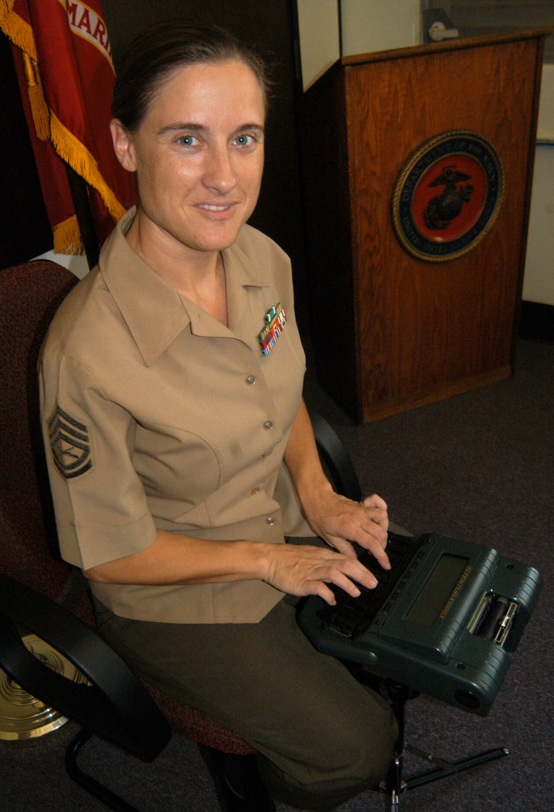
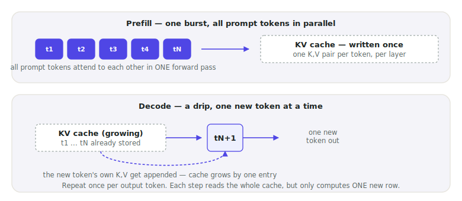
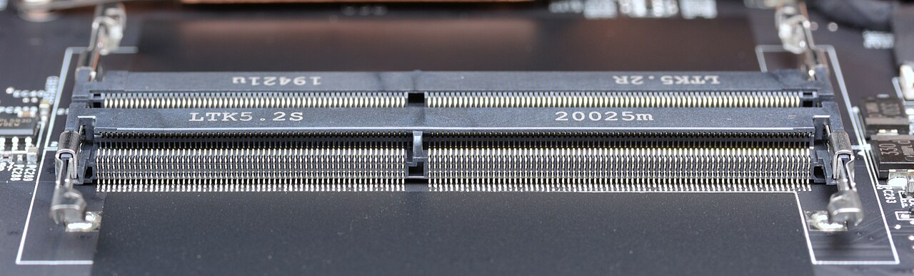

# Lecture 05 — Prefill, Decode, and the KV Cache

> **In one sentence:** We name the two halves of every generation request — the one-time burst that reads your prompt and the token-by-token drip that writes the answer — and build the running notebook, the KV cache, that makes the drip fast.

**Last time:** Lecture 04 explained compute-bound versus memory-bound in general, but never said why our own system's first token and every token after it behave so differently. **This time:** we split a request into its two real workloads and derive the cache that makes the second one fast.

## Learning Objectives

- Explain why prefill and decode are two different workloads, and map each onto the roofline model from Lecture 04.
- Derive the KV cache size formula from the model's real architecture, and predict a serving deployment's memory before running it.
- Turn the KV cache **off** and measure, directly, how much of decode's speed depends on it.

## Prerequisites

| Concept | Needed? | Notes |
| --- | --- | --- |
| Lecture 04 | Yes | We're placing prefill and decode as two literal points on the roofline |
| Self-attention | Yes | Just the idea that each token attends to every earlier token |
| GQA / MQA | No | We use the course model's real head counts without deriving why they differ (Lecture 11) |

## Story

A court reporter doesn't re-transcribe the entire trial from memory every time a witness says one more word.

She keeps a **running shorthand record** — every word already spoken, written once, in a compressed notation only she needs to expand. When the witness says the next word, she doesn't re-listen to the whole testimony so far. She writes down *one new symbol*, appends it to the record, and moves on.

<figure>
  
  <figcaption>A stenograph is a running record, not a re-transcription. Every new word costs one new entry — never a re-read of everything before it. <em>Photo: U.S. Marine Corps, public domain</em></figcaption>
</figure>

A language model generating text has exactly this choice to make. It could, for every new token, re-read the entire conversation so far from scratch. Or it could keep a running record of what it already computed, and only do new work for the new word.

The running record has a name: the **KV cache**. Today we build it, measure its size, and then — to prove it's real — we turn it off and watch decode crawl.

## Mental Model

> **Prefill is the court reporter catching up on everything said before she arrived, all at once. Decode is her taking down each new word as it's spoken — one entry at a time, never re-reading the transcript so far.**

Two workloads, one model, radically different shapes:

| | Prefill | Decode |
| --- | --- | --- |
| Input | The whole prompt, \\(t\\) tokens | One token |
| Parallelism | All \\(t\\) tokens processed together | Strictly sequential, one at a time |
| Roofline regime (Lecture 04) | Compute-bound (high arithmetic intensity) | Memory-bound (arithmetic intensity ≈ 1) |
| What it produces | The **first** output token, plus a full KV cache | One new token, plus one new cache entry |
| Felt as | TTFT — time to first token | TPOT — time per output token |

<figure>
  
  <figcaption>Prefill is a burst that writes the cache. Decode is a drip that reads the whole cache and writes exactly one new entry, over and over.</figcaption>
</figure>

Every number in Lecture 01's baseline table already had a name it was hiding: TTFT *is* prefill's wall-clock time; TPOT *is* one decode step's wall-clock time. We measured them in Lecture 01 without yet knowing why they were two different numbers. Now we do.

Prefill and decode aren't two settings of the same workload — they're two different points on the roofline, and the KV cache is the structure that makes decode's point as cheap as it can be.
{: .remember}

## The System

Same environment as always — everything below runs ⚡ in the Lightning Studio terminal; this is a standalone GPU + model script, no server or corpus required.

The stenograph's actual alphabet: for every layer, for every token ever processed, the KV cache holds one **key** vector and one **value** vector — sized by the model's *key/value* heads, which on our course model are fewer than its *query* heads (that head-sharing trick is GQA, and it already quietly shrinks our cache four-fold; the full mechanics are Lecture 11's topic).

| Symbol | Course model's real value | Source |
| --- | --- | --- |
| Layers (\\(L\\)) | 36 | `config.json` |
| KV heads (\\(H\\)) | 8 (of 32 query heads) | `config.json` — this model uses GQA |
| Head dimension (\\(D\\)) | 128 | `config.json` |
| Precision | 2 bytes (bf16) | how we serve it |

<figure>
  
  <figcaption>Every byte the cache formula counts lives somewhere physical like this — just HBM soldered onto a GPU board instead of a DIMM slotted into a laptop. <em>Photo: D-Kuru, Wikimedia Commons, CC BY-SA 4.0</em></figcaption>
</figure>

## The Build

⚡ This lecture's folder, `code/module-1-foundations/05-prefill-decode-and-the-kv-cache/`, is a copy-forward of Lecture 04's folder with one new file: `kv_cache.py`.

```bash
git clone https://github.com/gaurav98095/Course-on-AI-Engineering.git   # skip if already cloned
cd Course-on-AI-Engineering/code/module-1-foundations/05-prefill-decode-and-the-kv-cache
pip install -r requirements.txt
```

### Step 1 — Read the model's real shape, don't guess it

Exactly like Lecture 04's `roofline.py`, we fetch the real config instead of assuming numbers:

```python
cfg = AutoConfig.from_pretrained("Qwen/Qwen3-VL-8B-Instruct")
text_cfg = cfg.text_config
L, H, D = text_cfg.num_hidden_layers, text_cfg.num_key_value_heads, text_cfg.head_dim
```

```text
layers=36  kv_heads=8 (query heads: 32)  head_dim=128
```

Thirty-two query heads, only eight KV heads — four query heads already share one KV head. Keep that ratio; it comes back in the math page.

### Step 2 — Turn the cache off and time the damage

The whole argument for the KV cache, made empirical in six lines:

```python
t_cache = timed_generate(model, inputs, N_TOKENS, use_cache=True)
t_nocache = timed_generate(model, inputs, N_TOKENS, use_cache=False)
print(f"KV cache speedup at {N_TOKENS} tokens: {t_nocache / t_cache:.1f}x")
```

`use_cache=False` forces the model to do what our court reporter refuses to do: re-read the entire growing transcript from scratch, every single word.

```bash
python kv_cache.py
```

```text
loading Qwen/Qwen3-VL-8B-Instruct ...
layers=36  kv_heads=8 (query heads: 32)  head_dim=128

prompt: 34 tokens

generating 60 tokens WITH the KV cache (the normal way)...
  1.98s  (30.3 tok/s)

generating 60 tokens WITHOUT it (recomputes the whole sequence, every step)...
  9.41s  (6.4 tok/s)

KV cache speedup at 60 generated tokens: 4.8x
```

(Ballpark, L40S, bf16 — the exact ratio depends on prompt length and token count; it grows *larger* the more tokens you generate, because the no-cache cost grows quadratically while the cached cost stays linear. At 60 tokens we're barely scratching that curve — try Exercise 1.)

### Step 3 — Predict the cache size, then measure it

```python
def cache_size_bytes(cfg, tokens, batch=1, dtype_bytes=2):
    L, H, D = text_cfg.num_hidden_layers, text_cfg.num_key_value_heads, text_cfg.head_dim
    return 2 * L * H * D * tokens * batch * dtype_bytes   # 2 = one K, one V
```

```text
--- cache size: theory vs measured ---
theoretical cache size at 94 tokens: 13.2 MiB
measured extra GPU memory for that generation: ~15 MiB (cache + activations + generation bookkeeping — not pure cache, but close)
```

The two numbers land close together — the small gap is activation memory and generation bookkeeping riding along, not an error in the formula.

## Measure It

The reason this lecture exists — put a real number on something Lecture 01 measured but couldn't yet explain:

| Metric | Value (ballpark, L40S, bf16) | What it actually is |
| --- | --- | --- |
| TTFT (Lecture 01, ~1,842-token prompt) | ~1 s | One prefill pass: compute-bound, right of the roofline's ridge |
| TPOT (Lecture 01) | ~30 ms | One decode step: memory-bound, deep left of the ridge |
| KV cache speedup at 60 tokens | ~4.8× | Grows with sequence length — Exercise 1 |
| Cache size, our RAG's real prompt (~1,800 tokens), batch 1 | ~253 MiB | `144 KiB/token × 1,800` |
| Cache size, 4k context, batch 8 (a real serving load) | ~4.5 GiB | On a 48 GiB card, that's real money |
| Cache size, 32k context, batch 64 | **~288 GiB** | Exceeds *every* GPU that exists |

> That last row is not a hypothetical. It is the entire reason "long context" and "high concurrency" fight each other for the same VRAM — and why PagedAttention (Lecture 10) exists at all.

## The Math, One Level Deeper

The intuition: every token, at every layer, leaves behind exactly one key vector and one value vector. Stack them all up and count the bytes:

\\[
\text{cache bytes} = 2 \times L \times H \times D \times t \times b \times s
\\]

One worked number: our course model, one token, one layer isn't even the full story — do the whole model at once. \\(L{=}36\\), \\(H{=}8\\), \\(D{=}128\\), batch \\(b{=}1\\), bf16 \\(s{=}2\\): per-token cache is \\(2 \times 36 \times 8 \times 128 \times 2 = 147{,}456\\) bytes — **144 KiB for a single token**, before it has said anything.

> **Want the full derivation?** Why the formula is linear in every one of its five variables, what GQA already bought us for free, and where the KV cache math breaks down at extreme context lengths:
> [Math Deep Dive 05 — Deriving the KV Cache Formula →](../math/05-kv-cache-math.md)

## Where It Breaks

**"Measured extra memory" isn't pure cache.** Our `torch.cuda.max_memory_allocated()` delta also captures activation memory and PyTorch's own bookkeeping. For short generations, this padding is a meaningfully large fraction of what we measured — the theory-vs-measured gap would shrink (in relative terms) at longer sequences, where the cache itself dominates.

**The formula assumes dense attention, every layer, every token.** Some architectures skip KV caching on certain layers, or share a cache across layers (a Module 2 topic). Treat this formula as the baseline every optimization is measured against, not a universal law.

**Batch and context length trade off the same budget.** Row 5 and row 6 of our table used the *same* per-token cost — the only difference was whether we spent the budget on more users (batch) or longer context. A serving system that promises both large batches *and* long context is promising more VRAM than exists, unless something changes (quantized cache, PagedAttention, or fewer KV heads still — all coming).

## Exercises

1. **Watch the gap grow.** Rerun `kv_cache.py` with `N_TOKENS = 20`, then `60`, then `120`. Plot the speedup ratio against token count — does it grow linearly, or faster?
2. **Predict before you measure.** Using the formula, compute the theoretical cache size for a 500-token conversation at batch 4, before running anything. Then adapt `kv_cache.py` to check it.
3. **Multiply query heads instead.** Recompute the cache-size table using `num_attention_heads=32` in place of `num_key_value_heads=8` — the number a model *without* GQA would need. How much bigger is every row?
4. **Where does 288 GiB actually break?** Find the largest single GPU on the market today (check its datasheet) and compute the maximum batch × context product our course model's KV cache could fit on it alone, no other memory used.
5. **Connect it to Lecture 03.** Using TPOT ≈ 30 ms/token, recompute Lecture 03's service time \\(S\\) from first principles: how many decode steps does a 200-token answer need, and does the total match what `load_test.py` measured?

## Summary

Every generation request is two workloads wearing one name. Prefill reads the whole prompt in one compute-bound burst and writes the KV cache; decode is a memory-bound drip that reads the whole cache and appends exactly one new entry per step — TTFT and TPOT, finally explained. We derived the cache's size from the model's real architecture, watched theory and measurement agree, and then proved the cache matters at all by turning it off and watching a 60-token reply take five times longer.

> **What should you remember?**
> - Prefill = compute-bound burst that fills the cache; decode = memory-bound drip that reads it. TTFT and TPOT are their wall-clock names.
> - Cache bytes = 2 × layers × KV heads × head_dim × tokens × batch × precision — linear in every term.
> - GQA already bought this course a 4× smaller cache before Module 2 even begins.

## Resources

- Pope et al., *Efficiently Scaling Transformer Inference* (2022) — the paper that formalized prefill/decode and KV cache memory accounting for serving.
- Ainslie et al., *GQA: Training Generalized Multi-Query Transformer Models from Multi-Head Checkpoints* (2023) — the head-sharing trick our course model already uses.
- `Qwen/Qwen3-VL-8B-Instruct`'s `config.json` on Hugging Face — the source of every number in this lecture's table.

---

[← Previous: Lecture 04 — The GPU: Architecture, HBM, and the Roofline Model](04-the-gpu-architecture-and-roofline.md) · [Course Home](../index.md) · [Next: Lecture 06 — Profiling: Where the Time Actually Goes →](06-profiling-where-the-time-actually-goes.md)
