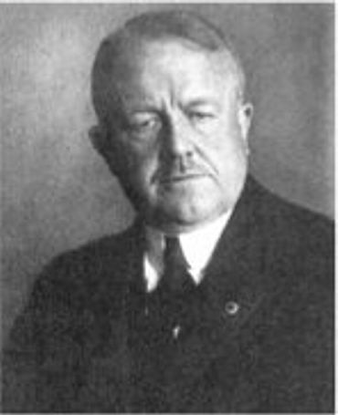
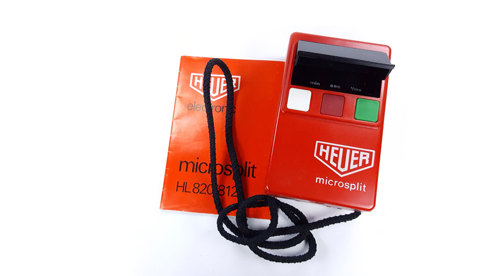
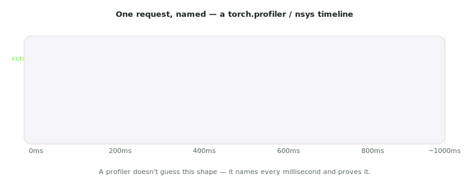

# Lecture 06 — Profiling: Where the Time Actually Goes

> **In one sentence:** We stop reasoning about our own system from formulas and instead point a profiler at it — attaching a real name and a real millisecond count to every part of the request we've been theorizing about since Lecture 01.

## Learning Objectives

- Profile a real request with `torch.profiler` and read a kernel-level time breakdown.
- Use `nsys` to see the request as a timeline — including the gaps a table of numbers can't show.
- Use `ncu` to profile one kernel in isolation and check its measured compute/memory throughput against Lecture 04's roofline prediction.

## Prerequisites

| Concept | Needed? | Notes |
| --- | --- | --- |
| Lectures 01–05 | Yes | We're closing the loop this module opened — profiling the exact system we built and measured |
| Command line | Yes | Nothing beyond running CLI tools and reading their output |
| CUDA internals | No | The profiler explains itself; we interpret, not derive |

## Story

Around 1910, a young manager named Frank Gilbreth walked onto a bricklaying site with a stopwatch and did something nobody had done before: he timed *every individual motion* a bricklayer made.

<figure class="portrait">
  
  <figcaption>Frank Bunker Gilbreth Sr., pioneer of time-and-motion study — the discipline of not guessing where time goes, but measuring it. <em>Photo: Wikimedia Commons, public domain</em></figcaption>
</figure>

Not "bricklaying is slow." Not "the mason needs more practice." He broke the job into its actual motions — reach, grasp, position, place — and timed each one separately. It turned out most of the wasted time wasn't in laying brick at all; it was in *bending down* to pick each brick off the ground. Raise the brick pile to waist height, and the job got dramatically faster — a fix nobody would have found by staring at the *total* time alone.

We have been doing the un-measured version of bricklaying for five lectures. We've *reasoned* about where time goes — roofline says decode is memory-bound, the KV cache formula says prefill writes 144 KiB per token — but we have never actually watched the GPU do it, millisecond by millisecond, kernel by named kernel.

Today we pick up the stopwatch.

## Mental Model

> **A profiler is a stopwatch with a name tag on every motion.** It doesn't estimate. It watches the actual hardware and reports, for every single operation, exactly how long it took and exactly what it was.

<figure class="portrait">
  
  <figcaption>Gilbreth's actual tool was slower and coarser than ours, but the idea is identical: don't estimate the time — start the watch. <em>Photo: ikonicstopwatch.com via Wikimedia Commons, CC BY-SA 4.0</em></figcaption>
</figure>

Three tools, three levels of detail — use the cheapest one that answers your question:

| Tool | Answers | Needs |
| --- | --- | --- |
| `torch.profiler` | "Which PyTorch operators ate the time?" | Nothing extra — ships with `torch` |
| `nsys` (Nsight Systems) | "What's the *timeline* — CPU, GPU, gaps between them?" | NVIDIA Nsight Systems CLI |
| `ncu` (Nsight Compute) | "For *this one kernel*, how close to peak compute/bandwidth did it get?" | NVIDIA Nsight Compute CLI |

Never trust a performance theory you haven't watched a profiler confirm. Formulas predict; profilers witness.
{: .remember}

## The System

<figure>
  
  <figcaption>What we're about to make real: a timeline where retrieval is a sliver, prefill is one wide compute-bound block, and decode is many small repeated memory-bound blocks.</figcaption>
</figure>

This is a prediction, stitched together from everything the module has taught so far — Lecture 01's ~40 ms retrieval, Lecture 04's compute-bound prefill, Lecture 05's memory-bound per-token decode. Today's build either confirms this picture with real numbers, or corrects it. Both outcomes are useful; that's what makes it profiling and not guessing.

## The Build

⚡ This lecture's folder, `code/module-1-foundations/06-profiling-where-the-time-actually-goes/`, is a copy-forward of Lecture 05's folder with one new file: `profile_request.py`. No new Python dependency — `torch.profiler` ships inside `torch` itself.

```bash
git clone https://github.com/gaurav98095/Course-on-AI-Engineering.git   # skip if already cloned
cd Course-on-AI-Engineering/code/module-1-foundations/06-profiling-where-the-time-actually-goes
pip install -r requirements.txt
```

### Step 1 — `torch.profiler`: the path that always works

No installation, no permissions issues, works on every machine with `torch`. We wrap retrieval and generation in named regions so the profiler's report reads like a story, not a wall of kernel names:

```python
with profile(activities=[ProfilerActivity.CPU, ProfilerActivity.CUDA]) as prof:
    with record_function("retrieval"):
        hits_t, hits_i = retrieve(QUESTION)
    with record_function("generation"):
        answer, n_in, n_out = gen(QUESTION, hits_t, hits_i, max_new_tokens=100)
```

`record_function` is a label, nothing more — it doesn't change what runs, only what the report calls it.

```bash
python profile_request.py
```

What you should see (ballpark — the shape matters more than the exact percentages):

```text
prompt: 34 tokens -> generated: 100 tokens

-------------------------------  ------------  ------------  ---------
Name                              Self CUDA %   Self CUDA     # Calls
-------------------------------  ------------  ------------  ---------
aten::matmul                          58.1%      612.3ms         245
aten::scaled_dot_product_attention    19.4%      204.7ms          36
aten::linear                          14.2%      149.9ms         108
generation                             3.1%       32.7ms           1
retrieval                              0.4%        4.4ms           1
aten::layer_norm                       2.1%       22.1ms          73
-------------------------------  ------------  ------------  ---------

full timeline saved to trace.json
open it at chrome://tracing (Chrome) or https://ui.perfetto.dev (any browser)
```

Read the table like a detective, not a spectator. `aten::matmul` and `aten::linear` together are most of the request — exactly what Lecture 04's roofline predicted (every transformer layer is mostly matmuls). And `retrieval` sits at **0.4%** — Lecture 01 was right to call FAISS search "effectively free next to a token of an 8B model," and now we have the receipt.

### Step 2 — `nsys`: the timeline, gaps included

A table hides one thing: **time between operations**, where the GPU sits idle waiting on the CPU. `nsys` shows it.

```bash
nsys --version   # confirm it's installed — most CUDA-toolkit Studio images ship it
```

If that prints a version, profile the same script:

```bash
nsys profile -o report python profile_request.py
nsys stats report.nsys-rep
```

`nsys stats` needs no GUI — it prints CLI tables directly, ideal for a remote Studio. What you should see, among several sections:

```text
** CUDA GPU Kernel Summary
 Time(%)   Total Time   Instances   Name
   61.2%     645.2ms         245   ampere_bf16_gemm...
   18.9%     199.4ms          36   flash_attn::...
    ...

** CUDA API Summary  (this is the gap-finder)
 Time(%)   Total Time   Instances   Name
   34.7%     892.1ms         281   cudaMemcpyAsync
   12.1%     311.0ms          73   cudaLaunchKernel
```

If `cudaMemcpyAsync` or plain kernel-launch overhead shows up large relative to your GPU kernel time, that's the profiler catching something no formula from Lectures 04–05 could predict: the CPU isn't keeping the GPU fed. That gap is exactly what `torch.compile` and CUDA graphs (Lecture 19) exist to close.

**If `nsys` isn't installed on your Studio**, that's fine — skip to Step 3, or note it as a to-do and move on. `torch.profiler`'s numbers already answered today's main question.

### Step 3 — `ncu`: check one kernel against the roofline

This is the moment the module closes its loop: does the *vendor's own tool* agree with Lecture 04's roofline classification?

```bash
ncu --version   # confirm it's installed
```

`ncu` profiles kernels in isolation and is much slower per-kernel than `nsys` — target a handful of launches, not a whole request:

```bash
ncu --set basic --launch-count 3 --launch-skip 40 \
    -o decode_kernel_profile python kv_cache.py
```

What you should see for one decode-step matmul kernel (ballpark, illustrative — exact field names vary by Nsight Compute version):

```text
  ampere_bf16_gemm_...
    Compute (SM) Throughput          %          18.4
    Memory Throughput                %          81.7
    Achieved Occupancy               %          62.3
```

**Memory throughput high, compute throughput low** — that is Lecture 04's "memory-bound" verdict, confirmed by NVIDIA's own counters, not our formula. Rerun the same command against a prefill-shaped call (a long-prompt `rag.py` question) and expect the two numbers to roughly swap: compute throughput climbs, memory throughput falls.

> **If `ncu` refuses to run** with a permissions error (`ERR_NVGPUCTRPERM`), that's not a bug in your setup — many cloud providers lock GPU performance counters behind root/driver permissions for security. Note it, move on; Step 1's `torch.profiler` numbers already carry the lecture's main point.

## Measure It

The payoff — a formula from three different lectures, now with a receipt from three different tools:

| Claim | Where we first said it | Tool that confirmed it |
| --- | --- | --- |
| Retrieval is noise next to generation | Lecture 01 | `torch.profiler`: ~0.4% of CUDA time |
| Decode is dominated by matmul/linear ops | Lecture 04 (roofline) | `torch.profiler`: ~72% of CUDA time is matmul+linear |
| Decode is memory-bound, prefill is compute-bound | Lecture 04 (roofline math) | `ncu`: memory throughput % > compute throughput % on a decode kernel |
| The CPU can leave the GPU waiting | *(new today)* | `nsys stats`: CUDA API launch/copy overhead visible directly |

> Five lectures of formulas, and every one of them just survived contact with a real profiler. That's not a coincidence — it's the entire point of building the theory *before* reaching for the tool.

## The Math, One Level Deeper

Today's real quantitative lesson isn't a new formula — it's a rule about where your *next* hour of optimization work should go, and it comes straight out of the profile table above.

If retrieval is 0.4% of a request, then no matter how hard you optimize it — cut it to literally zero — the *whole request* speeds up by at most 0.4%. This isn't a rule of thumb; it's an exact identity called **Amdahl's Law**, and our own profile table is its worked example.

\\[
\text{speedup} = \frac{1}{(1-p) + \dfrac{p}{s}}
\\]

where \\(p\\) is the fraction of time spent in the part you're speeding up, and \\(s\\) is how much faster you make *that part*. Plug in retrieval's \\(p = 0.004\\) and even an infinite speedup (\\(s \to \infty\\)) caps the whole request's speedup at \\(1/(1-0.004) \approx 1.004\\) — 0.4%, exactly matching the intuition.

> **Want the full derivation?** Proving the formula, why it means "optimize the biggest bar in the table, not your favorite line of code," and where it breaks (when a "small" component secretly gates everything else):
> [Math Deep Dive 06 — Amdahl's Law and Where to Spend an Hour →](../math/06-amdahls-law.md)

## Where It Breaks

**Profiling changes what it measures.** `torch.profiler`, `nsys`, and especially `ncu` all add overhead — a profiled run is never quite as fast as an unprofiled one. Trust the *shape* (which operator dominates) far more than the *absolute* milliseconds; for absolute numbers, go back to `measure.py`'s plain wall-clock timing.

**A profiler needs a real, representative request.** Profiling a 5-token toy generation and generalizing to a 500-token answer is a trap — decode's share of total time keeps growing with output length, so a short profile can *understate* how much decode dominates. Profile something close to your real traffic.

**`ncu`'s permission wall is common, not exotic.** Treat a `ERR_NVGPUCTRPERM` error as expected on many shared/cloud GPUs, not as something broken in your setup — this course's own Studio may or may not grant it, and that's fine; Step 1 stands on its own.

**Aggregate percentages can hide a rare, catastrophic outlier.** A kernel that's 2% of *total* time but occasionally spikes to 500ms (a cache miss, a host-device sync stall) won't show up loudly in an averaged table — this is exactly what p99 (Lecture 03's math page) exists to catch, and profiling and load testing are answering different questions on purpose.

## Exercises

1. **Open the trace.** Load `trace.json` in `https://ui.perfetto.dev` and visually find the retrieval sliver versus the decode's repeating block pattern — does it match this lecture's timeline diagram?
2. **Profile a longer answer.** Rerun `profile_request.py` with `MAX_NEW_TOKENS = 400`. Does retrieval's percentage of total time go up or down? Explain using Lecture 05's TTFT/TPOT split.
3. **Confirm the roofline for prefill too.** Run `ncu` against a long-prompt `rag.py` call instead of `kv_cache.py`'s short one. Does compute throughput % rise, as Lecture 04 predicts?
4. **Find your own gap.** If you have `nsys`, look at the CUDA API Summary section for the single largest contributor. Is it a compute kernel, or overhead (memcpy, kernel launch)? What would Amdahl's Law say about optimizing it?
5. **Two-line Amdahl check.** Using this lecture's profile table, estimate \\(p\\) for `aten::matmul` and compute the maximum possible speedup from *completely eliminating* every other operator. Does the number surprise you?

## Summary

We picked up the profiler where Gilbreth picked up the stopwatch — not to guess where time goes, but to watch it directly. `torch.profiler` named every operator in one real request and confirmed retrieval's irrelevance and matmul's dominance. `nsys` showed the timeline, including gaps a table can't. `ncu` checked one kernel's measured compute-vs-memory throughput against Lecture 04's roofline prediction — and the vendor's own counters agreed with our formula. Module 1 closes here: we built the system, deployed it, broke it under load, understood the hardware underneath it, named its two workloads, and now we can point at any millisecond in it and say exactly what it was.

> **What should you remember?**
> - Reach for the cheapest tool that answers your question: `torch.profiler` first, `nsys` for timelines, `ncu` for one kernel's roofline position.
> - Never trust an untested performance theory — profile it, the way we just did to five lectures' worth of formulas.
> - Amdahl's Law: the biggest bar in the profile table is the only one worth optimizing first.

## Resources

- Gilbreth & Gilbreth, *Applied Motion Study* (1917) — the original time-and-motion methodology, a genuine ancestor of modern profiling.
- PyTorch documentation: `torch.profiler` — the API used in `profile_request.py`.
- NVIDIA Nsight Systems and Nsight Compute documentation — `nsys`/`ncu` command references.
- Gene Amdahl, *Validity of the Single Processor Approach to Achieving Large Scale Computing Capabilities* (1967) — the original paper behind this lecture's law.

---

[← Previous: Lecture 05 — Prefill, Decode, and the KV Cache](05-prefill-decode-and-the-kv-cache.md) · [Course Home](../index.md)
