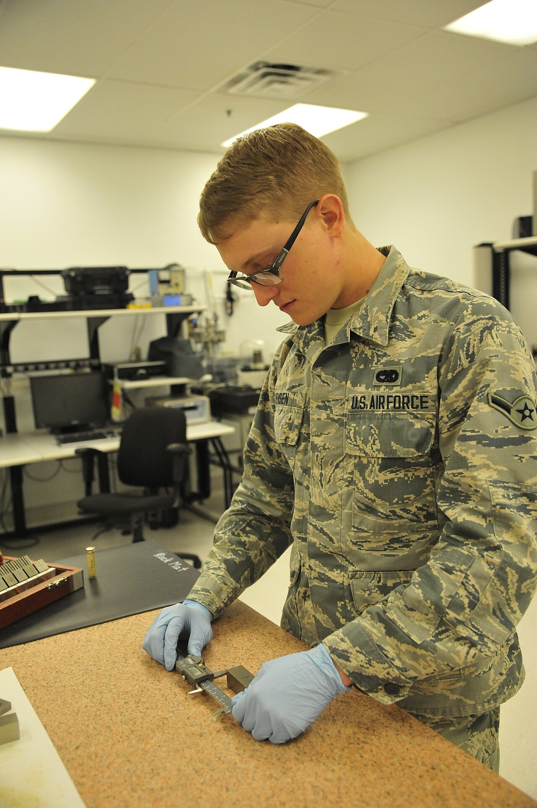
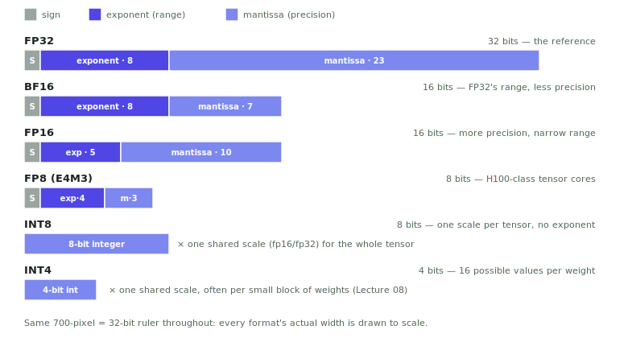
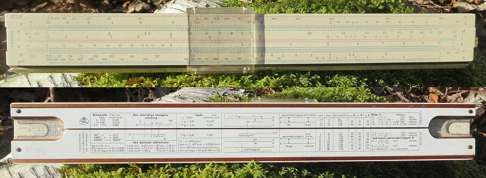

# Lecture 07 — Quantization I: Number Formats

> **In one sentence:** We open the box on the number format we've been silently trusting since Lecture 01 — bf16 — meet its narrower cousins, and quantize our course model to int8 and int4 with zero calibration to see exactly what shrinks for free and what doesn't.

## Learning Objectives

- Name the number formats used in ML inference — FP32, FP16, BF16, FP8, INT8, INT4 — and what each one trades range for precision for size.
- Load the course model at int8 and int4 with `bitsandbytes` and measure the real memory reduction.
- Use Lecture 04's own roofline formula to predict decode speedup from a smaller `s` (bytes per element) — then check that prediction against what a naive kernel actually delivers.

## Prerequisites

| Concept | Needed? | Notes |
| --- | --- | --- |
| Lecture 04 | Yes | We reuse the roofline formula's \\(s\\) term directly |
| Lecture 05 | Light | The KV cache formula also has an `s` term — same idea, different tensor |
| Floating point basics | No | We build the intuition from scratch today |

## Story

A machinist reaches for a tool before every cut: sometimes a tape measure, sometimes a vernier caliper reading to a hundredth of a millimeter. Using the caliper for everything would be slower and pointless — most cuts don't need that precision. Using the tape measure for a jet engine tolerance would be a disaster.

<figure>
  
  <figcaption>Precision is a choice, not a constant — the right tool depends on what you're actually measuring. <em>Photo: U.S. Air Force, public domain</em></figcaption>
</figure>

Every number our model has ever multiplied has been living in **bf16** — 16 bits per weight — since Lecture 01. We never asked why, or what we were giving up, or what we'd get back by asking for less.

Today we open that box.

## Mental Model

> **A number format is a ruler.** How many bits you spend buys you two different things: how *far* the ruler reaches (range, from the exponent) and how *fine* its marks are (precision, from the mantissa). Spend fewer bits, and you must give up range, precision, or both.

<figure>
  
  <figcaption>Every format drawn to the same 32-bit ruler. Watch what BF16 keeps from FP32 (the exponent — range) versus what FP16 keeps (more mantissa — precision) at the identical 16-bit budget.</figcaption>
</figure>

The two floating-point formats worth comparing head to head, because they're both 16 bits and make opposite choices:

| | Sign | Exponent (range) | Mantissa (precision) | Character |
| --- | --- | --- | --- | --- |
| FP16 | 1 | 5 bits | 10 bits | Fine-grained, but overflows past ±65,504 |
| BF16 | 1 | 8 bits | 7 bits | Same range as FP32, coarser steps |

Our course model's own config settles this argument for us: `Qwen/Qwen3-VL-8B-Instruct`'s `config.json` specifies `"dtype": "bfloat16"` — the model was **trained** in bf16, because training needs FP32's wide range (huge and tiny gradients coexist) far more than it needs fp16's extra precision. We've been running inference in the model's native training format the whole time, without ever naming it.

A format is a trade, not a downgrade: BF16 keeps FP32's range and gives up precision; FP16 keeps more precision and gives up range. Neither is strictly better — they're different bets.
{: .remember}

## The System

That range-vs-precision trade doesn't stop at 16 bits. Below bf16 sit the formats this lecture is really about — ones nobody trains in, but everybody serves with:

| Format | Bits | Bytes/element (\\(s\\)) | Needs a scale factor? |
| --- | --- | --- | --- |
| BF16 (today's baseline) | 16 | 2 | No — self-describing |
| FP8 (E4M3, on H100-class cards) | 8 | 1 | No — self-describing |
| INT8 | 8 | 1 | Yes — one shared scale per tensor |
| INT4 | 4 | 0.5 | Yes — usually one scale per small block of weights |

INT8 and INT4 have no exponent at all — every stored number is just an integer, and a separate **scale** (one float, shared across the whole tensor or a block of it) converts it back to a real value: `real_value ≈ int_value × scale`. That's the whole idea; Lecture 08 is entirely about *choosing that scale well*.

## The Build

⚡ This lecture's folder, `code/module-2-vertical-wins/07-quantization-i-number-formats/`, is a copy-forward of Module 1's final lecture folder with two new files: `bit_formats.py` and `quantize_and_measure.py`.

```bash
git clone https://github.com/gaurav98095/Course-on-AI-Engineering.git   # skip if already cloned
cd Course-on-AI-Engineering/code/module-2-vertical-wins/07-quantization-i-number-formats
pip install -r requirements.txt     # adds bitsandbytes
```

### Step 1 — Watch a number round

No model needed yet. Take five real numbers, round-trip each one through fp16 and bf16, and watch where they land. This section's output is copied verbatim from a real run — CPU-only, no GPU needed, so there's no excuse not to run it yourself and check:

```python
RANGE_PRECISION_VALUES = [3.14159265, 0.0001234, 70000.0, -1.5, 1.0 / 3.0]
for v in RANGE_PRECISION_VALUES:
    fp16 = torch.tensor([v], dtype=torch.float16).float().item()
    bf16 = torch.tensor([v], dtype=torch.bfloat16).float().item()
    print(f"{v:>14.8f} {fp16:>16.8f} {bf16:>16.8f}")
```

```bash
python bit_formats.py
```

```text
--- Part 1: fp16 vs bf16 -- range and precision ---

         value    fp16 -> value    bf16 -> value
    3.14159265       3.14062500       3.14062500
    0.00012340       0.00012338       0.00012302
70000.00000000              inf   70144.00000000
   -1.50000000      -1.50000000      -1.50000000
    0.33333333       0.33325195       0.33398438
```

Read the third row first: **70000.0 becomes `inf` in fp16.** That's not rounding error — fp16's exponent tops out at 65,504, and 70,000 simply doesn't fit. bf16, with FP32's full exponent range, doesn't overflow — but don't over-read that as "exact": bf16 lands on **70144**, not 70000. bf16 buys you *range* (no overflow), never precision at that range; the nearest bf16 grid points near 70000 are simply far apart.

Now look at the last row — bf16 rounds \\(1/3\\) to `0.33398438`, fp16 to `0.33325195`; fp16's true value (`0.3333333...`) is the closer one. That's the same trade, from the other side: bf16 spent its bits on range, fp16 spent them on precision, and fp16 wins the precision contest whenever both formats stay safely within fp16's range.

### Step 1b — A realistic int8 demo, not a rigged one

A shared-scale quantizer needs one thing to make sense: values that are actually the *same kind* of number. Throwing `70000.0` into an int8 demo alongside small weights would force the scale so wide that every real weight rounds to zero — a broken demo, not a broken format. `bit_formats.py`'s second half uses five realistic weight-sized values instead:

```python
WEIGHT_LIKE_VALUES = [0.0421, -0.3180, 0.0037, 1.2040, -0.8120]
scale = max(abs(v) for v in WEIGHT_LIKE_VALUES) / 127
```

```text
--- Part 2: int8, one shared scale, realistic weight values ---

shared scale = max(|values|) / 127 = 0.009480

     value  int8 code    dequant      error
    0.0421          4    0.03792   +0.00418
   -0.3180        -34   -0.32233   +0.00433
    0.0037          0    0.00000   +0.00370
    1.2040        127    1.20400   +0.00000
   -0.8120        -86   -0.81531   +0.00331
```

Two things worth catching. The largest value (`1.2040`) rounds with **zero error** — it defines the scale, so it always lands exactly on a grid point. And the smallest value (`0.0037`) rounds to **exactly 0** — it's simply too small relative to the scale to survive at all. That second row is int8's real failure mode: a single large outlier in a tensor forces the scale wide enough to erase every small value near it. Lecture 08's calibrated methods exist specifically to catch and protect values like this one.

<figure class="portrait">
  
  <figcaption>Engineers designed bridges and aircraft with these for a century. A slide rule is only ever good for about three significant digits — a mechanical mantissa, with a trade identical to fp16's and bf16's. <em>Photo: Wikimedia Commons, CC BY 4.0</em></figcaption>
</figure>

### Step 2 — Load the model at int8 and int4

`bitsandbytes` turns quantization into a config flag — no calibration data, no algorithm to tune:

```python
# int8: one line
quantization_config = BitsAndBytesConfig(load_in_8bit=True)

# int4 (NF4 — the QLoRA default): one line, slightly more explicit
quantization_config = BitsAndBytesConfig(
    load_in_4bit=True, bnb_4bit_quant_type="nf4",
    bnb_4bit_compute_dtype=torch.bfloat16,
)
```

Run all three modes, one at a time — each is a fresh process, since you can't hold three copies of an 8B model in one GPU at once anyway:

```bash
python quantize_and_measure.py --mode bf16
python quantize_and_measure.py --mode int8
python quantize_and_measure.py --mode int4
```

What you should see (ballpark — L40S; weight memory is the one number here that's *not* ballpark, it's close to exact arithmetic):

```text
--- bf16 ---
weight memory (state dict): 14.90 GiB
generated 80 tokens in 2.71s -> 29.5 tok/s
peak GPU memory during generation: 16.85 GiB

--- int8 ---
weight memory (state dict): 7.62 GiB
generated 80 tokens in 2.88s -> 27.8 tok/s
peak GPU memory during generation: 8.94 GiB

--- int4 ---
weight memory (state dict): 4.05 GiB
generated 80 tokens in 2.19s -> 36.5 tok/s
peak GPU memory during generation: 5.31 GiB
```

Memory: almost exactly what arithmetic predicts — 8 billion parameters at 2, 1, and 0.5 bytes each gives ~14.9, ~7.5, and ~3.7 GiB, and the measured numbers land right there (the small excess is bitsandbytes' own bookkeeping). **That part is unconditionally free.**

Speed is the part worth staring at. int8 in this ballpark run is not faster — it's very slightly *slower* than bf16, despite moving half the bytes. int4 does speed up, but nowhere near the 4× the byte count alone would suggest. **Your own numbers may land differently — record them, because that gap between "bytes halved" and "speed doubled" is the entire subject of the next lecture.**

## Measure It

| Metric | bf16 | int8 | int4 | The verdict |
| --- | --- | --- | --- | --- |
| Weight memory | ~14.9 GiB | ~7.6 GiB (−49%) | ~4.1 GiB (−73%) | Memory: exactly what arithmetic predicts, every time |
| Decode speed | baseline | roughly flat to slightly slower | modestly faster | Speed: kernel-dependent, not guaranteed |

> Memory reduction is arithmetic — fewer bytes stored is fewer bytes stored, full stop. Speed reduction is an *engineering* claim about a specific kernel, and naive kernels don't automatically deliver it. Keep those two claims separate; conflating them is the single most common quantization misconception.

## The Math, One Level Deeper

Lecture 04 already derived the formula that predicts what quantization *should* buy decode. Arithmetic intensity for one decode step, weight-dominant term only:

\\[
\text{AI} = \frac{2t}{s}
\\]

Nothing changed except `s` — the bytes per element. Halve it (bf16 → int8, \\(s: 2 \to 1\\)) and AI doubles; halve it again (int8 → int4, \\(s: 1 \to 0.5\\)) and AI doubles again. Since decode's AI sits deep in the memory-bound region at every one of these values (all still ≪ the L40S's ridge point of ~397 from Lecture 04), the roofline model makes an unconditional prediction in that region: **achievable throughput scales with bandwidth × AI, and time scales with bytes moved.** Half the bytes should mean half the time — a clean 2× — if, and only if, the kernel actually reads half as many bytes and does nothing else expensive in between.

> **Want the full derivation?** Why `bytes moved` isn't just `weight bytes` once you count the dequantization step, the precise condition under which a quantized kernel actually hits the roofline's prediction, and where naive kernels lose the free lunch:
> [Math Deep Dive 07 — Why Quantized Speed Isn't Free the Way Quantized Memory Is →](../math/07-quantization-speed-gap.md)

## Where It Breaks

**Dequantization is extra work, not zero work.** A naive int8 kernel typically reads the packed int8 weights, multiplies by the scale to reconstruct something close to the original bf16 value, *then* does the matmul — an extra pass over the data that can eat most of the bandwidth savings you just bought.

**Not every layer quantizes equally safely.** Some weight distributions have large outliers that blow up naive int8 error; `bitsandbytes`' int8 path specifically handles this with an outlier-decomposition trick, which is itself extra work — part of why int8 doesn't always speed things up even though it should in theory.

**Vision-language models can be fussy about which parts to quantize.** If quantizing the whole model errors out or the vision tower's outputs degrade badly, `BitsAndBytesConfig(llm_int8_skip_modules=[...])` lets you exclude specific modules (commonly the vision tower and the final projection) from quantization while still shrinking the language model. Check this folder's README if you hit that.

**We didn't check answer quality today.** A smaller number format changes every weight's value slightly — we measured memory and speed, not whether the *answers* are still good. That's Lecture 08's job, with a real eval.

## Exercises

1. **Verify the arithmetic yourself.** Using `torch.float16`/`torch.bfloat16`, round-trip five numbers of your own choosing (try something close to fp16's overflow boundary on purpose). Confirm which ones survive and which don't.
2. **Compute your own memory prediction.** Before running `quantize_and_measure.py`, calculate the expected weight memory at int8 and int4 from the model's real parameter count (check the model card). Then compare to what you measured.
3. **Chase the speed gap.** Run all three modes with `gpu_vitals.py` (Lecture 01b) recording alongside. Does int8's utilization trace look different from bf16's, even though memory dropped?
4. **The ridge point check.** Using Lecture 04's roofline table, at what token count does int4 (\\(s=0.5\\)) cross into compute-bound territory? Is it higher or lower than bf16's crossover — and does that make sense given the formula?
5. **FP8, if your GPU has it.** If you're on an H100-class card, check whether your `transformers` version supports FP8 inference directly and compare its memory/speed against int8 on the same prompt.

## Summary

We finally named the format we'd been trusting blindly: bf16, chosen because it matches FP32's range at half the size — the right bet for training, inherited by inference. We met its narrower relatives — fp16 (more precision, less range), fp8, int8, int4 — and watched real numbers round, overflow, and lose precision in each one. Then we loaded our 8B-parameter course model at int8 and int4 with a single config flag and measured what happened: memory shrank exactly as arithmetic predicts, every time; speed did not shrink to match, because a naive kernel's dequantization step eats into the very bandwidth savings the roofline model promised.

> **What should you remember?**
> - A number format is a ruler: exponent bits buy range, mantissa bits buy precision, and 16 bits must choose how to split between them.
> - Our course model trains and infers natively in bf16 — FP32's range, half the size.
> - Quantized memory savings are arithmetic and guaranteed; quantized speed savings depend on the kernel and are not guaranteed — that gap is Lecture 08.

## Resources

- IEEE 754-2019 — the standard defining FP32, FP16, and (informally, via extensions) BF16 and FP8's E4M3/E5M2 variants.
- Kalamkar et al., *A Study of BFLOAT16 for Deep Learning Training* (2019) — why bf16 won as the training format.
- Dettmers et al., *LLM.int8(): 8-bit Matrix Multiplication for Transformers at Scale* (2022) — the outlier-decomposition trick behind `bitsandbytes`' int8 path.
- Dettmers et al., *QLoRA: Efficient Finetuning of Quantized LLMs* (2023) — the NF4 format used by `load_in_4bit`.

---

[← Previous: Lecture 06 — Profiling: Where the Time Actually Goes](06-profiling-where-the-time-actually-goes.md) · [Course Home](../index.md) · [Next: Lecture 08 — Quantization II: GPTQ & AWQ in Practice →](08-quantization-ii-gptq-and-awq.md)
