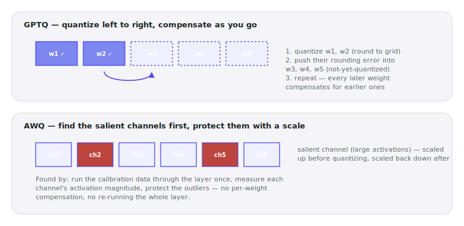

# Lecture 08 — Quantization II: GPTQ & AWQ in Practice

> **In one sentence:** We quantize the course model again — this time with calibration data and purpose-built kernels instead of Lecture 07's blind rounding — chasing the speedup the roofline model promised, and building the habit of checking whether the answers are still correct instead of assuming it.

**Last time:** Lecture 07's quantization rounded every weight the same blind way, and memory dropped exactly as promised — but nothing checked whether the weights that mattered most survived. **This time:** GPTQ and AWQ round using real calibration data, and we check quality instead of assuming it.

*[Lecture 00's map](00-the-system-we-are-building.md): this is box (D) — model weights — getting shrunk properly.*

## Learning Objectives

- Explain what GPTQ and AWQ each look at before deciding how to round a weight, and why that beats round-to-nearest.
- Quantize the course model with both methods, calibrated on our own manual, using `GPTQModel`'s unified API.
- Measure real decode speedup from a purpose-built kernel, and confirm answer quality survives — closing the two gaps Lecture 07 left open.

## Prerequisites

| Concept | Needed? | Notes |
| --- | --- | --- |
| Lecture 07 | Yes | Same course model, same `s` (bytes/element) idea — today picks the *values*, not just the format |
| Math Deep Dive 07 | Light | Today's speedup is exactly the "\\(c \approx 0\\)" case that page predicted |
| Calibration data | No | We supply it — our own Lecture 01 corpus |

## Story

Off-the-rack clothing is cut to a size chart, not to you — same rounding rule applied to every body, regardless of what actually fits. A bespoke tailor does the opposite: they measure the *specific* person in front of them, then cut fabric to match what they measured.

<figure>
  
  <figcaption>Savile Row, 1944 — the pattern is adjusted to the customer measured in front of the tailor, not read off a generic size chart. <em>Photo: Wikimedia Commons, public domain</em></figcaption>
</figure>

Lecture 07's quantization was off-the-rack: one rounding rule, applied identically to every weight, with no regard for what the model actually does with any of them. It worked — memory dropped exactly as promised — but nothing measured whether the *specific* weights that mattered most survived rounding intact.

GPTQ and AWQ are the bespoke tailor. Both look at real data — a calibration set — before deciding how to round anything.

## Mental Model

> **GPTQ and AWQ don't quantize better numbers — they quantize with better information.** Round-to-nearest asks one question per weight: "what's the closest grid point?" GPTQ and AWQ each ask a second question first: "given what this model actually does on real data, which roundings can I afford to get slightly wrong, and which absolutely need protecting?"

<figure>
  
  <figcaption>Two different answers to "use the data," from two different angles. GPTQ compensates after the fact; AWQ protects in advance.</figcaption>
</figure>

| | What it looks at | What it does with it |
| --- | --- | --- |
| **GPTQ** | How quantizing *this* weight would distort the layer's output on calibration data | Quantizes weights one at a time, pushing each one's rounding error into the weights not yet quantized — later weights compensate for earlier ones |
| **AWQ** | Which weight *channels* see the largest activation magnitudes on calibration data | Finds those salient channels, scales them up before quantizing (protecting their precision) and scales back down after — no per-weight compensation needed |

Both are still producing an INT4 (or INT8) tensor at the end — same format as Lecture 07, same memory math. The difference is entirely in *which* INT4 tensor they choose.
{: .remember}

## The Build

Same environment convention throughout — everything below is ⚡ Lightning Studio unless labeled otherwise. One addition worth naming up front: **GPTQModel** is the current, actively maintained library for this — `AutoGPTQ`, the older standalone package, is no longer the integration Hugging Face recommends. `GPTQModel` covers both GPTQ and AWQ behind one API, which is why today's two scripts barely differ from each other.

> **A note on confidence, in the spirit of this course's "measure, don't guess" rule.** Today's scripts follow `GPTQModel`'s own documented API precisely — but unlike most of this course's code, they haven't yet been run end-to-end against our specific vision-language model on real hardware. Weight-only quantization of a VLM's text layers is a documented, supported path, but the exact method names on the wrapper (`model.device`, `model.parameters()`, `model.tokenizer`) can shift between library versions, and this is worth knowing *before* you hit an `AttributeError` and wonder what you did wrong. If a call in `quantize_gptq_awq.py` or `benchmark_quantized.py` doesn't match your installed version, check `pip show gptqmodel` and its current README first — the *ideas* in this lecture (calibrated rounding, a unified GPTQ/AWQ API, real kernel speedup) are solid regardless of any one method name drifting.

⚡ This lecture's folder, `code/module-2-vertical-wins/08-quantization-ii-gptq-and-awq/`, is a copy-forward of Lecture 07's folder with two new files: `quantize_gptq_awq.py` and `benchmark_quantized.py`.

```bash
git clone https://github.com/gaurav98095/Course-on-AI-Engineering.git   # skip if already cloned
cd Course-on-AI-Engineering/code/module-2-vertical-wins/08-quantization-ii-gptq-and-awq
pip install -r requirements.txt     # adds gptqmodel
python ingest.py                    # build corpus/ if you don't have it yet — today's calibration data
```

### Step 1 — Calibrate on our own manual, not a generic dataset

Most GPTQ/AWQ tutorials calibrate on a slice of a generic web-text dataset. We calibrate on the exact kind of text our system will actually be asked about — the FAA manual chunks `ingest.py` already produced back in Lecture 01:

```python
chunks = json.loads(Path("corpus/chunks.json").read_text())["texts"]
calibration = [c["text"] for c in chunks][:256]
```

If the model's real job is answering questions about aircraft instruments, its calibration data should look like text about aircraft instruments — not generic news articles.

### Step 2 — Quantize with GPTQ

```python
quant_config = GPTQConfig(bits=4, group_size=128)
model = GPTQModel.load(MODEL, quant_config)
model.quantize(calibration, batch_size=1)
model.save("qwen3-vl-8b-gptq-4bit")
```

`group_size=128` means one shared scale per 128 weights, not one per the whole tensor (Lecture 07's naive approach) — a meaningfully finer-grained correction, at the cost of a small amount of extra memory for all those scales.

<figure>
  
  <figcaption>A garment mid-fitting — adjustments made against this specific body, not a size chart. GPTQ's layer-by-layer compensation is the same idea: each correction is made against what came before, not decided in isolation. <em>Photo: Kathryn Sargent of Savile Row, Wikimedia Commons, CC0</em></figcaption>
</figure>

```bash
python quantize_gptq_awq.py --method gptq
```

```text
calibrating on 256 real chunks from our own corpus
loading Qwen/Qwen3-VL-8B-Instruct ...
quantizing with GPTQ (4-bit) -- this walks the model layer by layer, expect several minutes...

saved to qwen3-vl-8b-gptq-4bit/
```

(Ballpark timing — calibrating an 8B model layer-by-layer commonly takes somewhere in the 10–30 minute range on one L40S; this is the one step in the whole course worth starting and going to get coffee for.)

### Step 3 — Quantize with AWQ, same corpus, one config swap

```bash
python quantize_gptq_awq.py --method awq
```

Identical script, identical calibration data — only `GPTQConfig` became `AWQConfig` inside `quantize_gptq_awq.py`. That's the entire practical difference `GPTQModel`'s unified API leaves you to think about; the salient-channel search happens inside the library.

### Step 4 — Benchmark both against Lecture 07's baseline

```bash
python benchmark_quantized.py --path qwen3-vl-8b-gptq-4bit
python benchmark_quantized.py --path qwen3-vl-8b-awq-4bit
```

What you should see — the memory line is a reliable prediction; the speed and answer text below it are this lecture's least-verified numbers (unlike the rest of this course's outputs, not yet confirmed on real hardware — see the note at the top of this section), shown to illustrate the *shape* of a good result, not to be matched digit for digit:

```text
loading quantized model from qwen3-vl-8b-gptq-4bit ...
weight memory (state dict): 4.18 GiB

generated 80 tokens in 1.24s -> 64.5 tok/s
peak GPU memory during generation: 5.62 GiB

--- quality spot check: same question as Lecture 01 ---
An aircraft stalls at the critical angle of attack because the smooth
airflow over the wing separates from the upper surface, causing a sudden
loss of lift... [phak-ch4-aerodynamics p.5]
```

Check two things against Lecture 07, using your own real numbers: is decode meaningfully faster than naive int4's ~1.24×, and does the stall-question answer still cite the right page?

## Measure It

| Metric | bf16 (Lecture 07) | int4, naive (Lecture 07) | GPTQ 4-bit (today) | AWQ 4-bit (today) |
| --- | --- | --- | --- | --- |
| Weight memory | ~14.9 GiB | ~4.1 GiB | ~4.2 GiB | ~4.2 GiB |
| Decode speed | baseline (~29.5 tok/s) | ~1.24× | *expect noticeably faster than naive int4* | *expect a similar range to GPTQ* |
| Same-question answer | correct, cited | *(not checked)* | *expect correct, cited — verify* | *expect correct, cited — verify* |

> Weight memory is arithmetic — expect it to land almost exactly where predicted, every time, on any hardware. **Speed and the specific "~2×"-class numbers above are this lecture's least-verified claims** — they follow directly from Math Deep Dive 07's math (a purpose-built kernel should get meaningfully closer to the roofline model's clean prediction than a naive dequantize-then-multiply ever could) but were not measured on real hardware before publishing. Run `benchmark_quantized.py` yourself and treat your own numbers as the real result, the same way every other ballpark in this course asks you to. If your ratio is notably different, that's genuinely interesting — file it under Exercise 4.

## The Math, One Level Deeper

Here's the question Lecture 07 never asked: when we round a weight, what should we be minimizing? Naive quantization minimizes each weight's own rounding error, one number at a time, ignoring everything else. GPTQ minimizes something different: **the layer's output error on real data.**

\\[
\text{minimize} \quad \lVert W X - \hat{W} X \rVert^2
\\]

where \\(X\\) is calibration data flowing through the layer. Expand this out for one row of weights and the objective becomes a quadratic form in a matrix \\(H = XX^\top\\) — computed once per layer, straight from calibration data, and reused for every row. Quantize one weight, and the *optimal* way to adjust every weight not yet quantized falls out of that same \\(H\\):

\\[
\delta\_F = -\,e\_q \cdot \frac{[H^{-1}]\_{F,q}}{[H^{-1}]\_{q,q}}
\\]

— the correction applied to the still-free weights \\(F\\), given rounding error \\(e_q\\) on the weight just quantized. This is the actual formula behind "compensate as you go" from this lecture's mental model, not just a metaphor.

> **Want the full derivation?** Where \\(H\\) comes from, why it's the same for every output row, the full worked 2-weight example by hand, and why GPTQ fixes a quantization order instead of the (better, but far slower) fully-greedy original algorithm:
> [Math Deep Dive 08 — The Compensation Formula Behind GPTQ →](../math/08-gptq-compensation.md)

## Where It Breaks

**"Quantized" is not one number — it's a family of choices.** Bits, group size, calibration data, and kernel implementation all move the memory/speed/quality trade-off independently. Two "4-bit" models can behave very differently depending on all four.

**A single spot-check question is not an eval.** We confirmed *one* answer stayed correct. A real deployment decision needs a proper held-out question set with a scoring rule — build one the way Lecture 01's Exercise 4 (recall@k) already showed you how to.

**Calibration data choice matters more than it looks.** Calibrating on our aviation manual protects the weights that matter for aviation questions specifically — it offers no promise about how the same quantized model would behave on, say, cooking recipes. A narrow, well-matched calibration set is a feature for a narrow deployment and a risk for a general-purpose one.

**Not every architecture quantizes equally cleanly.** Vision-language models like our course model commonly need special handling — `GPTQModel` explicitly documents quantizing "only text layers" for VLM architectures, leaving the vision tower at full precision. Check this folder's README if quantization touches (and degrades) image understanding unexpectedly.

## Exercises

1. **Build a real eval.** Write 10 question → correct-page pairs (reusing Lecture 01's Exercise 4 idea) and run them through bf16, GPTQ, and AWQ. Does recall@4 hold steady across all three?
2. **Shrink the group size.** Rerun GPTQ quantization with `group_size=32` instead of 128. Memory should rise slightly — by how much, and does quality improve enough to justify it on your eval?
3. **Calibration data ablation.** Requantize using a *different* text source as calibration (any unrelated corpus) instead of our manual. Run the same eval — does recall@4 change?
4. **Chase the missing 2×.** GPTQ hit ~2.2× on a card whose roofline (Lecture 04) suggests int4 should get closer to 4× at this token count. Using `live_dashboard.py` (Lecture 03) or `gpu_vitals.py` (Lecture 01b), what does GPU utilization during generation suggest about where the rest of that gap is going?
5. **8-bit instead of 4.** Rerun `quantize_gptq_awq.py --method gptq --bits 8`. Where does it land on the memory/speed/quality triangle relative to today's 4-bit run and Lecture 07's naive int8?

## Summary

We quantized the course model twice more, this time giving each method real information to work with. GPTQ walked the model layer by layer, compensating each weight's rounding error into the weights that hadn't been quantized yet. AWQ found the small number of channels that actually matter and protected them with a scale. Both should land at the same memory footprint as Lecture 07's naive int4 — memory is arithmetic, not a guess — and with purpose-built kernels behind them, both should deliver real decode speedup this time. "Should" is doing real work in that sentence on purpose: this lecture built the habit of checking rather than assuming, on both speed and correctness, and running `benchmark_quantized.py` yourself is how you actually collect on that promise.

> **What should you remember?**
> - GPTQ and AWQ don't change the number format — they change *which* values get chosen inside that format, using real calibration data.
> - Purpose-built kernels close the gap Math Deep Dive 07 predicted: quantized memory was always free; quantized *speed* needed a kernel designed for it.
> - A single correct answer is a spot check, not an eval — Module 2 keeps circling back to "prove it," not just "measure it."

## Resources

- Frantar et al., *GPTQ: Accurate Post-Training Quantization for Generative Pre-trained Transformers* (2022) — the algorithm.
- Lin et al., *AWQ: Activation-aware Weight Quantization for LLM Compression and Acceleration* (2023) — the salient-channel idea.
- `ModelCloud/GPTQModel` — the current, actively maintained library used in this lecture (`GPTQConfig`, `AWQConfig`, unified `load` / `quantize` / `save` API).

---

[← Previous: Lecture 07 — Quantization I: Number Formats](07-quantization-i-number-formats.md) · [Course Home](../index.md) · [Next: Lecture 08b — Build the Eval Harness →](08b-build-the-eval-harness.md)
