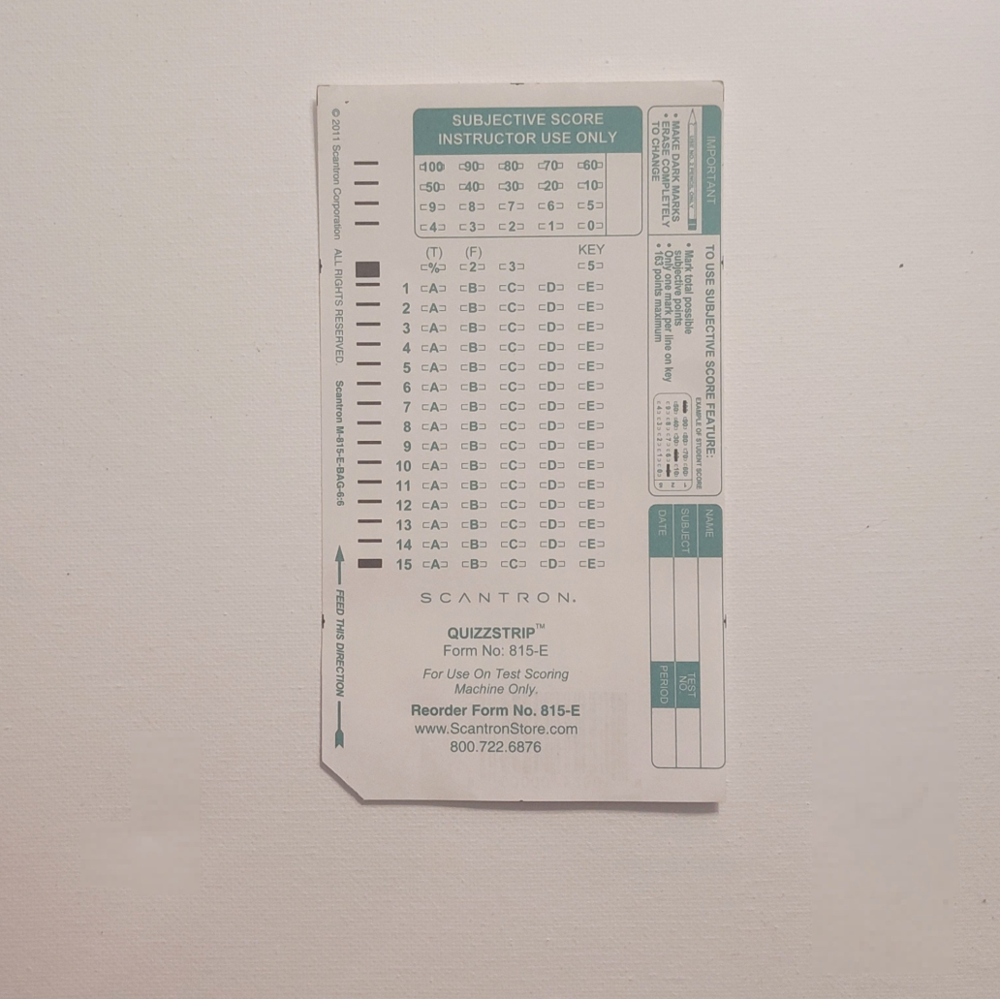

# Lecture 08b — Build the Eval Harness

> **In one sentence:** We build the tool this course has been promising since Lecture 01 — a real, reusable score for "is the answer still correct" — and use it to produce the first actual quality comparison between bf16, GPTQ, and AWQ, instead of one more eyeballed spot check.

**Last time:** Lecture 08 checked quality with one question, read by eye, and called it a spot check. **This time:** we build a harness that scores retrieval and answer quality automatically, across a whole question set.

## Prerequisites

| Concept | Needed? | Notes |
| --- | --- | --- |
| Lecture 01 | Yes | Reuses its `Retriever`/`Generator` and the recall@k idea from its Exercise 4 |
| Lecture 08 | Light | We re-run this eval against Lecture 08's saved GPTQ/AWQ checkpoints, if you have them |
| Statistics | No | The math page builds everything from one idea: a fraction computed from \\(N\\) samples carries uncertainty, and this page derives exactly how much |

Every quantization lecture since Module 2 opened has ended the same way: *"quality spot check: same question as Lecture 01."* One question, eyeballed, every time. Lecture 01 called this whole system an open-book exam — index cards, page-finding, answer-writing. We built the exam room. **We never built an answer key.**

<figure>
  
  <figcaption>An exam with no answer key isn't graded — it's just filled in. Every "spot check" this course has run so far is this sheet, unscored. <em>Photo: Lexilovescaffeine, Wikimedia Commons, CC0</em></figcaption>
</figure>

Today we do.

## Mental Model

> **An eval harness is a rubric, not a vibe check.** A rubric scores the same way, on paper, before anyone reads an answer. A vibe check is one person reading one answer and nodding.

What we've been doing versus what we build today:

| | What we did before | What we build today |
| --- | --- | --- |
| Retrieval | "the right paragraphs and the right diagram, before any generation happened" — one question (Lecture 01) | recall@k across every confirmed question in `eval_set.json` |
| Answer quality | "quality spot check: same question as Lecture 01" — one answer, read by eye (Lecture 08) | required-term coverage + citation accuracy, scored automatically, across every question |
| Answer key | Nobody wrote one down | Confirmed once, by a human, checked forever |

A rubric only works if someone actually checks it against reality once. Lecture 08's calibration set answered "what does the model see during quantization?" Today's eval set answers "how do we know it still works afterward?" — two different questions this course has been quietly conflating.
{: .remember}

## Where does everything run?

| Environment | Role in this lecture |
| --- | --- |
| 💻 Your laptop | Browser only, reading this page |
| ⚡ Lightning AI Studio | Everything — `build_eval_set.py` needs the GPU-backed retriever, `eval.py --generate` needs the GPU-backed generator |
| ☁️ AWS | Nothing yet — Module 3 |

## The Build

⚡ This lecture's folder, `code/module-2-vertical-wins/08b-build-the-eval-harness/`, is a copy-forward of Lecture 08's folder with three new files: `eval_set.json`, `build_eval_set.py`, `eval.py`.

```bash
git clone https://github.com/gaurav98095/Course-on-AI-Engineering.git   # skip if already cloned
cd Course-on-AI-Engineering/code/module-2-vertical-wins/08b-build-the-eval-harness
pip install -r requirements.txt
python ingest.py                    # build corpus/ if you don't have it yet
```

### Step 1 — Confirm a real answer key

`eval_set.json` ships with ten questions — the same eight from Lecture 03's `load_test.py`, plus two more — but every `expected_page` field is `null`. That's deliberate: a page number typed into this repo without ever being checked against your actual index would be a guess wearing the costume of a fact, and this course doesn't ship those.

```python
hits_t, _ = retriever(item["question"], k_text=5)
for i, t in enumerate(hits_t):
    print(f"  [{i}] {t['doc']} p.{t['page']}: {t['text'][:90]}...")
choice = input("Which index is the real answer? ('s' to skip): ").strip()
```

Run it and confirm each question by hand — this is the one step in the whole harness a script can't do for you:

```bash
python build_eval_set.py
```

```text
Q: Why does an aircraft stall at the critical angle of attack?
  [0] phak-ch4-aerodynamics p.5: The critical angle of attack is the angle at which airflow separates...
  [1] phak-ch4-aerodynamics p.4: As angle of attack increases, the airflow over the upper surface...
  [2] phak-ch7-instruments p.12: The angle of attack indicator, where installed, provides...
  [3] phak-ch4-aerodynamics p.6: Beyond the critical angle, the boundary layer can no longer...
Which index is the real answer? ('s' to skip): 0

Q: How does the attitude indicator work?
  [0] phak-ch7-instruments p.20: The attitude indicator uses a gyroscope to display...
  ...
Which index is the real answer? ('s' to skip): 0
```

Ten questions, ten judgment calls, saved once to `eval_set.json`. That file is now your answer key — every future run of `eval.py` checks against it, not against a guess, and not against this page's illustrative numbers.

### Step 2 — Score retrieval: recall@k

The formula Lecture 01's Exercise 4 already had you compute by hand, now automated across the whole set:

```python
def recall_at_k(retriever, items, k_text):
    hits = 0
    for item in items:
        hits_t, _ = retriever(item["question"], k_text=k_text)
        pages = {(t["doc"], t["page"]) for t in hits_t}
        if (item["expected_doc"], item["expected_page"]) in pages:
            hits += 1
    return hits / len(items)
```

```bash
python eval.py
```

```text
retrieval recall@4: 0.90  (10 questions)
```

One number, every question, no eyeballing. Sweep `--k` and you're re-running Lecture 01's Exercise 2 for real.

### Step 3 — Score the answer, not just the page

Recall@k only checks that the *right paragraph came back*. It says nothing about whether the model actually used it. Two automatic, literal checks close that gap:

```python
if all(term.lower() in answer.lower() for term in item["required_terms"]):
    term_hits += 1

cited = {(doc, int(page)) for doc, page in CITE_RE.findall(answer)}
if (item["expected_doc"], item["expected_page"]) in cited:
    cite_hits += 1
```

`required_terms` are the words a correct answer has to contain — "angle of attack," "separates" for the stall question. The citation check reuses the exact `[doc p.N]` format every generator prompt in this course has demanded since Lecture 01, so it's free to check.

```bash
python eval.py --generate
```

```text
retrieval recall@4: 0.90  (10 questions)

generating with: bf16 ...
required-term coverage: 0.80
citation accuracy:      0.70
```

### Step 4 — Put a real number on "does quantization hurt quality?"

The payoff. Point the exact same eval set at a checkpoint Lecture 08 saved:

```bash
python eval.py --generate --checkpoint qwen3-vl-8b-gptq-4bit
python eval.py --generate --checkpoint qwen3-vl-8b-awq-4bit
```

This works because `rag.py`'s `Generator` now takes an optional `quantized_path` — everything else, retrieval included, is identical:

```python
def __init__(self, quantized_path: str | None = None) -> None:
    if quantized_path is None:
        self.model = AutoModelForImageTextToText.from_pretrained(GENERATOR, ...)
    else:
        self.model = GPTQModel.load(quantized_path)
    self.processor = AutoProcessor.from_pretrained(GENERATOR)
```

<figure>
  
  <figcaption>A "STANDARD" reference mug, kept on the shelf specifically to check new ones against. That labeled cup <em>is</em> `eval_set.json` — the one confirmed-correct reference everything else gets held up to. <em>Photo: Encik Tekateki, Wikimedia Commons, CC BY-SA 4.0</em></figcaption>
</figure>

Retrieval recall@4 cannot move between these three runs — Lecture 08 already told us GPTQModel quantizes only the text generator, never the retrieval embedders, and `recall_at_k` never touches the generator at all. Any difference you see lives entirely in required-term coverage and citation accuracy.

## Measure It

| Metric | bf16 | GPTQ 4-bit | AWQ 4-bit | Why |
| --- | --- | --- | --- | --- |
| Retrieval recall@4 | ~0.90 (9/10) | *identical* | *identical* | Retrieval never runs through the generator checkpoint |
| Required-term coverage | ~0.80 (8/10) | *run it — expect close to bf16* | *run it — expect close to bf16* | Depends on generation quality |
| Citation accuracy | ~0.70 (7/10) | *run it — expect close to bf16* | *run it — expect close to bf16* | Stricter check — exact `[doc p.N]` format |

> The bf16 column is a ballpark, same as every "Measure It" table in this course. The GPTQ/AWQ columns are this lecture's least-verified numbers, for the same reason Lecture 08 flagged its own: `eval.py --generate --checkpoint ...` follows `GPTQModel`'s documented `load()` API but hasn't been run end-to-end on real hardware before publishing. Run it yourself and treat your own ten numbers as the real result — that is, after all, the entire point of building an eval harness instead of trusting a table in a lecture.

## The Math, One Level Deeper

Ten questions, nine correct, recall@4 = 0.90. That number looks precise. It isn't — it's a *sample* of size 10 from a process that could easily have handed you 8/10 or 10/10 by chance alone, even if nothing about the system changed at all.

\\[
SE = \sqrt{\frac{\hat p(1-\hat p)}{N}}, \qquad \text{95% CI} = \hat p \pm 1.96 \cdot SE
\\]

Plug in \\(N=10\\), \\(\hat p=0.90\\): \\(SE = 0.095\\), so the honest range behind that single "0.90" is **[0.71, 1.00]** — wide enough to swallow a genuinely worse system without our eval set ever noticing.

> **Want the full derivation?** Why an eval score is a coin flip repeated \\(N\\) times, how the confidence interval shrinks (slowly) with more questions, and the real number of questions needed before "GPTQ looks about as good as bf16" is a claim you can stand behind rather than a guess:
> [Math Deep Dive 08b — How Many Eval Questions Are Enough? →](../math/08b-eval-set-statistics.md)

## Where It Breaks

**Exact substring matching is a crude proxy for correctness.** `"angle of attack" in answer.lower()` misses a correct answer that says "AoA" or phrases the physics differently. This harness trades nuance for automation — a real production eval would grade with a second LLM call or a human, not a keyword list. Treat these scores as a floor, not a ceiling, on true quality.

**Ten questions is a demo, not a deployment eval.** The math page makes this precise: our confidence interval is enormous. Before trusting a quantization decision on real traffic, Exercise 4 below (and the math page's Part 5) tell you roughly how many more questions that actually takes.

**Calibration and eval share a corpus.** Lecture 08's GPTQ/AWQ calibration set was 256 chunks from this same manual — the same document our eval questions are about. That's the right choice for a narrow, single-manual deployment, but it means this eval isn't testing generalization to unrelated documents, only faithfulness to the one it was tuned on.

**A confirmed answer key is only as good as the human who confirmed it.** `build_eval_set.py` removes the "did I type the right page number" risk, not the "did the person confirming this session know the material" risk. For a real deployment, have someone who actually knows the domain do Step 1, not whoever is fastest at the keyboard.

## Exercises

1. **Confirm it for real.** Run `build_eval_set.py` yourself, then `eval.py`. How does your real recall@4 compare to this lecture's illustrative 0.90?
2. **Complete the triangle.** Run `eval.py --generate` against bf16 and both of Lecture 08's saved checkpoints. Build the real version of this lecture's Measure It table.
3. **Widen the eval set.** Add 10 more questions of your own — from a different chapter, or your own document entirely — confirm their answers, and re-run. Does recall@4 hold steady?
4. **How many questions would you actually need?** Using the math page's Part 5, compute the sample size needed to detect the specific gap you observed in Exercise 2 between bf16 and your quantized checkpoint (if any). Is 10 close, or nowhere near enough?
5. **Loosen the term check.** `required_terms` currently demands an exact substring. Rewrite `answer_quality` to accept any one of a short list of synonyms per term (e.g. `["angle of attack", "AoA"]`). Does required-term coverage change?

## Summary

We finally built the thing every quantization lecture has been promising: a real, automatic score. `build_eval_set.py` turns a guess into a confirmed answer key by having a human check it once. `eval.py` then runs recall@k and two literal answer-quality checks across the whole set, and can point its generator at any checkpoint — bf16 or either of Lecture 08's quantized models — without touching retrieval at all. The math page's confidence interval is the honest asterisk on every number this harness produces: ten questions is a real improvement over one, and still not enough to bet a production decision on without knowing exactly how much noise you're looking at.

> **What should you remember?**
> - An eval harness is a rubric confirmed once by a human, not a vibe check repeated forever.
> - Recall@k measures retrieval; required-term coverage and citation accuracy measure whether the model actually used what it retrieved — three different numbers, not one.
> - A score from \\(N\\) questions carries an uncertainty of roughly \\(1/\sqrt N\\) — quadruple the eval set to halve the uncertainty, not double it.

## Resources

- Recall@k and the eval-set idea — Lecture 01's Exercise 4, where this harness's core question first appeared.
- The Wilson score interval — the standard, more accurate small-sample alternative to this page's normal-approximation confidence interval.
- `ModelCloud/GPTQModel` — the library whose `load()` API `eval.py --checkpoint` reuses from Lecture 08.

---

[← Previous: Lecture 08 — Quantization II: GPTQ & AWQ in Practice](08-quantization-ii-gptq-and-awq.md) · [Course Home](../index.md) · [Next: Lecture 09 — FlashAttention →](09-flashattention.md)
