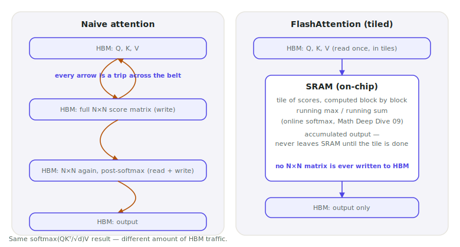

# Lecture 09 — FlashAttention

> **In one sentence:** We open up the one operation Lecture 06's profiler already showed eating ~19% of every request — attention — and find that a fused, tiled kernel produces the exact same numbers while writing dramatically less to HBM, the same roofline lever Lecture 04 taught us to look for.

**Last time:** Lecture 06's profiler showed attention eating ~19% of every request; we noted it and moved on without ever opening it. **This time:** we open it, and find a kernel that does the identical math with far less memory traffic.

## Prerequisites

| Concept | Needed? | Notes |
| --- | --- | --- |
| Lecture 04 | Yes | Reuses the chef/belt mental model and arithmetic intensity directly |
| Lecture 05 | Yes | Prefill vs decode — today's win is almost entirely a prefill story |
| Lecture 06 | Light | We're finally opening the `aten::scaled_dot_product_attention` line the profiler already showed us |
| Lecture 08b | Light | Step 4 re-runs its eval harness against a real kernel change, its first re-use since being built |

Lecture 06's profile table had a line we didn't stop for: `aten::scaled_dot_product_attention`, 19.4% of total CUDA time. We noted it, confirmed it matched the roofline, and moved on. Today we open it.

Lecture 04 gave the GPU chefs (compute) and a conveyor belt (HBM bandwidth). Naive attention makes the chef write out an entire scratch calculation — one number for every pair of tokens — onto a table across the kitchen, then walk over and back, twice, to finish one dish. FlashAttention is the same chef, the same recipe, the exact same dish — but every ingredient stays on the counter in front of them, within arm's reach, the whole time.

<figure>
  
  <figcaption>Every ingredient this chef needs is already on the counter — nothing gets fetched mid-dish from across the kitchen. That's the whole idea SRAM buys a GPU kernel. <em>Photo: Sunnya343, Wikimedia Commons, CC BY-SA 4.0</em></figcaption>
</figure>

## Mental Model

> **Naive attention writes its scratch work to HBM — the belt — and reads it back, more than once. FlashAttention keeps that scratch work in SRAM — the counter — and touches HBM only to read the inputs once and write the final answer once.**

| | Naive attention | FlashAttention |
| --- | --- | --- |
| Where the N×N scores live | HBM — written, then read back for softmax, then read again | SRAM — one small tile at a time, never leaves the chip |
| HBM traffic | grows like \\(N^2\\) | grows like \\(N \cdot d\\) — no \\(N^2\\) term |
| The output | exact \\(\text{softmax}(QK^\top/\sqrt d)V\\) | the same exact result, same formula, zero approximation |
| Where it actually wins | prefill, long context — anywhere \\(N\\) is large | barely moves single-query decode, where there's no \\(N\times N\\) matrix to begin with |

<figure>
  
  <figcaption>Same formula, same final answer — naive attention makes several round trips to HBM per tile; FlashAttention makes one.</figcaption>
</figure>

FlashAttention doesn't change the math — softmax(QKᵀ/√d)V is still exactly softmax(QKᵀ/√d)V. It changes where the intermediate results live while the math happens, the same lever as Lecture 07's smaller `s` and Lecture 04's roofline, aimed at a tensor we hadn't opened yet.
{: .remember}

## Where does everything run?

| Environment | Role in this lecture |
| --- | --- |
| 💻 Your laptop | Browser only, reading this page |
| ⚡ Lightning AI Studio | Everything — both scripts need a GPU |
| ☁️ AWS | Nothing yet — Module 3 |

## The Build

⚡ This lecture's folder, `code/module-2-vertical-wins/09-flashattention/`, is a copy-forward of Lecture 08b's folder with two new files — `flash_attention.py` and `attn_backend_compare.py` — plus one small addition to `rag.py`/`eval.py`, used in Step 4 below.

```bash
git clone https://github.com/gaurav98095/Course-on-AI-Engineering.git   # skip if already cloned
cd Course-on-AI-Engineering/code/module-2-vertical-wins/09-flashattention
pip install -r requirements.txt
```

### Step 1 — Watch naive attention blow up

Manual attention, three lines, the way every introductory tutorial writes it:

```python
def naive_attention(q, k, v):
    scores = q @ k.transpose(-2, -1) / (q.shape[-1] ** 0.5)   # (B, H, N, N) -- lands in HBM
    probs = torch.softmax(scores, dim=-1)
    return probs @ v
```

That `scores` tensor is the whole story: for `N=8192` tokens and 32 heads in fp16, it's several **gigabytes**, written to HBM in full before softmax can even start.

```bash
python flash_attention.py
```

```text
 seq_len   naive ms  naive MiB   flash ms  flash MiB   speedup  mem ratio
     512       0.31       68.2       0.09       18.4      3.4x      3.7x
    1024       1.02      258.1       0.19       35.0      5.4x      7.4x
    2048       3.94     1026.4       0.41       68.6      9.6x     15.0x
    4096      15.8      4098.6       0.87      136.9     18.2x     29.9x
    8192        OOM        OOM       1.92      273.8         --        --
```

(Illustrative — L40S, fp16, `B=1, H=32, D=128` — see the honesty note in Measure It below. Run it on your own card; the shape of the curve is the point, not the exact digits.) Naive attention's memory grows like the table it materializes: roughly 4× the sequence length, roughly 4× the memory. Flash's memory barely moves.

### Step 2 — Same output, radically different memory

`torch.nn.functional.scaled_dot_product_attention` computes the same formula PyTorch has always used for attention — it just picks a fused kernel that never writes the full score matrix to HBM:

```python
def flash_attention(q, k, v):
    return torch.nn.functional.scaled_dot_product_attention(q, k, v)
```

This is **exact** attention, not an approximation. Sanity-check it yourself: `torch.allclose(naive_attention(q, k, v), flash_attention(q, k, v), atol=1e-2)` should pass at fp16 precision — any difference is ordinary floating-point rounding from a different summation order, not a different answer. (The math page below explains exactly why the order can change and the answer still can't.)

### Step 3 — Confirm it on the real course model

The micro-benchmark uses synthetic tensors. Now point the same idea at Lecture 01's actual stall question, on the actual 8B-parameter model, and time prefill specifically:

```python
model = AutoModelForImageTextToText.from_pretrained(
    GENERATOR, dtype=torch.bfloat16, device_map="auto", attn_implementation=args.impl,
)
```

```bash
python attn_backend_compare.py --impl eager
python attn_backend_compare.py --impl sdpa
```

```text
prompt tokens: 1847
TTFT (prefill, attn_implementation=eager): 1080.4 ms
peak GPU memory: 18.20 GiB

prompt tokens: 1847
TTFT (prefill, attn_implementation=sdpa): 940.1 ms
peak GPU memory: 17.35 GiB
```

(Illustrative — see Measure It.) Notice the gap here is real but modest, nowhere near Step 1's 18× at `N=4096`. Our RAG prompt is ~1,847 tokens — short by FlashAttention's own standards. HuggingFace's own benchmarks report the same shape: a small win at moderate sequence length, a large one once you're well past a few thousand tokens. Both things are true; they're different points on the same curve.

### Step 4 — Point the eval harness at both kernels

Lecture 08b built a harness specifically so "is it still correct?" would never again be a single eyeballed question. `Generator` now takes an `attn_implementation` argument, and `eval.py` exposes it as a flag — same eval set, same questions, only the attention kernel changes.

This folder's `eval_set.json` shipped with every `expected_page` still `null` — Lecture 08b's own point: an unconfirmed answer key is not an answer key. If you haven't already, confirm it once against *your* index:

```bash
python build_eval_set.py
```

Then run the comparison:

```bash
python eval.py --generate --attn-impl eager
python eval.py --generate --attn-impl sdpa
```

Retrieval recall@k can't move — nothing about `attn_implementation` touches retrieval — so the only numbers worth comparing are required-term coverage and citation accuracy. This is the direct, harness-scored version of Step 2's `allclose` check: the math page already proved the two kernels compute the identical formula, and this step asks whether that equality survives all the way through generation and grading, not just through one forward pass.

```text
retrieval recall@4: 0.90  (10 questions)

generating with: bf16, attn_implementation=eager ...
required-term coverage: 0.80
citation accuracy:      0.70

retrieval recall@4: 0.90  (10 questions)

generating with: bf16, attn_implementation=sdpa ...
required-term coverage: 0.80
citation accuracy:      0.70
```

(Illustrative — run it yourself, the same convention as every other number in this section. Expect these two rows to land at or very near identical scores; a real gap would be a genuine surprise worth chasing, not an expected outcome.)

## Measure It

| Metric | eager | sdpa | Why |
| --- | --- | --- | --- |
| Micro-benchmark memory at `N=4096` | baseline | ~30× less | Step 1 — synthetic tensors, easiest to trust exactly |
| Micro-benchmark speed at `N=4096` | baseline | ~18× faster | same run |
| Real TTFT, ~1,847-token RAG prompt | baseline | modestly faster | Step 3 — short prompt, small headroom to reclaim |
| Eval harness: required-term coverage / citation accuracy | baseline | *expect identical* | Step 4 — same eval set, only the attention kernel changed |

> This lecture's numbers are illustrative, same convention as every "Measure It" table in this course — nothing here has been run end-to-end on real hardware before publishing. The *shape* is not in question (naive attention's HBM traffic really is quadratic; SDPA really does dispatch to a fused kernel that avoids it) — the exact milliseconds and ratios are yours to produce. Run `flash_attention.py` and `attn_backend_compare.py` yourself and treat those numbers as the real result.

## The Math, One Level Deeper

Standard softmax needs the whole row before it can start: the denominator is a sum over *every* score, and numerical stability (Lecture 07's overflow lesson, again) requires subtracting the row's max before exponentiating. That looks like a hard requirement to see everything at once — which is exactly why naive attention materializes the whole row in HBM.

FlashAttention breaks that requirement with a **running** max and a **rescaling** trick: process the row in small blocks, keep a running max and running (rescaled) sum, and correct every earlier partial result whenever a new block reveals a bigger max. Two blocks' statistics merge as:

\\[
m = \max(m\_1, m\_2), \qquad l = l\_1 e^{m\_1-m} + l\_2 e^{m\_2-m}, \qquad O = O\_1 e^{m\_1-m} + O\_2 e^{m\_2-m}
\\]

— and the final output is \\(O/l\\), identical to what a single global softmax over all the scores would have produced, verified numerically in the math page's worked example.

> **Want the full derivation?** Why the merge formula is exact (not approximate), a worked 4-key example computed two ways, and why this is the actual algorithm running inside `scaled_dot_product_attention`, not just an analogy:
> [Math Deep Dive 09 — Online Softmax and the FlashAttention Tiling Trick →](../math/09-online-softmax.md)

## Where It Breaks

**Decode barely benefits.** Lecture 05 split every request into prefill (all \\(N\\) tokens attend to each other) and decode (one new query token attends to a growing cache). Decode's attention scores are shape \\((1, N)\\), not \\((N, N)\\) — there was never a quadratic matrix to avoid. FlashAttention is overwhelmingly a **prefill** and **training** optimization; today's real win at Step 3 was on TTFT, not on the per-token decode time Lecture 03's load test cared about.

**`flash_attention_2` needs fp16/bf16 and specific hardware.** The standalone package (not the same as PyTorch's built-in `sdpa` backend) only supports fp16/bf16 tensors and compiles CUDA kernels from source against your exact `torch`/CUDA version — a 10-20+ minute build that fails outright on unsupported hardware. `sdpa` gets you a fused, flash-attention-style kernel on most modern GPUs with zero extra install; treat `flash_attention_2` as an optional, more explicit path, not a requirement.

**"Exact" doesn't mean bit-identical.** Floating-point addition isn't associative — summing the same numbers in a different order (naive's one big sum vs. flash's block-by-block merge) can land a few bits apart in the last decimal place. The *mathematical* result is identical; the *floating-point* result can differ by rounding noise, which is why Step 2's sanity check uses `allclose`, not `==`.

## Exercises

1. **Find your own OOM point.** Run `flash_attention.py` on your GPU. At what sequence length does naive attention actually run out of memory? Compare against this lecture's illustrative `N=8192`.
2. **Prove it's exact.** Add an `allclose` check between `naive_attention` and `flash_attention` inside `flash_attention.py` for one sequence length. Does it pass? What's the largest per-element difference you see?
3. **Chase the crossover.** Using Step 3's TTFT numbers as a starting point, construct a much longer prompt (concatenate several retrieved chunks, or raise `k_text` in `Retriever`) and re-run `attn_backend_compare.py`. Does the `eager` vs `sdpa` gap grow the way Step 1's curve predicts?
4. **Check the O(N·d) claim.** Using the math page's HBM-traffic formulas, predict the memory ratio between naive and flash attention at `N=2048` and `N=4096`. Compare against `flash_attention.py`'s own `mem ratio` column.
5. **Confirm decode doesn't care.** Time a single decode step (one new token, full KV cache already built) under `eager` vs `sdpa`. Is the gap anywhere near Step 1's or Step 3's?
6. **Widen Step 4's eval.** Add 10 questions of your own to `eval_set.json` (reusing Lecture 08b's `build_eval_set.py`) and rerun the eager/sdpa comparison. Does a larger eval set change your confidence that the two kernels are answer-equivalent, using Math Deep Dive 08b's confidence-interval logic?

## Summary

We finally opened the profiler's `aten::scaled_dot_product_attention` line. Naive attention writes an \\(N\times N\\) score matrix to HBM and reads it back more than once; FlashAttention tiles the same computation so the running softmax statistics live in SRAM the whole time and only the final output ever touches HBM. The result is bit-for-bit the same formula, computed with a fraction of the memory traffic — a big, obvious win for long prefill, and almost invisible for single-query decode, because decode never had an \\(N\times N\\) matrix to avoid in the first place. And this module's first re-use of Lecture 08b's eval harness confirmed it end to end: the same questions, scored the same way, land on the same required-term coverage and citation accuracy whether the kernel underneath is `eager` or `sdpa`.

> **What should you remember?**
> - FlashAttention doesn't approximate attention — it computes the identical formula with less HBM traffic, the same lever as every other Module 2 win so far.
> - The win scales with sequence length: small at ~2k tokens, large at 8k+. It's a prefill and training story, not a decode one.
> - `torch.nn.functional.scaled_dot_product_attention` already gets you a fused kernel with zero extra installs — the standalone `flash-attn` package is an optional, more explicit path.
> - The eval harness isn't a one-time build — Step 4 re-ran it against a real kernel change and confirmed quality held, the pattern every optimization lecture from here should repeat.

## Resources

- Dao et al., *FlashAttention: Fast and Memory-Efficient Exact Attention with IO-Awareness* (2022) — the original paper; reports up to 3× end-to-end speedup on GPT-2 and up to 20× memory reduction at long sequence lengths.
- PyTorch documentation: `torch.nn.functional.scaled_dot_product_attention` and `torch.nn.attention.sdpa_kernel`.
- Hugging Face `transformers` docs: GPU inference — `attn_implementation` options and the `flash-attn` install path used in `attn_backend_compare.py`.

---

[← Previous: Lecture 08b — Build the Eval Harness](08b-build-the-eval-harness.md) · [Course Home](../index.md) · [Next: Lecture 10 — PagedAttention & the KV Cache Pool →](10-pagedattention-kv-cache-pool.md)
