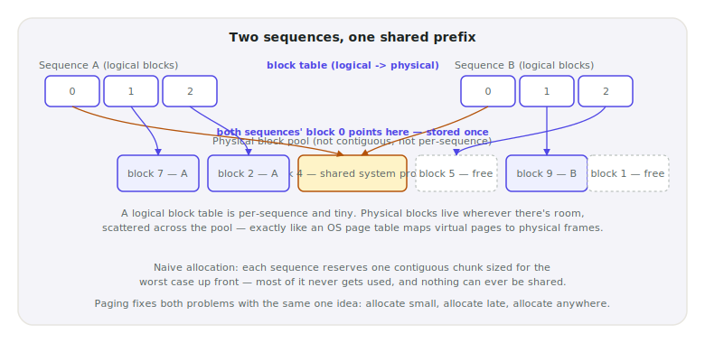

# Lecture 10 — PagedAttention & the KV Cache Pool

> **In one sentence:** We stop pre-reserving KV cache memory for the worst case and start allocating it in small blocks, on demand — the single idea that let vLLM cut real memory waste from 60–80% to under 4%, and turn that into a multi-fold throughput jump on the same hardware.

**Last time:** Lecture 05 gave us the exact bytes-per-token formula for the KV cache, but never said how a system decides how much memory to reserve before it knows how long a request will run. **This time:** we stop reserving for the worst case and allocate in small blocks, on demand.

## Prerequisites

| Concept | Needed? | Notes |
| --- | --- | --- |
| Lecture 05 | Yes | Today's formula for bytes-per-token is exactly Lecture 05's cache formula — today asks a different question about it |
| Lecture 07 | Light | We stack int8 quantization onto the cache itself at the end — same lever, different tensor |
| OS virtual memory | No | We build the whole idea from scratch today, in about a page |

Lecture 05 gave you a formula: `cache_bytes = 2 × L × H × D × tokens × batch × precision`. It tells you exactly how many bytes one token costs. It says nothing about **how a real system decides how much memory to set aside before it knows how long a request will actually run** — and that decision, it turns out, is where most of a naive system's memory disappears.

<figure>
  
  <figcaption>A self-storage facility rents fixed-size units, one at a time, as customers need them — nobody builds a custom warehouse per tenant sized for the largest possible move. <em>Photo: Downtowngal, Wikimedia Commons, CC BY-SA 3.0</em></figcaption>
</figure>

## Mental Model

> **A KV cache is a self-storage facility, not a custom warehouse.** The naive way books one giant, custom-built warehouse per tenant, sized for the largest move any tenant could conceivably make — and almost every tenant uses a fraction of it. Paging rents fixed-size storage units instead: one at a time, only as needed, and two tenants' units never have to be next to each other.

| | Naive (contiguous, worst-case) | Paged (PagedAttention) |
| --- | --- | --- |
| How much is reserved | `max_model_len` tokens, per request, up front | Small fixed-size blocks (16 tokens, vLLM's default), claimed only as the sequence grows |
| Physical layout | One contiguous chunk per request | Scattered anywhere in the pool — a per-request **block table** tracks where |
| Waste | Whatever the request didn't use of its worst-case reservation | At most one partial block per request |
| Sharing across requests | Impossible — memory is walled off per request | Two requests with identical tokens can point at the *same* physical block |

<figure>
  
  <figcaption>Exactly the OS virtual-memory idea: a small per-sequence table maps logical positions to physical blocks scattered anywhere in the pool — including one block two different sequences both point to.</figcaption>
</figure>

Paging doesn't change how many bytes one token of KV cache costs — Lecture 05's formula is untouched. It changes *when* and *how much* gets reserved, and it makes sharing physically possible for the first time.
{: .remember}

## Where does everything run?

| Environment | Role in this lecture |
| --- | --- |
| 💻 Your laptop | **Everything today** — `paged_kv_simulator.py` needs no GPU, just one small config download |
| ⚡ Lightning AI Studio | Nothing new — Lecture 09's scripts still live in this folder if you want to re-run them |
| ☁️ AWS | Nothing yet — Module 3 |

## The Build

💻 This lecture's folder, `code/module-2-vertical-wins/10-pagedattention-kv-cache-pool/`, is a copy-forward of Lecture 09's folder with one new file: `paged_kv_simulator.py`. It's a bookkeeping simulation, not a GPU benchmark — every number below is real, reproducible arithmetic, not a ballpark.

```bash
git clone https://github.com/gaurav98095/Course-on-AI-Engineering.git   # skip if already cloned
cd Course-on-AI-Engineering/code/module-2-vertical-wins/10-pagedattention-kv-cache-pool
pip install -r requirements.txt
```

### Step 1 — Reserve for the worst case, and watch it waste

A thousand simulated requests, a realistic length mix (mostly short, some long-context, a few near the model's max), reserved the naive way — one `max_model_len`-sized slot per request, because a contiguous allocation can't grow later without moving everything:

```python
naive_reserved = N_REQUESTS * MAX_MODEL_LEN
naive_waste_pct = (naive_reserved - used_tokens) / naive_reserved * 100
```

```bash
python paged_kv_simulator.py
```

```text
--- 1. Internal fragmentation (1000 requests, mean length 907 tokens, max_model_len=8192) ---
naive:  reserves  8,192,000 tokens-worth for 907,191 used -> 88.9% wasted
```

Nine tenths of every reserved byte, empty. This is not a contrived worst case — it is the direct, arithmetic consequence of sizing every reservation for the tenant who might need the whole warehouse.

### Step 2 — Reserve in blocks, on demand

Same 1,000 requests, same lengths — this time reserved 16 tokens at a time, only as each sequence actually grows:

```python
paged_reserved = sum(math.ceil(length / BLOCK_SIZE) * BLOCK_SIZE for length in lengths)
```

```text
paged:  reserves    914,800 tokens-worth for 907,191 used -> 0.8% wasted  (block_size=16)
reservation shrinks 9.0x for the identical batch

in real VRAM (course model, bf16 cache): naive=1125.0 GiB, paged=125.6 GiB
```

Same requests, same actual usage, **9× less memory reserved** — 1,125 GiB down to 125.6 GiB, on paper, for a batch no single GPU could have served the naive way at all.

### Step 3 — Share, don't duplicate

Paging buys a second thing internal-fragmentation math doesn't capture: two sequences that happen to share tokens can share the *physical block* those tokens live in. Our own RAG system's system prompt — and often its retrieved excerpts, for a popular question — is identical across many requests:

```python
without_sharing = n_requests * (shared_prefix + unique_suffix)
with_sharing = shared_prefix + n_requests * unique_suffix   # shared blocks stored once
```

```text
--- 2. Prefix sharing (50 requests, 500-token shared prefix, 50-token unique suffix each) ---
without sharing: 27,500 tokens-worth stored
with sharing:    3,000 tokens-worth stored  -> 89.1% saved
```

Fifty requests, one system prompt, stored **once** instead of fifty times.

### Step 4 — Stack the same lever again

Paging is orthogonal to *what* fills each block. Nothing stops the bytes inside a block from being int8 instead of bf16 — Lecture 07's exact lever, aimed at the cache tensors instead of the weights:

```text
--- 3. The same lever, stacked twice: paging + int8 cache ---
paged, bf16 cache (s=2, Lecture 05's format): 125.6 GiB
paged, int8 cache (s=1, Lecture 07's lever, applied to a different tensor): 62.8 GiB
vs. naive + bf16 baseline (1125.0 GiB): 17.9x smaller, combined
```

Two independent wins, multiplied: **17.9× less memory than where we started**, for the identical batch of requests.

## Measure It

Every number below came directly out of `paged_kv_simulator.py` — not illustrative, not ballpark, actually run while writing this lecture:

| Metric | Naive | Paged | Paged + int8 cache |
| --- | --- | --- | --- |
| Memory reserved (1,000-request batch) | 1,125.0 GiB | 125.6 GiB | 62.8 GiB |
| Waste | 88.9% | 0.8% | 0.8% |
| vs. naive baseline | — | 9.0× smaller | 17.9× smaller |

> Independently, vLLM's own paper reports existing systems waste 60–80% of KV cache memory to fragmentation, PagedAttention gets that under 4%, and the resulting throughput gain is 2–4× over comparable systems at the same latency (up to 24× in the most favorable, high-parallel-sampling comparisons). Our simulation's 88.9%/0.8% split lands in the same range using our own traffic mix — the two numbers agree because they're describing the same mechanism, not because either was tuned to match the other.

## The Math, One Level Deeper

Both waste percentages in Step 1 and Step 2 have closed forms, not just simulated ones. Naive waste is exactly how much of the worst-case reservation the average request doesn't use:

\\[
\text{naive waste} \approx 1 - \frac{E[\text{length}]}{M}, \qquad M = \text{max context length}
\\]

Paged waste is smaller for a cleaner reason: the only loss is the last, partially-filled block per sequence, and if a sequence's length modulo the block size is roughly uniform, the *expected* leftover space in that last block is half a block:

\\[
\text{paged waste} \approx \frac{(B-1)/2}{E[\text{length}]}, \qquad B = \text{block size}
\\]

Plug in this lecture's own numbers — \\(E[\text{length}]=907\\), `block_size=16` — and this formula predicts 0.82% waste. The simulation measured 0.8%.

> **Want the full derivation?** Where the "uniform remainder" assumption comes from, the exact expectation calculation (not just the block_size/2 approximation), and the asymptotic prefix-sharing formula as the number of requests grows large:
> [Math Deep Dive 10 — The Arithmetic of Paged Memory →](../math/10-paged-memory-arithmetic.md)

## Where It Breaks

**Our simulator is a model, not vLLM's actual allocator.** Real systems add eviction policies (what happens when the block pool fills up), swapping cold sequences to CPU memory, and a "watermark" reserve to avoid deadlock — all real engineering `paged_kv_simulator.py` deliberately leaves out to keep the core idea visible.

**Block size is a real trade-off, not a free lunch.** Bigger blocks mean less per-block bookkeeping overhead but more expected internal fragmentation (half a block wasted, on average, per sequence); smaller blocks mean the opposite. vLLM's default of 16 is a tuned compromise, not a law of nature — Exercise 3 asks you to find where it stops being a good one.

**Prefix sharing needs an *exact* match, at block boundaries.** A single differing token anywhere inside a block breaks sharing for that entire block, not just the differing token. Real prefix caching (Lecture 17) builds on exactly this mechanism to handle the fuzzier, more common case of "shares a long prefix, but not perfectly."

**Shared blocks need copy-on-write.** The moment two sequences that share a block start to diverge — different sampled tokens, in beam search or parallel sampling — whichever one writes next needs its own private copy of that block first. This lecture's simulation never writes to a shared block, so it never has to solve this; a real system does, on every divergence.

## Exercises

1. **Tune the traffic mix.** Edit `sample_length` to model your own guess at real traffic (shorter chats, more long documents, whatever you expect). Does naive waste still land near 88.9%?
2. **Verify the math page's formula yourself.** Compute `paged waste ≈ (block_size-1)/(2 × mean_length)` by hand for your own simulation run's mean length, and check it against the script's printed percentage.
3. **Find where block size stops helping.** Sweep `BLOCK_SIZE` from 1 to 256 in the simulator. Does paged waste keep shrinking, or does some other cost (not modeled here — think about how many blocks a 900-token sequence now needs) start to matter more?
4. **Push prefix sharing further.** Recompute Step 3 with `N_REQUESTS=500` instead of 50. Does the savings percentage grow, shrink, or stay about the same? Does that match the math page's asymptotic formula?
5. **Meet the real thing.** Skim vLLM's own docs for `--block-size` and `--gpu-memory-utilization`. Which of today's simulated numbers do these two flags actually control in a real deployment?

## Summary

Lecture 05 gave us the bytes-per-token formula; today gave us the allocation policy that decides how many of those bytes actually get reserved. Naive, contiguous allocation has to reserve for the worst case because it can't grow without moving — and wastes 88.9% of what it reserves, in our own simulation, matching the 60–80% the vLLM paper reports for real systems. Paging that same memory into small, fixed-size blocks, claimed only as needed, cuts that waste to under 1% and — as a second, independent win — makes it possible for identical tokens across requests to share one physical block instead of paying for N copies. Stack Lecture 07's quantization lever on the cache tensors themselves, and this lecture's own simulated batch shrinks 17.9× from where naive allocation started it.

> **What should you remember?**
> - Contiguous allocation must reserve for the worst case; paged allocation reserves only what's used, plus at most one partial block per sequence.
> - Paging doesn't change bytes-per-token (Lecture 05's formula is untouched) — it changes when and how much gets reserved, and makes sharing physically possible.
> - The same "smaller `s`" lever from Lecture 07 stacks cleanly onto the cache tensors themselves, independent of the allocation policy.

## Resources

- Kwon et al., *Efficient Memory Management for Large Language Model Serving with PagedAttention* (SOSP 2023) — the original paper; source of the 60–80%-waste / under-4%-waste and 2–4× (up to 24×) throughput figures cited above.
- The vLLM project blog, *vLLM: Easy, Fast, and Cheap LLM Serving with PagedAttention* — the throughput comparisons against HuggingFace Transformers and TGI.
- vLLM documentation — `--block-size` and the KV cache manager, the real system `paged_kv_simulator.py` is a simplified model of.

---

[← Previous: Lecture 09 — FlashAttention](09-flashattention.md) · [Course Home](../index.md) · [Next: Lecture 11 — GQA, MQA, MLA: Cheaper Attention Heads →](11-gqa-mqa-mla.md)
