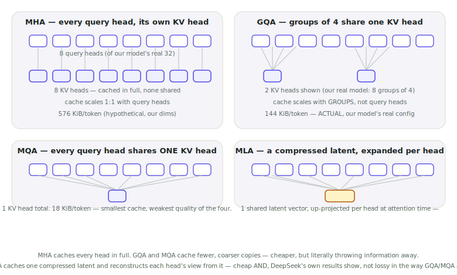

# Lecture 11 — GQA, MQA, MLA: Cheaper Attention Heads

> **In one sentence:** We open the head-sharing trick Lecture 05 used without explaining — 32 query heads, only 8 KV heads — and meet the design space it belongs to: MQA's extreme version, and MLA's genuinely different alternative.

**Last time:** Lecture 05 told us our model uses GQA and that this bought a 4× smaller cache, without ever explaining how or why. **This time:** we open the head-sharing mechanism itself and meet the wider design space it belongs to.

## Prerequisites

| Concept | Needed? | Notes |
| --- | --- | --- |
| Lecture 05 | Yes | Today reopens its cache formula's \\(H\\) term and its already-stated fact that our model uses GQA |
| Lecture 04 | Light | Today's math page reuses arithmetic intensity to explain *why* fewer KV heads helps, not just that it does |
| Self-attention | Yes | Just what Q, K, V are; the multi-head split is explained from scratch today |

Lecture 05 told you this and moved on: *"kv_heads=8 (query heads: 32) — this model uses GQA... GQA already bought this course a 4× smaller cache before Module 2 even begins."* We used that fact without asking where it came from, or what the alternatives were.

<figure>
  
  <figcaption>An operator connecting one call is MHA. An operator who's learned to run four lines at once, from the same board, is GQA. This switchboard already had the idea — decades before transformers did. <em>Photo: Wikimedia Commons, public domain</em></figcaption>
</figure>

## Mental Model

Every attention design answers the same two questions differently: **how many distinct key/value representations get computed and cached**, and **how do multiple query heads use them**?

| Design | KV representations | How query heads share them |
| --- | --- | --- |
| **MHA** (original Transformer) | One per query head | No sharing — every head is fully independent |
| **GQA** | A handful of *groups* | Each group's K/V is reused, unmodified, by several query heads |
| **MQA** | Exactly one | *Every* query head reuses the same single K/V |
| **MLA** (DeepSeek-V2) | One shared, *compressed* latent | Each head reconstructs its own K/V from the latent via a learned projection |

<figure>
  
  <figcaption>GQA and MQA save memory by sharing raw KV heads — literally reusing the same numbers for several query heads. MLA saves memory by compressing instead of sharing — nothing gets literally reused, everything gets reconstructed.</figcaption>
</figure>

GQA and MQA are the same idea at different group sizes — MQA is just GQA with one giant group. MLA isn't on that spectrum at all: it doesn't share raw heads, it compresses them.
{: .remember}

## Where does everything run?

| Environment | Role in this lecture |
| --- | --- |
| 💻 Your laptop | **Everything today** — pure tensor-shape mechanics and arithmetic, no GPU, no model download |
| ⚡ Lightning AI Studio | Nothing new — earlier lectures' scripts still live in this folder |
| ☁️ AWS | Nothing yet — Module 3 |

## The Build

💻 This lecture's folder, `code/module-2-vertical-wins/11-gqa-mqa-mla/`, is a copy-forward of Lecture 10's folder with one new file: `attention_head_designs.py`.

```bash
git clone https://github.com/gaurav98095/Course-on-AI-Engineering.git   # skip if already cloned
cd Course-on-AI-Engineering/code/module-2-vertical-wins/11-gqa-mqa-mla
pip install -r requirements.txt
```

### Step 1 — The whole GQA mechanism, in eleven lines

This is reproduced **verbatim** from `transformers`' own source — not a simplified stand-in:

```python
def repeat_kv(hidden_states, n_rep):
    batch, num_key_value_heads, slen, head_dim = hidden_states.shape
    if n_rep == 1:
        return hidden_states
    hidden_states = hidden_states[:, :, None, :, :].expand(batch, num_key_value_heads, n_rep, slen, head_dim)
    return hidden_states.reshape(batch, num_key_value_heads * n_rep, slen, head_dim)
```

That's the entire trick: take the small set of cached KV heads and `expand` — not copy, broadcast — each one across the query heads in its group, right before the attention dot product.

```bash
python attention_head_designs.py
```

```text
--- 1. What repeat_kv actually does ---
stored (cache) K shape:     (1, 8, 5, 128)  (5,120 elements)
expanded (compute) K shape: (1, 32, 5, 128)  (20,480 elements)
4x more elements at COMPUTE time, zero extra bytes ever written to the CACHE

query heads 0-3 all see source KV head 0's identical vector: True
This -- and nothing more exotic -- is what 'grouped' means in grouped-query attention.
```

### Step 2 — Cache versus compute, the whole savings story in one line

Read that output again: the **cache** stores 8 heads' worth, always. The **compute** briefly, transiently, uses a 32-head *view* of it — a broadcast, not a copy, gone the moment that attention step finishes. GQA doesn't do less attention math than MHA. It stores less.

### Step 3 — Put a real number on all four designs

```python
def gqa_bytes(n_groups, head_dim, layers, precision_bytes):
    return 2 * n_groups * head_dim * layers * precision_bytes   # MQA is just n_groups=1

def mla_bytes(latent_dim, rope_dim, layers, precision_bytes):
    return (latent_dim + rope_dim) * layers * precision_bytes   # one shared latent, no factor of 2 or n_heads
```

```text
--- 2. KV cache per token, all four designs, our course model's dimensions ---
(layers=36, query_heads=32, head_dim=128, bf16)

MHA (32 separate KV heads)                  589,824 B/token =  576.0 KiB/token   [hypothetical -- our model does not use this]
GQA (8 groups)                              147,456 B/token =  144.0 KiB/token   [ACTUAL -- Qwen3-VL-8B-Instruct's real config]
MQA (1 shared group)                         18,432 B/token =   18.0 KiB/token   [hypothetical]
MLA (DeepSeek-V2 ratios, hypothetical)       41,472 B/token =   40.5 KiB/token   [hypothetical -- our model does not use this]

GQA vs MHA: 4.0x smaller -- matches Lecture 05's '4x smaller cache' claim exactly
MQA vs GQA: 8.0x smaller again
MLA vs GQA (hypothetical): 3.56x -- MLA's real pitch isn't 'smallest cache', it's 'MHA-level quality at close to MQA-level memory'
```

The GQA row is the only *measured* fact about our own model here — everything else is the same formula family, applied honestly, clearly labeled as "what if."

### Step 4 — MLA: compress, don't share

MLA doesn't fit the group-sharing spectrum at all. Instead of caching raw K/V heads — shared or not — it caches one small **latent vector** per token, and reconstructs each query head's own K and V from that latent via a learned projection at attention time. DeepSeek-V2's real numbers: a 512-dimensional latent (plus a 64-dimensional piece carrying positional information), replacing what would otherwise be 128 separate 128-dimensional K vectors and 128 more V vectors. DeepSeek's own published ablations report this cuts KV cache by roughly 93% versus standard MHA **while matching or beating MHA's quality** — not just "smaller and a little worse," the way GQA and MQA both are relative to MHA.

## Measure It

Every number below came directly out of `attention_head_designs.py` — run while writing this lecture, not illustrative:

| Design | KV cache per token | vs. GQA (our actual model) | Status |
| --- | --- | --- | --- |
| MHA | 576.0 KiB | 4.0× larger | Hypothetical |
| **GQA** | **144.0 KiB** | **baseline** | **Actual — Qwen3-VL-8B-Instruct** |
| MQA | 18.0 KiB | 8.0× smaller | Hypothetical |
| MLA | 40.5 KiB | 3.56× smaller | Hypothetical, DeepSeek-V2's published ratios |

## The Math, One Level Deeper

Lecture 04 found that decode's arithmetic intensity is ≈1 FLOP/byte, *independent of model size* — memory-bound at any scale, by construction. Today's question: does head-sharing change that?

For one decode step's attention, every query head still needs its own attention output — grouping doesn't reduce that FLOP count. What shrinks is **bytes read from HBM**: fewer distinct KV heads means fewer bytes moved for the identical amount of compute.

\\[
\text{AI}\_{\text{attn}} \propto \frac{n\_h}{n\_g}
\\]

— the decode attention step's arithmetic intensity scales *exactly* with the group size, independent of context length and head dimension (both cancel in the ratio). Our model's GQA (\\(n\_h/n\_g = 32/8 = 4\\)) has 4× the arithmetic intensity plain MHA would; a hypothetical MQA version (\\(n\_h/n\_g=32\\)) would have 32×.

> **Want the full derivation?** The exact FLOPs-vs-bytes accounting this ratio comes from, why it's exact and not approximate, and where it sits relative to our GPU's ridge point from Lecture 04:
> [Math Deep Dive 11 — Arithmetic Intensity of Grouped Attention →](../math/11-gqa-arithmetic-intensity.md)

## Where It Breaks

**Sharing isn't free — it's a real quality trade-off.** Every query head in a GQA group is forced to attend through the *same* key/value lens, even though different heads often specialize in different things. Fewer groups means more heads compromising; Ainslie et al.'s original GQA paper shows this cost is small when groups aren't too large, not that it's zero.

**MQA's extreme sharing shows up as measurably worse quality in the literature**, which is exactly why most current open models (including ours) land on GQA rather than MQA — a deliberate point on the memory/quality curve, not the cheapest possible one.

**MLA is real, but not free either.** It adds the up-projection matrices needed to reconstruct per-head K/V from the shared latent — extra compute and extra parameters versus GQA, a cost this lecture's memory-only comparison doesn't show. DeepSeek's own results say that trade is worth it for them; it hasn't (yet) become the default choice industry-wide the way GQA has.

**Our course model doesn't use MLA, and this lecture never claims it does.** Every MLA number here is a labeled hypothetical, scaled from DeepSeek-V2's published ratios onto our model's dimensions — useful for comparing the *shape* of the trade-off, not a fact about Qwen3-VL.

## Exercises

1. **Verify the group math yourself.** Using `repeat_kv`, confirm that query heads 8-11 all see source KV head 2's identical vector (the next group over from the one Step 1 checked).
2. **Sweep group size.** Modify `cache_comparison()` to print cache size at every valid group count (1, 2, 4, 8, 16, 32) for our model's dimensions. Where does the curve bend fastest?
3. **Chase the arithmetic-intensity claim.** Using the math page's formula, compute where GQA's decode attention step lands relative to our L40S's ridge point from Lecture 04. Is it still deep in memory-bound territory, or closer to the ridge?
4. **Read a real GQA config.** Pick another open model's `config.json` on Hugging Face and compute its own MHA-equivalent, GQA, and MQA cache sizes using this lecture's formulas. How does its group size compare to our course model's 4?
5. **MLA's parameter cost.** DeepSeek-V2's latent dimension (512) is *larger* than one head's dimension (128) but far smaller than all heads' combined (16,384). Explain in one paragraph why that's still a big compression, and what determines whether MLA's extra up-projection compute is worth paying for.

## Summary

Lecture 05's "GQA already bought this course a 4× smaller cache" finally has a mechanism behind it: `repeat_kv` broadcasts a small number of cached KV heads across more query heads at compute time, so the cache only ever stores the small number. MQA pushes the same idea to its limit — one KV head for everyone — buying more memory at a real, measurable quality cost. MLA takes a different approach entirely: compress the KV representation into a shared latent and reconstruct each head's view from it, DeepSeek's own results say without MHA's quality cost. Our course model picked GQA, a deliberate middle point on this design space, not the cheapest one available.

> **What should you remember?**
> - GQA/MQA save memory by literal, unmodified head-sharing; MLA saves memory by compression and reconstruction — genuinely different mechanisms, not points on one line.
> - Sharing doesn't reduce attention's FLOP count — every query head still computes its own output. It reduces bytes moved, which is exactly why it helps a memory-bound operation.
> - Grouping multiplies decode attention's arithmetic intensity by the group size, exactly — an under-appreciated a second reason GQA helps, beyond the raw memory savings.

## Resources

- Ainslie et al., *GQA: Training Generalized Multi-Query Transformer Models from Multi-Head Checkpoints* (2023) — the paper behind our course model's own design choice, already cited in Lecture 05.
- Shazeer, *Fast Transformer Decoding: One Write-Head is All You Need* (2019) — the original MQA paper.
- DeepSeek-AI, *DeepSeek-V2: A Strong, Economical, and Efficient Mixture-of-Experts Language Model* (2024) — Multi-head Latent Attention, and the ~93% KV cache reduction figure cited above.
- `transformers`' `modeling_llama.py` — source of this lecture's verbatim `repeat_kv` function.

---

[← Previous: Lecture 10 — PagedAttention & the KV Cache Pool](10-pagedattention-kv-cache-pool.md) · [Course Home](../index.md)
