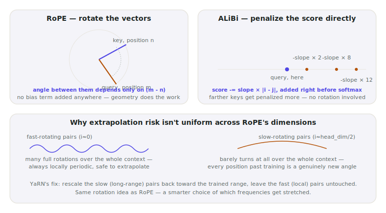

# Lecture 12 — RoPE, ALiBi, YaRN: Positional Encodings

> **In one sentence:** We ask a question every lecture so far has quietly assumed the answer to — how does the model know token 5 comes before token 500 — and meet the three real answers: rotate the vectors (RoPE, our model's actual mechanism), penalize the score directly (ALiBi), or fix RoPE's extrapolation blind spot after the fact (YaRN).

**Last time:** Lecture 11 showed exactly what gets cached and shared across attention heads — but every one of those vectors carried no information about its own position in the sequence. **This time:** we fix that, with rotation.

## Prerequisites

| Concept | Needed? | Notes |
| --- | --- | --- |
| Lecture 11 | Light | RoPE rotates the exact Q/K vectors Lecture 11's `repeat_kv` demo moved around |
| Self-attention | Yes | Just that it's a dot product between vectors — today explains what goes into those vectors first |
| Complex numbers / rotation matrices | No | The math page builds the one fact it needs from scratch |

Self-attention, on its own, has no idea what order tokens came in. It's a weighted sum over a *set* of vectors — shuffle the input and, without something telling it otherwise, attention produces the identical output. *"The dog bit the man"* and *"the man bit the dog"* would look the same to it. Every lecture since Lecture 01 has used a model that clearly doesn't have this problem, and never asked why.

<figure>
  
  <figcaption>A compass doesn't label a place "here." It reports an angle. RoPE encodes position the same way — as a rotation, not a label. <em>Photo: Calsidyrose, Wikimedia Commons, CC BY 2.0</em></figcaption>
</figure>

## Mental Model

> **RoPE doesn't tell a token "you are at position 47." It rotates the token's query/key vector by an angle proportional to 47.** Two tokens' relationship after rotation depends only on the *angle between* their rotations — which is exactly their relative distance, regardless of where either one sits in the sequence.

| | RoPE | ALiBi |
| --- | --- | --- |
| What changes | The Q/K **vectors** themselves, rotated before the dot product | The attention **score**, penalized directly after the dot product |
| Mechanism | A rotation, applied per pair of dimensions | A subtraction: `score -= slope × distance` |
| Position type encoded | Relative, as a provable consequence of rotation math | Relative, by explicit construction |
| Our course model | **Uses this** (a multimodal extension of it, M-RoPE — see Where It Breaks) | Not used here |

<figure>
  
  <figcaption>Two different philosophies for the same job — change the vectors, or change the score — plus the reason one dimension of RoPE is riskier to extrapolate than another.</figcaption>
</figure>

RoPE and ALiBi solve the identical problem two structurally different ways: one changes what goes *into* the dot product, the other changes what comes *out* of it.
{: .remember}

## Where does everything run?

| Environment | Role in this lecture |
| --- | --- |
| 💻 Your laptop | **Everything today** — pure numpy on small vectors, no GPU, no download |
| ⚡ Lightning AI Studio | Nothing new — earlier lectures' scripts still live in this folder |
| ☁️ AWS | Nothing yet — Module 3 |

## The Build

💻 This lecture's folder, `code/module-2-vertical-wins/12-rope-alibi-yarn/`, is a copy-forward of Lecture 11's folder with one new file: `positional_encodings.py`.

```bash
git clone https://github.com/gaurav98095/Course-on-AI-Engineering.git   # skip if already cloned
cd Course-on-AI-Engineering/code/module-2-vertical-wins/12-rope-alibi-yarn
pip install -r requirements.txt
```

### Step 1 — Rotate, and prove position becomes relative

```python
def rope_rotate(x, pos, freqs):
    angles = pos * freqs                 # one angle per 2D pair, scaled by position
    cos, sin = np.cos(angles), np.sin(angles)
    x1, x2 = x[0::2], x[1::2]
    out = np.empty_like(x)
    out[0::2] = x1 * cos - x2 * sin       # standard 2D rotation, applied pair by pair
    out[1::2] = x1 * sin + x2 * cos
    return out
```

Using our course model's real `head_dim` (128) and `rope_theta` (5,000,000):

```bash
python positional_encodings.py
```

```text
--- 1. RoPE: the score depends only on (m - n) ---
(head_dim=128, theta=5,000,000 -- our course model's real config)

pairs with m - n = 0:
  m=      0 n=      0  score=0.346338
  m=      5 n=      5  score=0.346338
  m=    100 n=    100  score=0.346338
  m= 50,000 n= 50,000  score=0.346338

pairs with m - n = 7 (note: identical score, every time):
  m=     10 n=      3  score=3.330872
  m=    110 n=    103  score=3.330872
  m=  5,010 n=  5,003  score=3.330872
  m=100,007 n=100,000  score=3.330872
```

Same relative distance, identical score, whether the tokens are at the very start of the sequence or 100,000 positions in. That is not a coincidence of these particular numbers — the math page proves it holds for any vectors, any distance.

### Step 2 — ALiBi's completely different move

No rotation, no relative-position algebra — just a number subtracted from the score, bigger for farther keys:

```python
def alibi_slopes(n_heads):
    i = np.arange(1, n_heads + 1)
    return 1.0 / (2.0 ** ((8.0 / n_heads) * i))   # Press et al.'s geometric sequence
```

```text
--- 2. ALiBi: an explicit distance penalty, added to the score directly ---
  head 0: slope=0.50000  penalty at distance 100 tokens = -50.000
  head 3: slope=0.06250  penalty at distance 100 tokens = -6.250
  head 7: slope=0.00391  penalty at distance 100 tokens = -0.391
```

Different heads get different slopes — some heads are forced to care mostly about nearby tokens (steep slope), others stay nearly indifferent to distance (shallow slope). Nothing here touches the Q or K vectors at all.

### Step 3 — Why some rotations are riskier to extrapolate than others

```text
--- 3. Why extrapolation risk isn't the same for every dimension ---
(our model's real config: theta=5,000,000, max_position_embeddings=262,144)

fastest-rotating pair:  41,721.5 full rotations over the trained context -- always locally periodic, safe to extrapolate
slowest-rotating pair:  0.0106 full rotations over the trained context -- has barely turned at all; every position past training is a genuinely new angle
```

The fastest-rotating pair of dimensions spins around **41,721 times** over our model's full 262,144-token training range — any two nearby tokens always see a small, familiar angle between them, no matter how far into the sequence they are. The slowest pair barely turns **1%** of one full rotation over that entire range. Push past the trained length, and that slow dimension reports an angle the network has simply never seen — not wrong, just unfamiliar, the way a fluent reader still stumbles on a word encountered for the first time.

```text
for scale: theta=10,000, max_pos=4,096 (a smaller, more typical config) --
  slowest pair's angle at the trained max: 0.0753 rotations
  the SAME dimension at 2x that length:    0.1506 rotations
  -> a genuinely new angle the network never trained on.
```

**This is exactly the gap YaRN closes.** Rather than train a new model on longer sequences, YaRN rescales the slow-rotating (long-range) dimensions back toward the angles the network already trained on, while leaving the fast-rotating (local) dimensions alone — because those were never the problem. Peng et al.'s method (2023) reports extending LLaMA-family models' usable context several-fold this way, using far less fine-tuning data than training a longer-context model from scratch.

## Measure It

Every number below came directly out of `positional_encodings.py` — real, deterministic math, not a hardware ballpark:

| Check | Result |
| --- | --- |
| RoPE score, `m-n=0`, tested at positions 0 through 50,000 | Identical to 6 decimal places, every time |
| RoPE score, `m-n=7`, tested at positions 3 through 100,007 | Identical to 6 decimal places, every time |
| Fastest RoPE dimension, rotations over full 262,144-token context | 41,721.5 |
| Slowest RoPE dimension, rotations over full 262,144-token context | 0.0106 |

## The Math, One Level Deeper

Step 1 verified the relative-position property numerically. It's actually an exact algebraic fact, provable in a few lines using complex numbers — treat each rotated 2D pair as a single complex number, and RoPE's rotation becomes ordinary multiplication by \\(e^{i\theta}\\):

\\[
\langle R(m)q,\, R(n)k \rangle \;=\; \text{Re}\!\left[ q \, \bar k \, e^{i(m-n)\theta} \right]
\\]

Everything about \\(m\\) and \\(n\\) individually cancels, leaving only their difference — the score is a function of \\((m-n)\\) and nothing else, for *any* choice of \\(q\\), \\(k\\), or \\(\theta\\).

> **Want the full derivation?** The complete complex-number proof, why it generalizes cleanly across all 64 rotating pairs at once, and the precise sense in which a "slow" dimension's angle range is information-theoretically too small to cover a long context:
> [Math Deep Dive 12 — RoPE as Rotation: The Relative-Position Proof →](../math/12-rope-relative-position-proof.md)

## Where It Breaks

**Our course model doesn't use plain 1D RoPE — it uses M-RoPE.** Qwen3-VL's real `config.json` shows `"rope_type": "default"` with an `mrope_section: [24, 20, 20]` — a multimodal extension that splits the 64 rotating pairs into three groups, giving temporal position, image height, and image width each their own slice of the rotation space, so a video frame's position can be encoded on three axes at once instead of one. This lecture teaches the 1D mechanism M-RoPE is built from; the multimodal split itself is a real, more intricate design decision this course doesn't derive in full.

**ALiBi trades flexibility for simplicity.** It has no learned parameters and famously extrapolates to longer contexts than it was trained on with no fix required at all — but it can't represent patterns that need to reference an *exact* position rather than distance (RoPE, done right, can).

**YaRN's real ramp function is more nuanced than "rescale slow, leave fast alone."** Production YaRN blends the two regimes with a smooth ramp across a range of intermediate frequencies, not a hard cutoff — this lecture's demonstration shows the *why*, correctly, without claiming to reproduce the exact interpolation curve the paper tunes.

**None of today's code touches a real model.** `positional_encodings.py` verifies the mathematics with real, small vectors — it doesn't load Qwen3-VL and confirm its actual attention layers behave this way. The `config.json` values (`rope_theta`, `max_position_embeddings`, `mrope_section`) are real and fetched from the model's actual configuration; the rotation demonstration itself is a from-scratch reimplementation, not the model's own code path.

## Exercises

1. **Push the relative-position check further.** Add a pair with `m-n = -7` (query before key) to Step 1. Does the score match the `m-n=7` case, or differ? What does that tell you about RoPE and direction?
2. **Feel ALiBi's extremes.** Compute the penalty at distance 1,000 for the steepest and shallowest slopes in an 8-head setup. At what distance does the shallowest-slope head's penalty finally exceed 10?
3. **Find your own model's risk profile.** Fetch another open model's `rope_theta` and `max_position_embeddings` from its `config.json`, and rerun Part 3's calculation for it. Is its slowest dimension safer or riskier than our course model's?
4. **Verify the math page's proof numerically.** Pick a random 2D pair, three positions `m`, `n`, `n'`, and confirm the complex-number formula predicts the same score for `(m,n)` and `(m+5, n+5)` — the exact property Step 1 checked, derived a different way.
5. **M-RoPE's shape.** Our model's `mrope_section` is `[24, 20, 20]` — three groups summing to 64 (half of `head_dim=128`). Sketch, in words, what you'd expect each group to be responsible for in a video input, and why a plain text-only prompt would only ever use the first group.

## Summary

Self-attention has no built-in sense of order — RoPE gives it one by rotating query and key vectors by an angle proportional to position, a rotation whose mathematical structure guarantees the resulting attention score depends only on relative distance, proven exactly and verified numerically at distances up to 100,000 tokens. ALiBi solves the identical problem a completely different way, subtracting an explicit, per-head distance penalty from the score instead of touching the vectors at all. Both encode relative position; neither is free of trade-offs. And because RoPE's rotation frequencies span a huge range — some spinning tens of thousands of times over a long context, others barely turning at all — extrapolating a RoPE model past its trained length is not uniformly risky across dimensions, which is exactly the asymmetry YaRN's frequency-dependent rescaling is built to exploit.

> **What should you remember?**
> - RoPE rotates vectors; ALiBi penalizes scores. Two different mechanisms, both landing on relative rather than absolute position.
> - The relative-position property isn't approximate — it's an exact algebraic consequence of rotation, provable in a few lines with complex numbers.
> - RoPE's fast-rotating dimensions are always safe to extrapolate; its slow-rotating dimensions are exactly where naive context extension breaks, and exactly what YaRN targets.

## Resources

- Su et al., *RoFormer: Enhanced Transformer with Rotary Position Embedding* (2021) — the original RoPE paper.
- Press et al., *Train Short, Test Long: Attention with Linear Biases Enables Input Length Extrapolation* (2021) — ALiBi.
- Peng et al., *YaRN: Efficient Context Window Extension of Large Language Models* (2023).
- Qwen3-VL's real `config.json` on Hugging Face — source of every `rope_theta`, `max_position_embeddings`, and `mrope_section` number used in this lecture.

---

[← Previous: Lecture 11 — GQA, MQA, MLA: Cheaper Attention Heads](11-gqa-mqa-mla.md) · [Course Home](../index.md) · [Next: Lecture 13 — Continuous Batching →](13-continuous-batching.md)
