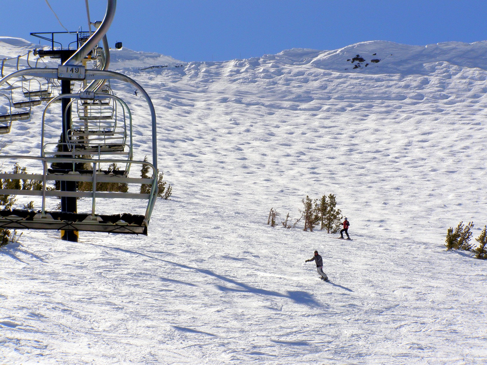
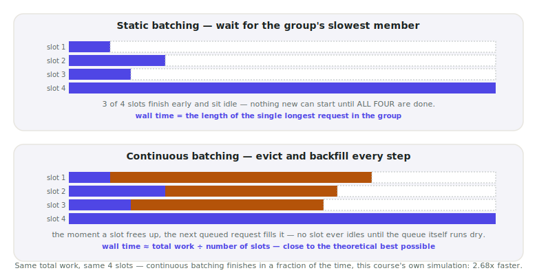

# Lecture 13 — Continuous Batching

> **In one sentence:** We stop waiting for a whole batch's slowest request to finish before starting the next one, and let finished slots refill immediately — the single scheduling change that turns idle GPU capacity into 2–3× more real throughput, no new hardware, no new kernel.

**Last time (and every lecture since Lecture 03):** our own server has processed exactly one request at a time — batch size 1, always, the "one operator" limit Lecture 03 found and every lecture since has quietly carried forward. **This time:** we simulate what happens when many requests genuinely share a batch, and discover that *how* they share it matters as much as whether they do.

## Prerequisites

| Concept | Needed? | Notes |
| --- | --- | --- |
| Lecture 03 | Yes | Reopens the "one operator, one request" finding this course has never revisited since |
| Lecture 04 | Light | The math page reuses arithmetic intensity to explain batching's *second* benefit, beyond scheduling |
| Queueing / Little's Law | No | Today is about scheduling *within* a batch, a different question from Lecture 03's queueing math |

## Mental Model

> **A serving system with batch size B is a chairlift with B chairs.** Static batching waits for the *entire lift* to complete one full loop — every chair unloaded — before loading a single new rider. Continuous batching loads the next skier in line the instant any one chair frees up.

<figure>
  
  <figcaption>Every numbered chair keeps moving. The moment one unloads at the top, it's already back at the bottom for the next rider — nobody waits for the whole lift to empty first. <em>Photo: glenngould, Wikimedia Commons, CC BY 2.0</em></figcaption>
</figure>

| | Static batching | Continuous batching |
| --- | --- | --- |
| When a new request can start | Only when *every* slot in the current batch is free | The instant *any one* slot frees up |
| What sets the wall time | The single longest request in the group | Roughly total work ÷ number of slots |
| What idle slots do | Wait, doing nothing, for the stragglers | Never idle until the whole queue is drained |

Same GPU, same total work, same batch size — the only thing that changed is *when* a slot is allowed to pick up new work. That one scheduling decision is worth more throughput than most kernels this course will write.
{: .remember}

## Where does everything run?

| Environment | Role in this lecture |
| --- | --- |
| 💻 Your laptop | **Everything today** — a pure scheduling simulation, no GPU, no third-party package |
| ⚡ Lightning AI Studio | Nothing new — earlier lectures' scripts still live in this folder |
| ☁️ AWS | Nothing yet — Module 3 |

## The Build

💻 This lecture's folder, `code/module-2-vertical-wins/13-continuous-batching/`, is a copy-forward of Lecture 12's folder with one new file: `continuous_batching_simulator.py`.

```bash
git clone https://github.com/gaurav98095/Course-on-AI-Engineering.git   # skip if already cloned
cd Course-on-AI-Engineering/code/module-2-vertical-wins/13-continuous-batching
pip install -r requirements.txt
```

### Step 1 — Static batching: wait for the slowest

```python
def static_batching(lengths, batch_size):
    wall_steps, slot_steps = 0, 0
    for i in range(0, len(lengths), batch_size):
        group = lengths[i:i + batch_size]
        group_time = max(group)                  # the whole group waits for this one
        wall_steps += group_time
        slot_steps += group_time * len(group)     # every slot "occupied," most of them idle
    return wall_steps, slot_steps
```

### Step 2 — Continuous batching: evict and backfill every step

```python
def continuous_batching(lengths, batch_size):
    queue = list(lengths)
    active = [queue.pop(0) for _ in range(min(batch_size, len(queue)))]
    wall_steps, slot_steps = 0, 0
    while active:
        wall_steps += 1
        slot_steps += batch_size
        still_active = []
        for remaining in active:
            remaining -= 1
            if remaining > 0:
                still_active.append(remaining)
            elif queue:
                still_active.append(queue.pop(0))   # the instant a slot frees, refill it
        active = still_active
    return wall_steps, slot_steps
```

### Step 3 — Run both against the identical 200 requests

```bash
python continuous_batching_simulator.py
```

```text
requests: 200, batch_size: 8, mean length: 126.6 tokens
total useful decode steps (identical either way): 25,319

                       wall steps     slot-steps  utilization
static batching             8,731         69,848        36.2%
continuous batching         3,262         26,096        97.0%

continuous batching finishes 2.68x faster (wall time)
continuous batching wastes 3.0% of slot-steps, vs static's 63.8%
```

Same 200 requests. Same total work — 25,319 decode steps, either way, because that number is just how much text the model has to generate. Static batching takes 8,731 wall-clock steps to clear the queue; continuous batching takes 3,262. **2.68× faster, from scheduling alone.**

## Measure It

Every number below came directly out of `continuous_batching_simulator.py` — real, deterministic, reproducible:

| Metric | Static batching | Continuous batching |
| --- | --- | --- |
| Wall-clock steps to clear 200 requests | 8,731 | 3,262 |
| GPU-slot utilization | 36.2% | 97.0% |
| Wasted slot-steps | 63.8% | 3.0% |

<figure>
  
  <figcaption>The same four slots, the same total work — static batching's idle time (dashed) is real GPU capacity you already paid for and never used.</figcaption>
</figure>

> This simulation models the *scheduling* decision in isolation — real systems (vLLM, TGI) implement continuous batching alongside PagedAttention (Lecture 10) so a dynamically changing batch composition never fragments memory, and GQA/FlashAttention (Lectures 09, 11) to make each individual step cheap. Lecture 14 runs the course model on a real engine and measures this for real, on real hardware.

## The Math, One Level Deeper

Continuous batching's win isn't only about idle slots. Recall Lecture 04's finding: at batch size 1, decode's arithmetic intensity is exactly 1 FLOP/byte, because reading a weight once produces exactly one token. **Batch multiple requests' decode steps together, and that same weight-read now produces \\(B\\) tokens — arithmetic intensity scales with batch size, directly:**

\\[
\text{AI}(B) = \frac{2B}{s}
\\]

At \\(B=1\\), bf16 (\\(s=2\\)): AI \\(=1\\), matching Lecture 04/05 exactly. Batching is therefore a *second*, independent lever, on top of the scheduling win Step 3 just measured — it also pushes decode closer to the compute-bound side of the roofline.

> **Want the full derivation?** Where the batch-size term comes from, the exact batch size at which decode's arithmetic intensity crosses our L40S's real ridge point, and why static batching's *relative* inefficiency gets worse — not better — as batch size grows:
> [Math Deep Dive 13 — Batching, Arithmetic Intensity, and the Cost of Waiting for the Slowest →](../math/13-batching-arithmetic-intensity.md)

## Where It Breaks

**This is a scheduling simulation, not a running server.** It proves the *mechanism* — evict and backfill beats wait-for-everyone — with real numbers, on a simplified model of the problem. It doesn't touch a GPU, a KV cache, or a real attention kernel.

**Continuous batching needs a memory system that can handle a constantly-changing batch composition.** A request joining or leaving mid-flight means the KV cache pool's shape changes every single step — this is exactly the problem Lecture 10's PagedAttention exists to solve cleanly. Naive contiguous KV cache allocation and continuous batching don't mix well.

**Prefill and decode compete for the same batch slots.** A new request's very first step is prefill — a compute-bound burst (Lecture 05) — landing in the same batch as other requests' cheap decode steps. Real schedulers have to decide how to interleave the two without prefill spikes stalling everyone else's decode; this lecture's simulator doesn't model that interaction at all.

**The traffic mix matters enormously.** If every request generated the exact same number of tokens, static and continuous batching would perform identically — the entire advantage comes from *variance* in response length, which real traffic always has (Exercise 3 asks you to prove this to yourself).

## Exercises

1. **Kill the variance, watch the advantage disappear.** Edit `sample_length` to always return the same fixed value. Rerun the simulator — does continuous batching still win?
2. **Sweep batch size.** Run the simulator at `BATCH_SIZE = 1, 4, 16, 64`. Does continuous batching's speedup over static grow, shrink, or stay flat as batch size increases?
3. **Prove variance is the whole story.** Compute the standard deviation of `lengths` for two different `sample_length` distributions — the current mixed one, and a low-variance one you design. Confirm the speedup ratio tracks the variance, not just the mean.
4. **Chase the roofline crossing.** Using the math page's formula, compute the exact batch size at which our L40S's decode arithmetic intensity reaches its ridge point. Compare against Lecture 04's own table.
5. **Design the interleaving fix.** In one paragraph, propose a rule for how a real scheduler should decide whether to let a new request's prefill step join an in-progress decode batch, versus making it wait. What trade-off are you balancing?

## Summary

Static batching ties every request in a group to the pace of its slowest member — in our own 200-request simulation, that wasted 63.8% of allocated GPU-slot-steps. Continuous batching backfills a freed slot the instant it frees, and the identical workload finished 2.68× faster with 97% utilization. The underlying cause is the same one Lecture 03 first surfaced and this course never revisited: a server that processes work one rigid group at a time leaves capacity on the table, and the fix isn't more hardware, it's a better scheduling rule. Batching also has a second, independent payoff the math page derives precisely: it pushes decode's arithmetic intensity up, the same roofline lever this course has returned to since Lecture 04.

> **What should you remember?**
> - Static batching's wall time is set by a group's slowest member; continuous batching's is set by total work divided by slot count — a structurally different, and usually much smaller, number.
> - The entire advantage comes from variance in response length — uniform-length traffic erases it completely.
> - Batching helps twice: once through scheduling (today), once through arithmetic intensity (the math page) — two different mechanisms pointing the same direction.

## Resources

- Yu et al., *Orca: A Distributed Serving System for Transformer-Based Generative Models* (OSDI 2022) — the paper that introduced iteration-level (continuous) batching.
- The vLLM and Hugging Face TGI documentation on continuous batching, the production implementations this lecture's simulation models.
- Lecture 03's `load_test.py` and Lecture 10's `paged_kv_simulator.py` — the two earlier scripts today's simulator borrows its traffic-mix and simulation style from.

---

[← Previous: Lecture 12 — RoPE, ALiBi, YaRN: Positional Encodings](12-rope-alibi-yarn.md) · [Course Home](../index.md) · [Next: Lecture 14 — vLLM & SGLang →](14-vllm-and-sglang.md)
