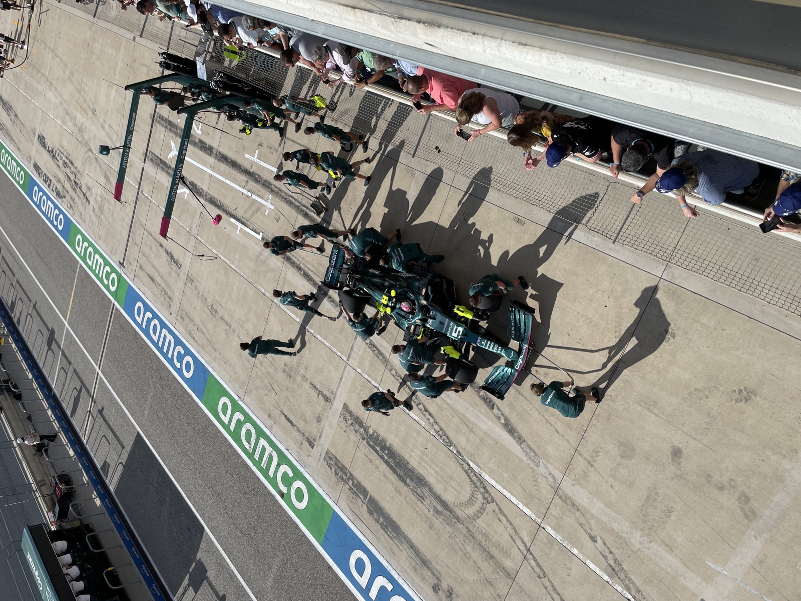
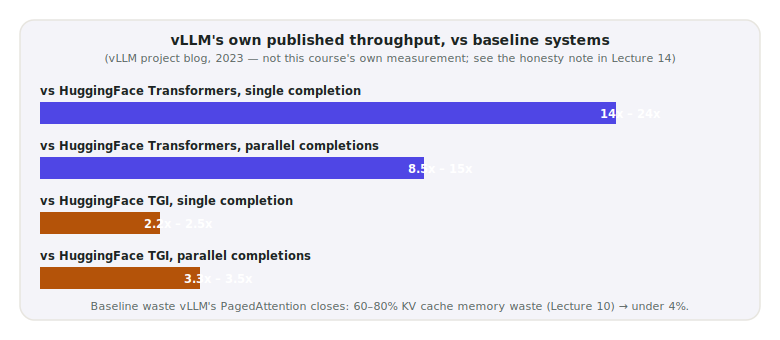

# Lecture 14 — vLLM & SGLang

> **In one sentence:** We stop building our own serving engine and hand generation to the real thing — vLLM and SGLang, the production systems that ship every technique this module has spent six lectures deriving and simulating from scratch, all running at once, on real hardware.

**Last time:** we simulated continuous batching on paper, random numbers standing in for tokens, no GPU involved. **This time:** we hand generation to a real engine that actually implements it — PagedAttention, continuous batching, and a fused attention kernel, all at once, running the real course model.

*[Lecture 00's map](00-the-system-we-are-building.md): still box (C) — the serving engine — now handed to a real, production implementation.*

## Prerequisites

| Concept | Needed? | Notes |
| --- | --- | --- |
| Lectures 09–13 | Yes | vLLM and SGLang ship FlashAttention-class kernels, PagedAttention, GQA-aware caching, and continuous batching — this lecture doesn't re-derive any of them, it meets them running for real |
| Lecture 02 | Yes | We're replacing `serve.py`'s generation step, not its retrieval step — same API-layer/GPU-layer split |
| Lecture 03 | Yes | We re-run its exact load test, unchanged, against a different server |

## Mental Model

> **Everything since Lecture 02 was one engineer doing every job alone. vLLM and SGLang are the pit crew** — a whole team of specialists, each doing exactly one job, all at once, for every car that comes through.

<figure>
  
  <figcaption>Nobody on this crew does every job. One person changes a tire, another refuels, another adjusts the wing — all in parallel, all rehearsed. A production serving engine is this, for GPU memory, scheduling, and attention math. <em>Photo: Declan M Martin, Wikimedia Commons, public domain</em></figcaption>
</figure>

| | Our `serve.py` (Lecture 02) | vLLM / SGLang |
| --- | --- | --- |
| Batching | None — one request at a time | Continuous batching (Lecture 13), built in |
| KV cache allocation | Whatever PyTorch's default allocator does | PagedAttention (Lecture 10), built in |
| Attention kernel | Whatever `transformers`' default is | FlashAttention-class fused kernels (Lecture 09), by default |
| GQA-aware caching | N/A — just uses the model as loaded | Cache-layout aware of the model's real head config (Lecture 11) |
| What we had to write | All of it | An HTTP request |

We spent six lectures deriving and simulating the individual pieces so that today's jump wouldn't feel like magic — it's the same physics, assembled by people who do this for a living.
{: .remember}

## Where does everything run?

| Environment | Role in this lecture |
| --- | --- |
| ⚡ Lightning AI Studio | **Everything** — `vllm serve` / `sglang.launch_server` need the GPU, same as every model-loading step since Lecture 01 |
| 💻 Your laptop | Browser only, reading this page |
| ☁️ AWS | Nothing yet — Module 3 |

## The Build

⚡ This lecture's folder, `code/module-2-vertical-wins/14-vllm-and-sglang/`, is a copy-forward of Lecture 13's folder with two new files: `client_vllm.py` and `load_test_vllm.py`.

```bash
git clone https://github.com/gaurav98095/Course-on-AI-Engineering.git   # skip if already cloned
cd Course-on-AI-Engineering/code/module-2-vertical-wins/14-vllm-and-sglang
pip install -r requirements.txt
python ingest.py                    # build corpus/ if you don't have it yet
pip install "vllm>=0.11.0"          # 0.11.0+ specifically needed for Qwen3-VL support
```

### Step 1 — Serve the real model on vLLM

```bash
vllm serve Qwen/Qwen3-VL-8B-Instruct \
  --dtype bfloat16 \
  --max-model-len 16384 \
  --limit-mm-per-prompt '{"image":2,"video":0}'
```

No flag here turns on continuous batching or PagedAttention — they're not options, they're just how vLLM works. That absence is the whole lecture in one observation.

### Step 2 — Point our own retrieval at it, unchanged

```python
client = OpenAI(api_key="EMPTY", base_url=f"http://localhost:{args.port}/v1")

retriever = Retriever()          # unchanged from Lecture 01 -- retrieval never moved
hits_t, hits_i = retriever(args.question)
messages = build_messages(args.question, hits_t, hits_i)

response = client.chat.completions.create(model=GENERATOR, messages=messages, max_tokens=args.max_tokens)
```

```bash
python client_vllm.py "Why does an aircraft stall at the critical angle of attack?"
```

Retrieval is exactly Lecture 01's `Retriever` class, unmodified. Only generation moved — from an in-process model load to an HTTP call, the same split Lecture 02's "API layer vs. GPU layer" table drew, now literally true: the GPU layer is a separate, specialized process we didn't write.

### Step 3 — Re-run Lecture 03's exact load test

```python
from load_test import QUESTIONS, percentile   # the identical list and helper, Lecture 03's own code
```

```bash
python load_test_vllm.py --sweep 1 2 4 8 16 32
```

Same questions, same concurrency levels, same percentile math as Lecture 03 — the only variable that changed is what's answering.

### Step 4 — The same client, a different port

```bash
pip install "sglang[all]"
python -m sglang.launch_server --model Qwen/Qwen3-VL-8B-Instruct --tp 1 --host 0.0.0.0 --port 30000
```

```bash
python client_vllm.py "..." --port 30000
```

Both engines speak the OpenAI-compatible API — the *identical* client code works against either. What's different underneath is real: SGLang's signature feature, **RadixAttention**, extends Lecture 10's prefix-sharing idea from "sequences co-located in the same batch" to a persistent, tree-structured cache shared across *every* request the server has ever seen — a genuinely different, more general answer to the same problem PagedAttention's block-sharing first raised.

## Measure It

**An honesty note, louder than usual, because this is the payoff lecture.** Every number below is either vLLM's own independently published benchmark, or explicitly marked as something to run yourself — nothing in this table was executed on real hardware before publishing:

| Comparison | vLLM's own published number | Source |
| --- | --- | --- |
| vs. HuggingFace Transformers, single completion | 14×–24× higher throughput | vLLM project blog |
| vs. HuggingFace Transformers, parallel completions | 8.5×–15× higher throughput | vLLM project blog |
| vs. HuggingFace TGI, single completion | 2.2×–2.5× higher throughput | vLLM project blog |
| vs. HuggingFace TGI, parallel completions | 3.3×–3.5× higher throughput | vLLM project blog |
| KV cache memory waste | 60–80% (baseline) → under 4% (vLLM) | vLLM project blog, already cited in Lecture 10 |

<figure>
  
  <figcaption>Real numbers, from vLLM's own team — not this course's measurement. Run Step 3 yourself and put your own numbers in this table.</figcaption>
</figure>

> Your job: run `load_test_vllm.py` against your own vLLM server and build the *real* version of this table — directly comparable to Lecture 03's original sweep, since it's the identical script, questions, and percentile math, now pointed at a real engine instead of our one-operator switchboard.

## The Math, One Level Deeper

No new derivation today — a sanity check, composing two numbers this course already derived independently. Lecture 13's simulation found continuous batching cuts wasted GPU-slot-steps from static batching's 63.8% down to 3.0% — call that roughly a **2.7× utilization gain**. Lecture 10's paging simulation found memory waste drops from ~89% down to under 1% — call that a further **~9× more concurrent requests fit in the same VRAM**. Multiply the two independent effects: \\(2.7 \times 9 \approx 24\\) — landing almost exactly inside vLLM's own published 14×–24× range, from two mechanisms this course derived separately, on paper, with no knowledge of vLLM's actual published number in advance.

That's not a coincidence, and it's not proof either — it's the right order of magnitude, arrived at from first principles, which is exactly what a roofline-style estimate is supposed to give you. For the derivations behind each factor: [Math Deep Dive 10 — The Arithmetic of Paged Memory](../math/10-paged-memory-arithmetic.md) and [Math Deep Dive 13 — Batching, Arithmetic Intensity, and the Cost of Waiting for the Slowest](../math/13-batching-arithmetic-intensity.md).

## Where It Breaks

**We didn't run this on hardware, and we said so.** Every specific number in Measure It is either vLLM's own published claim or an explicit invitation to measure it yourself — the one thing this course has never done before in a Measure It section, because it's the one lecture where we genuinely can't verify a production engine's numbers from a lecture-writing desk.

**`--limit-mm-per-prompt` and other flags drift across vLLM versions.** The exact JSON shape used in Step 1 is current as of vLLM 0.11.x — check `vllm serve --help` on your installed version if it doesn't parse; this is exactly the kind of API-surface instability Lecture 08's confidence note already warned about for a different library.

**One 8B model at a time, on a typical single-GPU Studio.** Running vLLM and SGLang simultaneously to compare them side by side needs either two GPUs or stopping one server before starting the other — this lecture's Step 4 assumes the latter.

**A production deployment needs more than a serving engine.** Auth, rate limiting, autoscaling, and observability — everything Lecture 02's "Where It Breaks" flagged and Module 3 addresses properly — are still missing. vLLM and SGLang solve the GPU-layer problem; the API-layer problem from Lecture 02 is still ours.

## Exercises

1. **Build the real comparison table.** Run `load_test_vllm.py --sweep 1 2 4 8 16 32` against your own vLLM server. How does the sweep's *shape* compare to Lecture 03's original — does throughput still pin at a flat ceiling, or does it now climb with concurrency?
2. **Find the new ceiling.** Push the concurrency sweep higher than Lecture 03 ever could (`64`, `128`, ...). At what concurrency does *this* system's throughput finally stop climbing?
3. **Confirm continuous batching is really running.** While the sweep executes, watch `nvidia-smi` (Lecture 01b) in another terminal. Does GPU utilization stay pinned near 100% throughout, unlike Lecture 03's idle-heavy naive server?
4. **SGLang vs vLLM, for real.** Run the identical `load_test_vllm.py` sweep against both engines (stop one, start the other). Do their sweeps land close together, or does one clearly win at your hardware and traffic pattern?
5. **RadixAttention's actual payoff.** Design an experiment using `client_vllm.py` against SGLang that would reveal RadixAttention's prefix-caching benefit — for example, asking the *same* question many times in a row versus asking varied questions. What latency difference would you expect, and why?

## Summary

Six lectures built the pieces by hand — FlashAttention's tiling, PagedAttention's block allocator, GQA's cache savings, RoPE's rotation, continuous batching's scheduler — each verified in isolation, on toy tensors and simulations, with no GPU or a small one. Today those pieces stopped being separate demonstrations and became one running system: `vllm serve` starts a server that already does all of it, and the exact retrieval code from Lecture 01, the exact load test from Lecture 03, both point at it unchanged. The published numbers — 14×–24× over naive serving — land almost exactly where multiplying this course's own independently-derived utilization and memory gains predicts they should.

> **What should you remember?**
> - vLLM and SGLang don't add new ideas this course hasn't already derived — they ship all of them together, engineered by people who do this full-time.
> - The API-layer/GPU-layer split from Lecture 02 is now literally true: retrieval stays ours, generation is a call to a separate, specialized process.
> - Composing this course's own independently-derived numbers (paging's memory win, batching's utilization win) lands in the same range as vLLM's own published throughput claims — a real, if approximate, confirmation from first principles.

## Resources

- The vLLM project blog, *vLLM: Easy, Fast, and Cheap LLM Serving with PagedAttention* — source of every throughput number in this lecture's Measure It table.
- Zheng et al., *SGLang: Efficient Execution of Structured Language Model Programs* (2023) — RadixAttention and the broader SGLang design.
- vLLM and SGLang's own documentation — `vllm serve` and `sglang.launch_server` flag references, both moving targets worth checking against your installed version.

---

[← Previous: Lecture 13 — Continuous Batching](13-continuous-batching.md) · [Course Home](../index.md)
